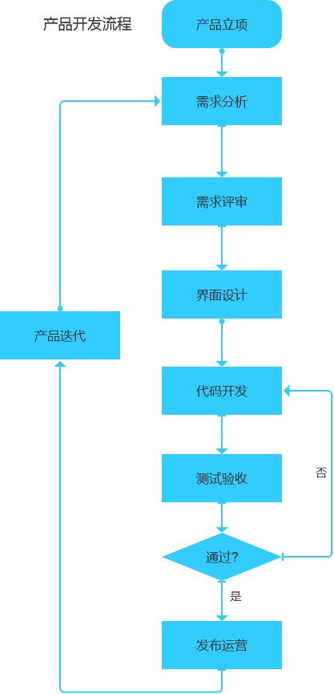
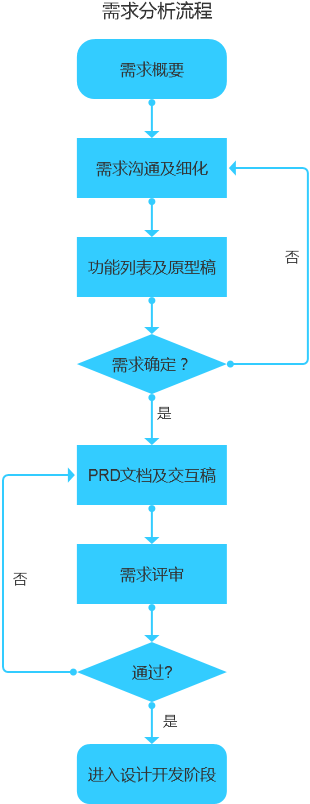
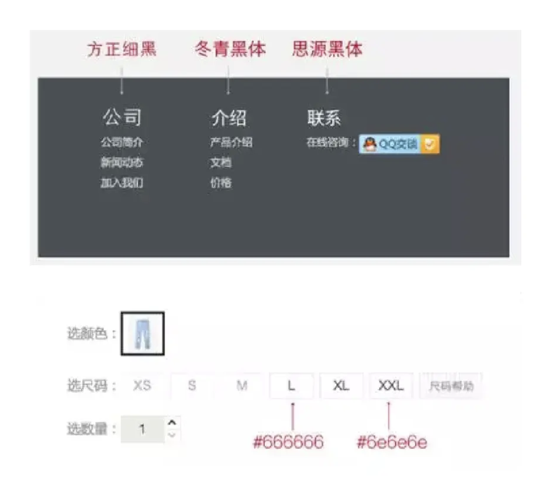
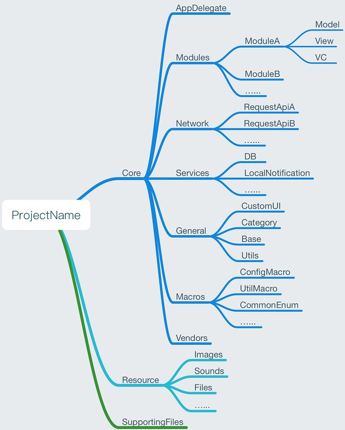

# APP设计及开发规范

## APP流程规范

标准化的流程都能让事情事半功倍，尤其是在复杂的移动APP开发上。在开发之前，首先需要明确每个环节是什么，了解app的开发流程，然后根据流程进行开发，这样可以使开发更加规范和顺畅。

### 一、主要流程



### 二、产品立项

- 工作描述

    产品立项阶段亦称为准备阶段，该阶段主要基于需求大纲通过针对性的市场调研、用户访谈及竞品分析，尽可能的评估产品的核心功能，方向定位、目标用户群、成本投入和市场前景。在决策层评估通过的条件下，组建虚拟开发小组，协调资源，明确项目负责人及产品计划上线时间等事项。若为甲方需求的项目，可省略市场调研及商业价值评估的相关内容。

- 工作要点
    描绘远景，设定目标：产品的远景是什么？计划需要做什么实现这个远景？明确各个阶段的产品目标，为什么设定这样的目标？

- 市场调研，竞品分析：通过针对性的市场调研和充分的竞品分析，测算产品市场前景和风险成本。

- 收集需求，排优先级：收集各业务市场部门反馈的需求意见，做典型用户的深度访谈，组相开发设计运营人员头脑风暴，明确产品核心功能和开发需求优先级。

- 组建团队，定负责人：依据产品定位和投入资源，组建合适的虚拟开发小组，指定项目负责人，团队相互熟悉各个岗位人员。

- 定期碰头，制定计划：商定项目相关人员定期碰头会，保持团队所有人最新需求信息同步，初步制定产品各个阶段完成时间节点。

- 交付成果
《竞品分析报告》、《产品立项说明书》、《产品PRD文档》

</br>



</br>

### 三、需求分析及评审

- 工作描述

    基于产品定位和运营策略，与产品各需求方进行深度的需求沟通，将抽象繁杂的需求整理分析成可落地执行的方案，召开需求评审，排定各功能点的开发优先级，规划产品各个版本迭代的功能计划表，设计产品原型，撰写产品需求说明书，与设计开发团队沟通确定各阶段的完成时间节点，明确产品实际上线时间，与市场运营团队沟通上线运营计划方案等。

- 工作要点

    需求分析，原型设计：与市场业务运营同事深度沟通，形成初步的需求大纲，功能列表，组织团队全员头脑风暴，分析需求的真伪及紧迫性，确定需求开发优先级，制定产品功能迭代计划表，设计产品原型初稿及页面结构图；

- 需求评审，确定方案：由产品经理牵头召开需求评审会议，向开发团队详细讲解产品逻辑流程和交互细节，评估技术实现的可行性。对不明确的需求做二次需求更新；

- 需求文档，开发周期：依据需求评审结果，修改设计最终版原型及交互，标注原型及撰写产品需求说明书，管理后台数据相关数据统计等需求，技术根据需求文档反馈每个阶段的完成时间节点。

- 交付成果
  《产品PRD文档》、《产品交互原型稿》（低/高保真）、《产品开发进度计划表》

</br>

### 四、UI界面设计

- 工作描述

    基于原型交互稿及产品PRD文档设计产品页面效果图，与产品沟通确定详细的交互细节及效果。与需求业务方确定完善效果图设计最终版，依据开发需求进行效果图细节标注，设计产品icon及应用市场审核宣传材料，配合市场运营部门设计产品运营活动页面等。

- 工作要点

    用户分析，设计梳理：收集相关资料分析目标用户的使用特征、情感、习惯、心理、需求等，基于3W法明确使用者，使用环境及使用方式；

- 素材收集，确定风格：在深度熟悉产品整体业务流程和商业需求的基础上，确定页面主辅色，制定交互方式，操作与跳转流程、结构、布局、信息和其他元素；

- 界面设计，规范输出：设计产品页面、图标、ICON，皮肤及一些界面交互的表现。与前端开发沟通，明确切图命名及标注规范，输出最终设计稿。

- UE测试，整体复盘：产品测试阶段包含UE测试，负责测试页面的还原度及交互的易用性，针对设计稿和需求文档提出测试反馈优化意见。产品上线发布后，全面复盘本次设计架构和细节，总结设计经验和优化迭代建议，并撰写相关的分析优化报告。

- 交付成果
  《PSD源文件》、《切图源文件》、《交互描述及标注细节规范说明》

</br>

### 五、代码开发

- 工作描述

    分为用户端、服务端两类开发。其中用户端开发，主流有`iOS`和`Android`，依据需求文档和设计稿，实现前端页面的交互效果，与服务端确定数据交换接口协议。服务端开发依据需求文档，设计数据库表结构，评估核心复杂功能的实现方案，撰写开发设计概要文档及反馈重要功能的完成时间节点。

- 交付成果
  《开发设计概要》、《接口协议文档》、《自测通过的产品》

</br>

### 六、测试验收

- 工作描述

    参考产品需求文档和开发设计概要，撰写产品测试用例，召开用例讲解会，对产品全方位的进行测试，将测试不通过的内容反馈给开发，判定bug严重程度和跟进修复进度，评估产品上线发布的可行性，协助产品和业务人员撰写产品验收报告。

- 测试类型

    功能性测试、容错性测试、性能效率测试、易用性测试、兼容性测试、压力测试等

- 交付成果
    《测试用例》、《测试bug反馈记录表》、《测试验收报告》

</br>

## APP设计规范

目前市面上 iOS 与 android 存在大量的机型，然后但并非所有开发团队都有足够的时间和人力成本去搭建两个平台设计团队，为了提高开发的效率和节约开发的成本，在很多的公司都会选择用一套设计稿去适配两个平台。

制定设计规范，不仅能够让产品在不同的平台统一适配，也能让多个设计师合作的团队更好的理解设计规则，提高协作能力。参考大平台规范体系，我们整理出一些适合自己的规范内容，能有效地避免规范内容缺失，也能发挥出规范应有的作用。

- **色彩规范**

作为UI设计中非常重要的一个元素，颜色的运用与搭配决定页面的质感。在界面的风格确定之后，需要统一界面用色的规范。设计需要将不同的颜色罗列出来，在设计的时候，可以围绕这些颜色进行设计。在 UI 设计中，颜色的使用规范主要在于：品牌主色、文本颜色、界面颜色（背景色、线框色）等。

- **字体规范**

字体一般在规范好只有一种字体，最多不超过两种字体。其他特殊字体比较少量使用，可以特别说明。

iOS苹果的默认中文字体：苹方简；英文、数字用San Francisco Pro,

Android系统当中中文字体：Noto（思源黑体字体），也是目前安卓系统当中使用的最新字体，英文字体：Roboto。

关于字体颜色和是否加粗：字体的颜色设置我们一般很少用纯黑色，一般用深灰色和浅灰色、细体和粗体（注意要用字体本身的字重，不能用 PS 的加粗功能）来区分重要信息和次要信息，进行信息层级的划分。

**a:字重**

常规体——Regular

中黑体——Medium

**b:字间距**

文字的字间距保持默认为0；多行文字的行间距通常为字号的1.2～1.5倍


- **图标规范**

在应用界面的设计中，功能图标不是单独的个体，通常是由许多不同的图标构成整个系列，它们贯穿于整个产品应用的所有页面并向用户传递信息。

一套 APP图标应该具有相同的风格，包括造型规则、圆角大小，线框粗细，图形样式和个性细节等元素都应该具有统一的规范。


- **间距规范**

  1. 全局间距
      全局边距是指页面内容到屏幕边缘的距离，整个应用的界面都应该以此来进行规范，以达到页面整体视觉效果的统一。全局边距的设置可以更好的引导用户竖向向下阅读。

    以 iOS 原生态页面为例，「设置」页面和「通用」页面都是使用的30px的边距。

    

    以微信和支付宝为例，他们的边距分别是20px和24px。

    

  2. 卡片间距
      在移动端页面设计中卡片式布局是非常常见的布局方式，至于卡片和卡片之间的距离的设置需要根据界面的风格以及卡片承载信息的多少来界定，通常最小不低于16px，过小的间距会造成用户的紧张情绪，使用最多的间距是20px、24px、30px、40px，当然间距也不宜过大，过大的间距会使界面变得松散，间距的颜色设置可以与分割线一致，也可以更浅一些。

    以 iOS（750*1334px）为例，设置页面不需要承载太多的信息，因此采用了较大的70px作为卡片间距，有利于减轻用户的阅读负担，而通知中心承载了大量的信息，过大的间距会让浏览变得不连贯和界面视觉松散，因此采用了较小的16px作为卡片的间距。

    
  


- **注意事项**

  1.先定义最主要，再往上下展开

  ​	无论是颜色，字体，间距，都应该先定下最常用的参数，再往次级，次次级依次展开，会使规范根基更稳，条理清晰。

​			


​		2.避免相近的参数出现

​		    当两个参数肉眼难以区分，在同一层级去做区分是没必要的。同时会导致延伸时混肴，增加工作量。力求既统一又快速。

​			


## SDK 开发规范

### 开发规范

- API功能单一，减少类似enum的入参设计
- 线程处理， 如非必要不要使用应用主线程，不能长时间占用，SDK内应有一个专门线程处理SDK 相关操作
- 尽量减少全局回调
- 提供异常情况回调和输出方便接入放定位，错误回调采用code+msg组合
- 能不用单例的就尽量少的使用
- 代码中需要注意API 的版本 支持，少用不用较早较新 API，实在要用时做好版本校验
- 对IOS 来说能不用xib 就不用，能不用通知就不用通知
- **备注：其他开发详细规范请参考下面的APP开发规范细则**

### 命名规范

- 接口名称，参数命名清晰规范，参数尽可能少，所有传入参数要做好校验，禁止使用拼音和中文
- 类名前缀和包命名缩写要一致
- 函数命名遵循共性，不要出现歧义或者违背大家的共识
- 所有资源命名前缀：dftc_xxx_ 工程命名：dftc-sdk-xxx-android or df-sdk-xxx-ios
- demo 项目命名：demo，包名：cn.dftc.sdk.xxx.demo sdk
- 项目命名：DFTCxxxSDK，包名：cn.dftc.sdk.xxx
**备注：其他开发详细规范请参考下面的APP开发规范细则**

### 注释规范

- 代码注释规范清楚
- 接口注释要完善
- 注释形式统一
- 注释内容准确简洁

### 日志设计

- 核心处理log日志可以配置
- 可控制打印log级别
- 主流程，异常日志存储方便定位问题

### 第三方库依赖处理原则

- 能用系统的API解决的，就不要使用第三方，减少对其他库的依赖；
- 最小可用性原则，即用最少的代码，如无必要勿增实体；
- 最少依赖性原则，即用最低限度的外部依赖，如无必要勿增依赖
- SDK开发中，需要尽量避免依赖第三方库以免引起不必要的冲突
**如果确实因为项目需要，要引入一些开源库，可以通过源码集成的形式引入，再更改一下包名（类名），避免集成冲突。**

### 版本管理规范

- 使用三位版本号，每位版本号最后一位最高三位数字，其他位数最高两位数字，如：1.0.12
- 版本号递增原则：
- 第三位：bug修复，极小的变更
- 第二位：一般的功能迭代
- 第一位：项目重构，功能变更较大，需团队共同确定

### 通用规范 （注意事项）

- 接口隔离 （小而精简、颗粒化）
- 接口易用性 （对外接口易用，易懂）
- 向后兼容  （升级SDK兼容）
- 配套有完整且详细的使用说明文档和版本更新说明
- 尽量不要引用第三方库，要尽量使用系统自带的功能，然后在其基础上进行封装。
- SDK需要有较强的容错性，增减稳定，增大力度对于SDK内部异常进行捕获。
- SDK内部对于关键路径要有详细的Log记录，便于后期排查问题。
- 各个库之间要做到高内聚，低耦合
- 核心代码的安全性

### 打包原则

- 对外提供的包不能包含任何编译生成的文件和目录，如安卓的build目录  iOS XcodeData
- 使用脚本一键打包，提升打包效率，降低手动打包带来的出错率
- 打包脚本需与项目其他脚本分离，尽量职责单一， 包中尽量提供示例工程， 示例工程必须让开发者以最低的成本运行起来
- 打包完成的SDK，集成到示例工程，要进过QA测试才能放给用户

## APP开发规范

### iOS开发规范

随着公司业务的不断增加，功能的快速迭代，app的业务线越来越多，代码体积变得越来越庞大。同时，app投入的开发者也也越来越多，不同的开发者的code风格千差万别。加之公司开发者人员变动，为了保证app稳定性，保证开发效率，统一开发风格。

开发规范像是一条可供参考的标准线。不同开发者可以根据这条标准线来规范自己的开发行为，尤其是在大的项目中，开发规范可以约束不同开发者的开发风格，使项目从细节到整体上都能达到风格统一，利于维护。根据约束力度，我们把开发规范暂时划分成两个等级，分别是【必须】、【建议】。

- 【必须】：必须遵守。是不得不遵守的约定，一旦违反极有可能引起严重后果。

- 【建议】：建议遵守。长期遵守这样的约定，有助于维护系统的稳定和提高合作效率。

**(一) 命名规范**

- 通用命名规范(讲述命名的一些通用规范)
- 缩写规范(讲述常见的缩写以及缩写规范)
- Method命名规范(讲述方法命名的具体规范)
- Accessor命名规范(讲述set和get方法的命名规范)
- Parameter命名规范(讲述参数命名规范)
- Delegate方法命名规范(讲述delegate方法的命名规范)
- Private方法命名规范(讲述私有方法的命名规范)
- Category命名规范(讲述分类的命名规范)
- Class命名规范(讲述类命名规范)
- Protocol命名规范(讲述协议的命名规范)
- Notification命名规范(讲述通知的命名规范)
- Constant命名规范(讲述枚举常量以及const常量的命名规范)
- Exception命名规范(讲述异常的命名规范)

**(二) 编码规范**

- Initialize方法(讲述类的initialize方法的使用规范)

- Init方法(讲述初始化方法的设计规范包括designated init方法和secondary init方法)

- Init error(讲述init方法初始化对象失败时的错误处理)

- Dealloc规范(讲述dealloc方法的使用规范)

- Block规范(讲述block的使用规范)

- Notification规范(讲述通知的使用规范)

- UI规范(讲述开发UI时的一些规范)

- IO规范(讲述读写文件时的一些注意事项)

- Collection规范(讲述集合类型的使用规范)

- 分支语句规范(讲述常用的分支语句if、switch语句的编码规范)

- 对象判等规范(讲述常用的判定对象等同性的方法使用规范)

- 懒加载规范(讲述懒加载的使用规范)

- 多线程规范(讲述多线程环境下的一些编码规范)

- 内存管理规范(讲述编码过程中常见的内存管理注意点)

- 延迟调用规范(讲述使用延迟方法时注意事项)

- 注释规范(讲述编码中注释的使用规范)

- 类的设计规范(讲述类的设计规范)

- 代码组织规范(讲述类中的代码组织规范)

- 工程结构规范(讲述工程的文件组织规范)

**(二) 其他规范**

- 工程目录规范

- 资源文件命名规范

- 第三方库引用规范

#### (一)命名规范

根据Cocoa编码规范里的描述，以前情况下，命名应该遵循以下基本原则：Clarity、Consistency、No Self Reference。即清晰性、一致性、不要自我指涉[Code Naming Basics](https://developer.apple.com/library/content/documentation/Cocoa/Conceptual/CodingGuidelines/Articles/NamingBasics.html)。

##### (1.1) 通用命名规则

一般情况下，通用命名规则适用于变量、常量、属性、参数、方法、函数等。当然也有例外，下面我们会针对于每一种情况一一列举。 【必须】自我描述性。属性/函数/参数/变量/常量/宏 的命名必须具有自我描述性。杜绝中文拼音、过度缩写、或者无意义的命名方式。

【必须】禁止自我指涉。属性/局部变量/成员变量不要自我指涉。通知和掩码常量(通常指那些可以进行按位运算的枚举值) 除外。 通俗的讲，自我指涉是指在变量末尾增加了自己类型的一个后缀。

| 命名           | 说明               |
| :------------- | :----------------- |
| NSString       | 规范的写法         |
| NSStringObject | 自我指涉（不规范） |

掩码常量、通知除外：

| 命名                                 | 说明       |
| :----------------------------------- | :--------- |
| NSUnderlineByWordMask                | 规范的写法 |
| NSTableViewColumnDidMoveNotification | 规范的写法 |

【必须】驼峰命名方式。参数名、成员变量、局部变量、属性名都要采用小写字母开头的驼峰命名方式。如果方法名以一个众所周知的大写缩略词开始，可以不适用驼峰命名方式。比如FTP、WWW等。

【建议】一致性。属性/函数/参数/变量/常量/宏 的命名应该具有上下文或者全局的一致性，相同类型或者具有相同作用的变量的命名方式应该相同或者类似。 说明：具体来讲，不同文件中或者不同类中具有相同功能或相似功能的属性的命名应该是相同的或者相似的。好处在于：方便后来的开发者减少代码的阅读量和提高对代码的理解速度。比如：

```objc
// count同时定义在NSDictionary、NSArray、NSSet这三个集合类中。且这三个集合类中的count属性都代表同一个意思，即集合中对象的个数。
@property (readonly) NSUInteger count;
```

【必须】清晰性。属性/函数/参数/变量/常量/宏 的命名应该保持清晰+简洁，如果鱼和熊掌不能兼得，那么清晰更重要。

| 命名                  | 说明                                     |
| :-------------------- | :--------------------------------------- |
| insertObject:atIndex: | 规范的写法                               |
| insert:at:            | 不清晰，插入什么？at代表什么？           |
| removeObjectAtIndex:  | 规范的写法                               |
| removeObject:         | 规范的写法，因为参数指明了要移除一个对象 |
| remove:               | 不清晰，移除什么？                       |

【建议】一般情况下，不要缩写或省略单词，建议拼写出来，即使它有点长。当然，在保证可读性的同时，for循环中遍历出来的对象或者某些方法的参数可以缩写。

| 命名                 | 说明     |
| :------------------- | :------- |
| destinationSelection | 规范写法 |
| destSel              | 不清晰   |
| setBackgroundColor:  | 规范写法 |
| setBkgdColor:        | 不清晰   |

##### (1.2) 缩写规范

通常，我们都不应该缩写命名(参考[General Principles](https://developer.apple.com/library/content/documentation/Cocoa/Conceptual/CodingGuidelines/Articles/NamingBasics.html#//apple_ref/doc/uid/20001281-1001751))。然而，下面所列举的都是一些众所周知的缩写，我们可以继续使用这些古老的缩写。在其他情况下，我们需要遵循下面两条缩写建议：

- 允许使用那些在C语言时代就已经在使用的缩写，比如`alloc`和`getc`。
- 我们可以在命名参数的时候使用缩写。其他情况，尽量不要使用缩写。

我们也可以使用计算机行业通用的缩写。包括但不限于HTML、URL、RTF、HTTP、TIFF、JPG、PNG、GIF、LZW、ROM、RGB、CMYK、MIDI、FTP。

##### (1.3) Method命名规范

【必须】方法名也要采用小写字母开头的驼峰命名方式。如果方法名以一个中所周知的大写缩略词开头（比如HTTP），该规则可以忽略。

【建议】一般情况下，不要在方法名称中使用前缀，因为他存在于特定类的命名空间中。

【建议】类、协议、函数、常量、枚举等全局可见内容需要添加三个字符作为前缀。苹果保留对任意两个字符作为前缀的使用权。所以尽量不要使用两个字符作为前缀。禁止使用的前缀包括但不限于：**NS,UI,CG,CF,CA,WK,MK,CI,NC**。

【必须】禁止在方法前面加下划线“ _”。Apple官网团队经常在方法前面加下划线"_"。为了避免方法覆盖，导致不可预知的意外，禁止在方法前面加下划线。

【必须】自我描述性。方法的命名也应该具有自我描述性。杜绝中文拼音、过度缩写、或者无意义的命名方式。

【建议】一致性。方法的命名也应该具有上下文或者全局的一致性，相同类型或者具有相同作用的方法的命名方式应该相同或者类似。

```objc
// 该方法同时定义在NSView、NSControl、NSCell这三个类里面。
- (NSInteger)tag;
// 该属性同时定义在NSDcitionary和NSArray中。
@property (readonly) NSUInteger count;
```

【必须】苹果爸爸说：如果一个方法代表某个名词执行的动作，则该方法应该以一个动词开头。如下：

```objc
- (void)invokeWithTarget:(id)target;
- (void)selectTabViewItem:(NSTabViewItem *)tabViewItem
```

【必须】苹果爸爸还说：如果方法代表对象接收的动作，那么方法一动词开头。但不要使用“do”或者"does"作为方法名称的一部分，因为这些助动词不能为方法名称增加太多的意义，反而让方法看起来更加臃肿。同时，也请不要在动词前面使用副词或者形容词。

【必须】如果方法返回接收者的某个属性，那么请直接以属性名作为方法名。如果方法间接的返回一个或多个值，我们可以使用“getxxx”的方式来命名方法。相反，无需额外的在方法名前面添加"get"。

| 命名                    | 说明 |
| :---------------------- | :--- |
| - (NSSize)cellSize;     | OK   |
| - (NSSize)calcCellSize; | 不OK |
| - (NSSize)getCellSize;  | 不OK |

【必须】只有当方法间接的返回对象或数值，才有必要在方法名称中使用“get”，这种格式只适用于返回多个数据项的情况。如下：

```objc
// 通过传入指针，来获得多个值
- (void)getLineDash:(float *)pattern count:(int*)count phase:(float *)phase;
// NSURLCache (NSURLSessionTaskAdditions)中声明的方法
- (void)getCachedResponseForDataTask:(NSURLSessionDataTask *)dataTask completionHandler:(void (^) (NSCachedURLResponse * __nullable cachedResponse))completionHandler;
```

【必须】所有参数前面都应该添加关键字，除非你能保证每个人都能意会到你的精神。

| 命名                                                         | 说明 |
| :----------------------------------------------------------- | :--- |
| - (void)sendAction:(SEL)aSelector toObject:(id)anObject forAllCells:(BOOL)flag; | OK   |
| - (void)sendAction:(SEL)aSelector :(id)anObject :(BOOL)flag; | 不OK |

【建议】苹果爸爸说：参数之前的单词尽量能描述参数的意义。

| 命名                               | 说明 |
| :--------------------------------- | :--- |
| - (id)viewWithTag:(NSInteger)aTag; | OK   |
| - (id)taggedView:(int)aTag;        | 不OK |

【必须】如果当前子类创建的方法比从父类继承来的方法更加具体明确。本身提供的方法更具有针对性。则不该重写类本身提供的方法。而是应该单独的提供一个方法，并在新的方法后面添加上必要的关键参数。

| 命名                                                         | 说明                           |
| :----------------------------------------------------------- | :----------------------------- |
| - (id)initWithFrame:(CGRect)frameRect;                       | NSView, UIView.                |
| - (id)initWithFrame:(NSRect)frameRect mode:(int)aMode cellClass:(Class)factoryId numberOfRows:(int)rowsHigh numberOfColumns:(int)colsWide; | NSMatrix, a subclass of NSView |

```objc
// UIView提供的方法
- (instancetype)initWithFrame:(CGRect)frame
// 更具针对性的方法
- (instancetype)initWithFrame:(CGRect)frame mode:(int)aMode cellClass:(Class)factory Id numberOfRows:(int)rows numberOfColumns:(int)cols;
```

【建议】请不要使用“and”连接接收者属性。尽管and在下面的例子中读起来还算顺口，但随着你创建的方法参数的增加，这将会带来一系列的问题。

| 命名                                                         | 说明 |
| :----------------------------------------------------------- | :--- |
| - (int)runModalForDirectory:(NSString *)path file:(NSString*) name types:(NSArray *)fileTypes; | OK   |
| - (int)runModalForDirectory:(NSString *)path andFile:(NSString*)name andTypes:(NSArray *)fileTypes; | 不OK |

【建议】如果方法描述了两个独立的动作，可以使用“and”连接起来。

| 命名                                                         | 说明                 |
| :----------------------------------------------------------- | :------------------- |
| - (BOOL)openFile:(NSString *)fullPath withApplication:(NSString*)appName andDeactivate:(BOOL)flag; | OK （NSWorkspace. ） |

##### (1.4) Accessor命名规范

Accessor Methods是指set、get方法。这些方法有一些推荐写法格式：

【建议】如果属性是名词，推荐格式如下：

```objc
- (type)noun;
- (void)setNoun:(type)aNoun;
例如：
- (NSString *)title;
- (void)setTitle:(NSString *)aTitle;
```

【建议】如果属性表示一个形容词，推荐格式如下：

```objc
- (BOOL)isAdjective;
- (void)setAdjective:(BOOL)flag;

例如：
- (BOOL)isEditable;
- (void)setEditable:(BOOL)flag;
```

【建议】如果属性是一个动词，动词使用一般现在时。推荐格式如下：

```objc
- (BOOL)verbObject;
- (void)setVerbObject:(BOOL)flag;

例如：
- (BOOL)showsAlpha;
- (void)setShowsAlpha:(BOOL)flag;
```

【必须】不要把动词的过去分词形式当做形容词来使用。

| 命名                                     | 说明 |
| :--------------------------------------- | :--- |
| - (void)setAcceptsGlyphInfo:(BOOL)flag;  | OK   |
| - (BOOL)acceptsGlyphInfo;                | OK   |
| - (void)setGlyphInfoAccepted:(BOOL)flag; | 不OK |
| - (BOOL)glyphInfoAccepted;               | 不OK |

| 命名                                       | 说明 |
| :----------------------------------------- | :--- |
| - (void)setCanHide:(BOOL)flag;             | OK   |
| - (BOOL)canHide;                           | OK   |
| - (void)setShouldCloseDocument:(BOOL)flag; | OK   |
| - (BOOL)shouldCloseDocument;               | OK   |
| - (void)setDoesAcceptGlyphInfo:(BOOL)flag; | 不OK |
| - (BOOL)doesAcceptGlyphInfo;               | 不OK |

【建议】可以使用情态动词（can、should、will等）明确方法意义，但不要使用do、does这类无意义的情态动词。

| 命名                                       | 说明 |
| :----------------------------------------- | :--- |
| - (void)setCanHide:(BOOL)flag;             | OK   |
| - (BOOL)canHide;                           | OK   |
| - (void)setShouldCloseDocument:(BOOL)flag; | OK   |
| - (BOOL)shouldCloseDocument;               | OK   |
| - (void)setDoesAcceptGlyphInfo:(BOOL)flag; | 不OK |
| - (BOOL)doesAcceptGlyphInfo;               | 不OK |

【建议】只有方法间接的返回一个数值，或者需要多个数值需要被返回的时候，才有必要在方法名称中使用“get”。 像这种接收多个参数的方法应该能够传入nil，因为调用者未必对每个参数都感兴趣

 ```objc
 - (void)getLineDash:(float *)pattern count:(int *)count phase:(float *)phase;
 ```

##### (1.5) Parameter命名规范

【必须】不要使用 ”pointer” 或 ”ptr” 命名参数，应该使用参数类型而非它的名字来代表他是否是一个指针。[Method Arguments](https://developer.apple.com/library/content/documentation/Cocoa/Conceptual/CodingGuidelines/Articles/NamingMethods.html)

##### (1.6) Delegate方法命名规范

delegate methods 又叫做delegation methods，如果delegate对象实现了另一个对象的delegate方法，那么这个对象就可以在它自己某个指定的事件发生时调用delegate对象的delegate方法。delegate方法的命名有一些与众不同的格式： 【建议】以触发消息的对象名开头，省略类名前缀并且首字母小写：

 ```objc
- (BOOL)tableView:(NSTableView *)tableView shouldSelectRow:(int)row;
- (BOOL)application:(NSApplication *)sender openFile:(NSString *)filename;
 ```

【建议】除非delegate方法只有一个参数，即触发delegate方法调用的delegating对象，否则冒号是紧跟在类名后面的。

 ```objc
- (BOOL)applicationOpenUntitledFile:(NSApplication *)sender;
 ```

【建议】发送通知后再触发delegate方法是一个例外：当delegate方法的调用是为了告诉delegate对象，某个通知已经被发送时，这个delegate方法的参数应该是通知对象，而非触发delegate方法的对象。

 ```objc
- (void)windowDidChangeScreen:(NSNotification *)notification;
 ```

【建议】使用did或will这两个情态动词通知delegate对象某件事已经发生或将要发生。

 ```objc
- (void)browserDidScroll:(NSBrowser *)sender;
- (NSUndoManager *)windowWillReturnUndoManager:(NSWindow *)window;
 ```

【建议】虽然我们可以在delegate方法中使用did和will来询问delegate是否可以代替另一个对象做某件事情，但是使用should看起来更加完美。

 ```objc
- (BOOL)windowShouldClose:(id)sender;
 ```

##### (1.7) Private方法命名规范

大部分情况下，私有方法的命名和公有方法的命名规则是一样的。然而，通常情况下应该给私有方法添加一个前缀，目的是和公有方法区分开。尽管这样，这种给私有方法加前缀的命名方式有可能引起一些奇怪的问题。问题就是：当你从Cocoa framework（即Cocoa系统库）中的某个类派生出来一个子类时，你并不知道你的子类中定义的私有方法是否覆盖了父类的私有方法，即有可能你自己在子类中实现的私有方法和父类中的某个私有方法同名。在运行时，这极有可能导致一些莫名其妙的问题，并且调试追踪问题的难度也是相当大。 Cocoa frameworks（Cocoa系统库）中的私有方法通常以一个下划线“ _”开头，用于标记这些方法是私有的(比如，_fooData ) 。不要问我为什么他们这么做，这大概就是Apple工程师的开发习惯。基于这个事实，提供以下两条建议： 【必须】禁止使用下划线“ _ “作为私有方法的开头。Apple已经预留这种私有方法的命名习惯。

【建议】如果你是要子类化Cocoa Frameworks中的一个非常庞大复杂的类（比如NSView或UIView），并且你想绝对的确保你自己的子类中的私有方法名和父类中的私有方法名不重复。你可以添加一个你自己的前缀作为私有方法的前缀，这个前缀应该尽可能的独特。也许这个前缀是基于你公司或者项目的缩写，比如”XX_“。 尽管给私有方法增加前缀看起来和”方法存在于他们的类的命名空间中“这一之前的说法有些冲突，但此处的意图是：为子类私有方法添加前缀仅仅是为了保证子类方法和父类方法名称不冲突。

【必须】不要在参数的名称中使用“pointer”或者"ptr"。应该使用参数的类型来说明参数是否是一个指针。

【必须】不要使用一到两个字符作为参数名。

【必须】不要对参数的每个单词都缩写。

【建议】如果调用某个方法是为了通知delegate某个事件"即将"发生或者"已经"发生，则请在方法名称中使用“will”或者“did”这样的助动词。例如：

 ```objc
- (void)applicationWillResignActive:(UIApplication *)application;
- (void)applicationDidEnterBackground:(UIApplication *)application;
 ```

【建议】如果调用某个方法是为了要求delegate代表其他对象执行某件事情，我们应该在方法中使用“should”这样的情态动词。当然，也可以在方法中使用“did”或者“will”这样的字眼，但更倾向于前者。

 ```objc
- (BOOL)tableViewSholdScroll:(id)sender;
 ```

##### (1.8) Category命名规范

【必须】category中不要声明属性和成员变量。

【必须】避免category中的方法覆盖系统方法。可以使用前缀来区分系统方法和category方法。但前缀不要仅仅使用下划线”_“。

【建议】如果一个类比较复杂，建议使用category的方式组织代码。具体可以参考UIView。

##### 1.9 Class命名规范

【必须】class的名称应该由两部分组成，前缀+名称。即，class的名称应该包含一个前缀和一个名词。

##### (1.10) Protocol命名规范

| 命名      | 说明                     |
| :-------- | :----------------------- |
| NSLocking | OK                       |
| NSLock    | 不好，看起来像是一个类名 |

【建议】有时候protocol只是声明了一堆相关方法，并不关联class。这种不关联class的protocol使用ing形式以和class区分开来。比如NSLocking而非NSLock。

| 命名      | 说明                     |
| :-------- | :----------------------- |
| NSLocking | OK                       |
| NSLock    | 不好，看起来像是一个类名 |

| 命名                | 说明 |
| :------------------ | :--- |
| UITableViewDelegate | OK   |
| NSObjectProtocol    | OK   |

【建议】如果proctocol不仅声明了一堆相关方法，还关联了某个class。这种关联class的protocol的命名取决于关联的class，然后再后面再加上protocol或delegate用于显示的声明这是一份协议。

| 命名                | 说明 |
| :------------------ | :--- |
| UITableViewDelegate | OK   |
| NSObjectProtocol    | OK   |

##### (1.11) Notification命名规范

【建议】苹果爸爸说：如果一个类声明了delegate属性，通常情况下，这个类的delegate对象可以通过实现的delegate方法收到大部分通知消息。那么，这些通知的名称应该反映出对应的delegate方法。比如，application对象发送的`NSApplicationDidBecomeActiveNotification`通知和对应的`applicationDidBecomeActive:`消息。其实，这也算是命名的一致性要求。

【必须】notification的命名使用全局的NSString字符串进行标识。命名方式如下： **`[Name of associated class] + [Did | Will] + [UniquePartOfName] + Notification`** 例如：

 ```objc
NSApplicationDidBecomeActiveNotification

NSWindowDidMiniaturizeNotification

NSTextViewDidChangeSelectionNotification

NSColorPanelColorDidChangeNotification
 ```

【必须】`object`通常是指发出notification的对象，如果在发送notification的同时要传递一些额外的信息，请使用`userInfo`，而不是object。

【必须】如果某个通知是为了告知外界某个事件"即将"发生或者"已经"发生，则请在通知名称中使用“will”或者“did”这样的助动词。例如：

 ```objc
UIKeyboardWillChangeFrameNotification;
UIKeyboardDidChangeFrameNotification;
 ```

##### (1.12) Constant命名规范

[Constants](https://developer.apple.com/library/content/documentation/Cocoa/Conceptual/CodingGuidelines/Articles/NamingIvarsAndTypes.html)

###### (1.12.1) 枚举常量

【必须】使用枚举类型来表示一组相关的整型常量。

【建议】枚举常量和typedef定义的枚举类型的命名规范同函数的命名规范一致。（参考 [Naming Functions](https://developer.apple.com/library/content/documentation/Cocoa/Conceptual/CodingGuidelines/Articles/NamingFunctions.html#//apple_ref/doc/uid/20001283-BAJGGCAD)）

 ```objc
typedef enum _NSMatrixMode {
    NSRadioModeMatrix           = 0,
    NSHighlightModeMatrix       = 1,
    NSListModeMatrix            = 2,
    NSTrackModeMatrix           = 3
} NSMatrixMode;
 ```

注意：上面枚举typeof中的`_NSMatrixMode`是无用的。 我们可以像位掩码(bit masks)一样创建一个匿名枚举，如下：

 ```objc
enum {
    NSBorderlessWindowMask      = 0,
    NSTitledWindowMask          = 1 << 0,
    NSClosableWindowMask        = 1 << 1,
    NSMiniaturizableWindowMask  = 1 << 2,
    NSResizableWindowMask       = 1 << 3
};
 ```

###### (1.12.2) 使用const关键字创建常量

【必须】使用`const`关键字创建浮点型常量。你也可以使用const来创建和其他常量不相关的整型常量。否则，请使用枚举类型来创建。即，如果一个整型常量和其他常量不相关，可以使用const来创建，否则，使用枚举类型表示一组相关的整型常量。 以下例子声明了const常量的格式：

 ```objc
const float NSLightGray;
 ```

###### 1.12.3 其他常量类型

【必须】通常情况下，不要使用`#define`预处理命令(preprocessor command)创建常量。正如上面所说，对于整型常量，使用枚举创建；对于浮点型常量，使用const修饰符创建。

【必须】有些符号需要使用大写字母标识。预处理器需要根据这个符号进行计算以便决定是否要对某一块代码进行处理。比如：

 ```objc
#ifdef DEBUG
 ```

注意：那些编译器定义的宏，左侧和右侧各有两个下划线。如下：

 ```objc
__MACH__
 ```

【必须】通知的名字和字典的key，应该使用字符串常量来定义。使用字符串常量编译器可以进行检查，这样可以避免拼写错误。Cocoa 系统库提供了许多字符串常量的例子，比如：

 ```objc
APPKIT_EXTERN NSString *NSPrintCopies;
 ```

字符串常量应该在.h头文件中暴露给外部，而字符串常量真正的赋值是在.m文件中。如下：

 ```objc
.h文件
extern NSString *const WSNetworkReachablityStatusDidChangedNotification;
.m文件
NSString * const WSNetworkReachablityStatusDidChangedNotification = @"WSNetworkReachablityStatusDidChangedNotification";
 ```

##### (1.13) Exception命名规范

[Notifications and Exceptions](https://developer.apple.com/library/content/documentation/Cocoa/Conceptual/CodingGuidelines/Articles/NamingIvarsAndTypes.html) 上面已经有一节介绍过通知的命名规范。异常和通知的命名遵循相似的规则，但又各有不同。

【必须】和Notification的命名规范一样(可参考**Notification命名规范**一节)，异常也是用全局的NSString字符串进行标识。命名方式如下： **`[Prefix] + [UniquePartOfName] + Exception`** 相当于异常由前缀、名称中能够标识异常唯一性的那部分、Exception。如下：

 ```objc
NSColorListIOException

NSColorListNotEditableException

NSDraggingException

NSFontUnavailableException

NSIllegalSelectorException
 ```

#### (二)编码规范

##### (2.1) Initialize规范

[Tips and Techniques for Framework Developers](https://developer.apple.com/library/content/documentation/Cocoa/Conceptual/CodingGuidelines/Articles/FrameworkImpl.html)

- (void)initialize类方法先于其他的方法调用。且initialize方法给我们提供了一个让代码once、lazy执行的地方。initialize通常被用于设置class的版本号(参考 [Versioning and Compatibility](https://developer.apple.com/library/content/documentation/Cocoa/Conceptual/CodingGuidelines/Articles/FrameworkImpl.html#//apple_ref/doc/uid/20001286-1001777))。 initialize方法的调用遵循继承规则(所谓继承规则，简单来讲是指：子类方法中可以调用到父类的同名方法，即使没有调用[super xxx])。如果我们没有实现initialize方法，运行时初次调用这个类的时候，系统会沿着继承链(类继承体系)，先后给继承链上游中的每个超类发送一条initialize消息，直到某个超类实现了initlialize方法，才会停止向上调用。因此，在运行时，某个类的initialize方法可能会被调用多次(比如，如果一个子类没有实现initialize方法)。 比如：有三个类：SuperClass、SubClass和FinalClass。他们的继承关系是这样的FinalClass->SubClass->SuperClass，现只实现了SuperClass方法的initialize方法。

 ```objc
// SuperClass
@implementation SuperClass
+ (void)initialize {
    NSLog(@"superClass initalize");
}
@end
// 初始化FinalClass
- (void)touchesBegan:(NSSet<UITouch *> *)touches withEvent:(UIEvent *)event {
    FinalClass *finalC = [FinalClass new];
}
// 控制台输出结果
2018-01-27 22:11:03.130365+0800 Demo[67162:11721965] superClass initalize
2018-01-27 22:11:03.130722+0800 Demo[67162:11721965] superClass initalize
2018-01-27 22:11:03.130815+0800 Demo[67162:11721965] superClass initalize
 ```

解释： 因为`FinalClass`继承自`SubClass`，`SubClass`继承自`SuperClass`。因为继承体系中只有SuperClass实现了initialize方法，导致初始化FinalClass这个子类时，FinalClass会调用他的父类(SubClass)中的initialize方法。又因为他(FinalClass)的父类(SubClass)也没有实现initialize方法，又会继续沿着继承体系，向上游寻找，最后找到SubClass的父类(SuperClass)。因为SuperClass实现了这个initialize方法，所以调用结束。至于为什么是连续调用了三次SuperClass的initialize方法。因为子类FinalClass的初始化触发了超类SubClass、SuperClass的初始化。所以初始化FinalClass时，实际上使这三个类都得到了初始化的机会，自然就会连续调用三次SuperClass的initialize方法。 还是上面那三个类，如果我们又给SubClass实现了initialize方法，那么控制台将会输出如下结果(至于为什么，前面已经介绍过了，大家可以自己分析下)：

 ```objc
2018-01-27 22:34:54.697952+0800 Load[67652:11780578] superClass initalize
2018-01-27 22:34:54.698118+0800 Load[67652:11780578] subClass initialize
2018-01-27 22:34:54.698472+0800 Load[67652:11780578] subClass initialize
 ```

基于上面陈述的这些事实，我们得出一个结论： 【必须】如果我们想要让initialize方法仅仅被调用一次，那么需要借助于GCD的dispatch_once()。如下：

 ```objc
+ (void)initialize {
    static dispatch_once_t onceToken = 0;
    dispatch_once(&onceToken, ^{
        // the initializing code
    }
}
 ```

【建议】如果我们想在继承体系的某个指定的类的initialize方法中执行一些初始化代码，可以使用类型检查和而非dispatch_once()。如下：

 ```objc
if (self == [NSFoo class]) {
    // the initializing code
}
 ```

说了这么多，总而言之，由于任何子类都会调用父类的initialize方法，所以可能会导致某个父类的initialize方法会被调用多次，为了避免这种情况，我们可以使用类型判等或dispatch_once()这两种方式，以保证initialize中的代码不会被无辜调用。

initialize是由系统自动调用的方法，我们不应该显示或手动调用initialize方法。如果我们要触发某个类的初始化行为，应该调用这个类的一些无害的方法。比如：

 ```objc
[NSImage self];
 ```

##### (2.2 )Init方法规范

`Objective-C`有`designated Initializers`和`secondary Initializers`的概念。designated Initializers叫做指定初始化方法。**《Effective Objective-C 2.0 编写高质量iOS 与 OS X代码的52个有效方法》**中将designated Initializers翻译为”全能初始化方法“。designated Initializers方法是指类中为对象提供必要信息以便其能完成工作的初始化方法。一个类可以有一个或者多个designated Initializers。但是要保证所有的其他secondary initializers都要调用designated Initializers。即：只有designated Initializers才会存储对象的信息。这样的好处是：当这个类底层的某些数据存储机制发生变化时(可能是一些property的变更)，只需要修改这个designated Initializers内部的代码即可。无需改动其他secondary Initializers初始化方法的代码。

【必须】所有secondary 初始化方法都应该调用designated 初始化方法。

【必须】所有子类的designated初始化方法都要调用父类的designated初始化方法。使这种调用关系沿着类的继承体系形成一条链。

【必须】如果子类的designated初始化方法与超类的designated初始化方法不同，则子类应该覆写超类的designated初始化方法。（因为开发者很有可能直接调用超类的某个designated方法来初始化一个子类对象，这样也是合情合理的，但使用超类的方法初始化子类，可能会导致子类在初始化时缺失一些必要信息）。

【必须】如果超类的某个初始化方法不适用于子类，则子类应该覆写这个超类的方法，并在其中抛出异常。

【必须】禁止子类的designated初始化方法调用父类的secondary初始化方法。否则容易陷入方法调用死循环。如下：

 ```objc
// 超类
@interface ParentObject : NSObject

@end

 @implementation ParentObject

    //designated initializer    
    - (instancetype)initWithURL:(NSString*)url title:(NSString*)title {
        if (self = [super init]) {
            _url = [url copy];
            _title = [title copy];
        }
        return self;
    }
    //secondary initializer
    - (instancetype)initWithURL:(NSString*)url {
        return [self initWithURL:url title:nil];
    }

    @end

// 子类
@interface ChildObject : ParentObject

@end

    @implementation ChildObject
    //designated initializer
    - (instancetype)initWithURL:(NSString*)url title:(NSString*)title {
        //在designated intializer中调用 secondary initializer，错误的
        if (self = [super initWithURL:url]) {

        }
        return self;
    }
    @end

 @implementation ViewController
    - (void)viewDidLoad {
        [super viewDidLoad];
        // 这里会死循环
        ChildObject* child = [[ChildObject alloc] initWithURL:@"url" title:@"title"];
    }
    @end
 ```

【必须】另外禁止在init方法中使用self.xxx的方式访问属性。如果存在继承的情况下，很有可能导致崩溃。具体参考本人之前的文章[《为什么不能在init和dealloc函数中使用accessor方法》](https://www.jianshu.com/p/3cf3f5007243)

##### (2.3) Init error

一个好的初始化方法应该具备以下几个方面，在初始化阶段就能够发现错误并给予处理，也就是初始化方法应该具备一些必要的容错功能。

【必须】调用父类的designated初始化方法初始化本类的对象。

【必须】校验父类designated初始化方法返回的对象是否为nil。

【建议】如果初始化当前对象的时候发生了错误，应该给予对应的处理：释放对象，并返回nil。 以下实例列举类初始化阶段可能会存在的错误：

 ```objc
- (id)init {
    self = [super init];  // Call a designated initializer here.
    if (self != nil) {
        // Initialize object  ...
        if (someError) {
            [self release];
            self = nil;
        }
    }

    return self;
}
 ```

##### (2.4) dealloc规范

【必须】不要忘记在dealloc方法中移除通知和KVO。

【建议】dealloc 方法应该放在实现文件的最上面，并且刚好在 `@synthesize` 和 `@dynamic` 语句的后面。在任何类中，init 都应该直接放在 dealloc 方法的下面。

【必须】在dealloc方法中，禁止将self作为参数传递出去，如果self被retain住，到下个runloop周期再释放，则会造成多次释放crash。如下：

 ```objc
-(void)dealloc{
    [self unsafeMethod:self];
    // 因为当前已经在self这个指针所指向的对象的销毁阶段，销毁self所指向的对象已经在所难免。如果在unsafeMethod:中把self放到了autorelease poll中，那么self会被retain住，计划下个runloop周期在进行销毁。但是dealloc运行结束后，self所指向的对象的内存空间就直接被回收了，但是self这个指针还没有销毁(即没有被置为nil)，导致self变成了一个名副其实的野指针。
    // 到了下一个runloop周期，因为self所指向的对象已经被销毁，会因为非法访问而造成crash问题。
}
 ```

【必须】和init方法一样，禁止在dealloc方法中使用self.xxx的方式访问属性。如果存在继承的情况下，很有可能导致崩溃。具体参考本人之前的文章[《为什么不能在init和dealloc函数中使用accessor方法》](https://www.jianshu.com/p/3cf3f5007243)、、

##### (2.5) Block规范

【必须】调用block时需要对block判空。

【必须】注意block潜在的引用循环。

##### (2.6) Notification规范

前面在命名规范一章中已经介绍了通知的命名规范，这里解释的是通知的使用规范。 通知作为观察者模式的一个落地产物，在开发中能够实现一对多的通信。所有可以使用delegate和block实现的通信和传值，都可以使用通知实现。正因通知如此灵活，我们更应该弄清楚通知适合使用的场景，避免把通知和delegate以及block等进行混淆。 通知是一把双刃剑，让你欢喜让你忧。开发中，当你走投无路将要崩溃时，可以考虑使用通知；而当你频繁使用通知时，同样会让你崩溃到走投无路。所以，在每个应用中，我们应该时刻留意并控制通知的数量，避免通知满天飞的现象。 曾经有一个项目摆在我面前，我却无法珍惜，因为通知太多了，几乎有代码的地方就有通知。如果现在同样有一个充满通知的项目摆在我面前，我知道是时候该优化它了。

【必须】基于以上的陈述，当我们使用通知时，必须要思考，有没有更好的办法来代替这个通知。禁止遇到问题就想到通知，把通知作为备选项而非首选项。

【必须】post通知时，`object`通常是指发出notification的对象，如果在发送notification的同时要传递一些额外的信息，请使用`userInfo`，而不是object。

【必须】NSNotificationCenter在iOS8及更老的系统有一个多线程bug，selector执行到一半可能会因为self的销毁而引起crash，解决的方案是在selector中使用weak_strong_dance。如下：

 ```objc
- (void)onMultiThreadNotificationTrigged:(NSNotification *)notify {
    __weak typeof(self) wself = self; __strong typeof(self) sself = wself; 
    if (!sself) { return; }
    [self doSomething]; 
}
 ```

【必须】在多线程应用中，Notification在哪个线程中post，就在哪个线程中被转发，而不一定是在注册观察者的那个线程中。如果post消息不在主线程，而接受消息的回调里做了UI操作，需要让其在主线程执行。 说明：每个进程都会创建一个NotificationCenter，这个center通过NSNotificationCenter defaultCenter获取，当然也可以自己创建一个center。 NoticiationCenter是以同步（非异步，当前线程，会等待，会阻塞）的方式发送请求。即，当post通知时，center会一直等待所有的observer都收到并且处理了通知才会返回到poster。如果需要异步发送通知，请使用notificationQueue，在一个多线程的应用中，通知会发送到所有的线程中。

##### (2.7) UI规范

【必须】如果想要获取window，不要使用view.window获取。请使用`[[UIApplication sharedApplication] keyWindow]`。

【必须】在使用到 UIScrollView，UITableView，UICollectionView 的 Class 中，需要在 dealloc 方法里手动的把对应的 delegate, dataSouce 置为 nil。

【必须】UITableView使用self-sizing实现不等高cell时，请在`- (UITableViewCell *)tableView:(UITableView *)tableView cellForRowAtIndexPath:(NSIndexPath *)indexPath;`中给cell设置数据。不要在`- (void)tableView:(UITableView *)tableView willDisplayCell:(UITableViewCell *)cell forRowAtIndexPath:(NSIndexPath *)indexPath;`方法中给cell设置数据。

【建议】当访问一个 `CGRect` 的 `x`， `y`， `width`， `height` 时，应该使用[`CGGeometry` 函数](http://developer.apple.com/library/ios/#documentation/graphicsimaging/reference/CGGeometry/Reference/reference.html)代替直接访问结构体成员。苹果的 `CGGeometry` 参考中说到：

> All functions described in this reference that take CGRect data structures as inputs implicitly standardize those rectangles before calculating their results. For this reason, your applications should avoid directly reading and writing the data stored in the CGRect data structure. Instead, use the functions described here to manipulate rectangles and to retrieve their characteristics.

因此，推荐的写法是这样的：

 ```objc
CGRect frame = self.view.frame;

CGFloat x = CGRectGetMinX(frame);
CGFloat y = CGRectGetMinY(frame);
CGFloat width = CGRectGetWidth(frame);
CGFloat height = CGRectGetHeight(frame);
 ```

反对这样的写法：

 ```objc
CGRect frame = self.view.frame;

CGFloat x = frame.origin.x;
CGFloat y = frame.origin.y;
CGFloat width = frame.size.width;
CGFloat height = frame.size.height;
 ```

##### (2.8) IO规范

【建议】尽量少用NSUserDefaults。 说明：[[NSUserDefaults standardUserDefaults] synchronize] 会block住当前线程，知道所有的内容都写进磁盘，如果内容过多，重复调用的话会严重影响性能。

【建议】一些经常被使用的文件建议做好缓存。避免重复的IO操作。建议只有在合适的时候再进行持久化操作。

##### 2.9 Collection规范

【必须】不要用一个可能为nil的对象初始化集合对象，否则可能会导致crash。

 ```objc
// 可能崩溃
NSObject *obj = somOjbcetMaybeNil;
NSMutableArray *arrM = [NSMutableArray arrayWithObject:obj];

// 崩溃信息：
*** Terminating app due to uncaught exception 'NSInvalidArgumentException', reason: '*** -[__NSPlaceholderArray initWithObjects:count:]: attempt to insert nil object from objects[0]’
 ```

 ```objc
// 改进办法:
NSObject *obj = somOjbcetMaybeNil;
NSMutableArray *arrM = nil;
if (obj && [obj isKindOfClass:[NSObject class]]) {
    arrM = [NSMutableArray arrayWithObject:obj];
} else {
    arrM = nil;
}
 ```

【必须】同理，对插入到集合对象里面的对象也要进行判空。

【必须】注意在多线程环境下访问可变集合对象的问题，必要时应该加锁保护。不可变集合(比如NSArray)类默认是线程安全的，而可变集合类(比如NSMutableArray)不是线程安全的。

【必须】禁止在多线程环境下直接访问可变集合对象中的元素。应该先对其进行copy，然后访问不可变集合对象内的元素。

 ```objc
// 正确写法
- (void)checkAllValidItems{
NSArray *array = [array copy];
[array enumerateObjectsUsingBlock:^(id _Nonnull obj, NSUInteger idx, BOOL * _Nonnull stop) {
//do something using obj
}]; }

// 错误写法
- (void)checkAllValidItems{
[self.allItems enumerateObjectsUsingBlock:^(id _Nonnull obj, NSUInteger idx, BOOL * _Nonnull stop) {
    //do something using obj
    // 如果在enumerate过程中，其他线程对allItems这个可变集合进行了变更操作，这里就有可能引发crash
}]; }
 ```

【必须】注意使用enumerateObjectsUsingBlock遍历集合对象中的对象时，关键字`return`的作用域。block中的return代表的是使当前的block返回，而非使当前的整个函数体返回。以下使用NSArray举例，其他集合类型同理。如下：

 ```objc
- (void)touchesBegan:(NSSet<UITouch *> *)touches withEvent:(UIEvent *)event {
    NSArray *array = [NSArray arrayWithObject:@"1"];
    [array enumerateObjectsUsingBlock:^(id  _Nonnull obj, NSUInteger idx, BOOL * _Nonnull stop) {
        // excute some code...
        return;
    }];
    // 依然会执行到这里
    NSLog(@"fall through");
}

// 执行结果：
// fall through
 ```

当然，两个enumerateObjectsUsingBlock嵌套，如果仅在最内层的block中return，外层block的代码还是会被执行。如下：

 ```objc
- (void)touchesBegan:(NSSet<UITouch *> *)touches withEvent:(UIEvent *)event {
    NSArray *arr1 = [NSArray arrayWithObject:@"1"];
    NSArray *arr2 = [NSArray arrayWithObject:@"2"];
    [arr2 enumerateObjectsUsingBlock:^(id  _Nonnull obj, NSUInteger idx, BOOL * _Nonnull stop) {
        [arr1 enumerateObjectsUsingBlock:^(id  _Nonnull obj, NSUInteger idx, BOOL * _Nonnull stop) {
            // do something
            return;
        }];
        
        NSLog(@"fall through");
    }];
    
    NSLog(@"fall through");
}

// 执行结果：
// fall through
// fall through
 ```

说明：其实block相当于一个匿名函数，在block中使用return返回，仅是让当前这个匿名函数返回。

【必须】禁止返回mutable对象，禁止mutable对象作为入参传递。

【建议】如果使用NSMutableDictionary作为缓存，建议使用NSCache代替。

【建议】集合类使用泛型来指定对象的类型。

 ```objc
@property(nonatomic,copy) NSArray<NSString *> *array;
@property(nonatomic,strong) NSMutableDictionary<NSString *,NSString *> *dictionary;
 ```

##### (2.10) 分支语句规范

【建议】if条件判断语句后面必须要加大括号{}。不然随着业务的发展和代码迭代，极有可能引起逻辑问题。

 ```objc
// 建议
if (!error) {
    return success;
}
// 不建议
if (!error) 
    return success;

if (!error)  return success;
 ```

【必须】多于3个逻辑表达式必须用参数分割成多个有意义的bool变量。

【建议】遵循gold path法则，不要把真正的逻辑写道括号内。

 ```objc
// 不建议
- (void)someFuncWith:(NSString *)parameter {
    if (parameter) {
        // do something
        [self doSomething];
    }
}

// 建议
- (void)someFuncWith:(NSString *)parameter {
    if (!parameter) {
        return;
    }
    // do something
    [self doSomething];
}
 ```

【建议】对于条件语句的真假，因为 nil 解析为 NO，所以没有必要在条件中与它进行比较。永远不要直接和 YES 和 NO进行比较，因为 YES 被定义为 1，而 BOOL 可以多达 8 位。

 ```objc
// 建议
if (isAwesome)
if (![someObject boolValue])
// 禁止这样做
if ([someObject boolValue] == NO) { }
if (isAwesome == YES) { } 
 ```

【必须】使用switch...case...语句的时候，不要丢掉default:。除非switch枚举。

【必须】switch...case...语句的每个case都要添加`break`关键字，避免出现fall-through。

##### (2.11) 对象判等规范

isEqual:方法允许我们传入任意类型的对象作为参数，如果参数类型和receiver(方法调用者)类型不一致，会返回NO。而isEqualToString:和isEqualToArray:这两个方法会假设参数类型和receiver类型一致，也就是说，这两个方法不会对参数进行类型检查。因此这两个方法性能更好但不安全。如果我们是从外部数据源(比如info.plist或preferences)获取的数据，那么推荐使用isEqual:，因为这样更安全。如果我们知道参数的确切类型，那么可以使用类似于isEqualToString:这样的方法，因为性能更好。关于对象等同性判定的更多内容，请参考文章[《浅析对象等同性判断》](https://www.jianshu.com/p/e1fd4fb9341c)。

##### (2.12) 懒加载规范

懒加载适合的场景：

- 一个对象的创建依赖于其他对象。
- 一个对象在整个app过程中，可能被使用，也可能不被使用。
- 一个对象的创建需要经过大量的计算或者比较消耗性能。除以上三条之外，请不要使用懒加载。

【建议】懒加载本质上就是延迟初始化某个对象，所以，懒加载仅仅是初始化一个对象，然后对这个对象的属性赋值。懒加载中不应该有其他的不必要的逻辑性的代码，如果有，请把那些逻辑性代码放到合适的地方。

【必须】不要滥用懒加载，只对那些真正需要懒加载的对象采用懒加载。

【必须】如果一个对象在懒加载后，某些场景下又被设置为nil。我们很难保证这个懒加载不被再次触发。

##### (2.13) 多线程规范

【必须】禁止使用GCD的dispatch_get_current_queue()函数获取当前线程信息。 【必须】对剪贴板的读取必须要放在异步线程处理，最新Mac和iOS里的剪贴板共享功能会导致有可能需要读取大量的内容，导致读取线程被长时间阻塞。

【建议】仅当必须保证顺序执行时才使用dispatch_sync，否则容易出现死锁，应避免使用，可使用dispatch_async。

 ```objc
 - (void)viewDidLoad {
   [super viewDidLoad];
   // 错误。出现死锁，报错:EXC_BAD_INSTRUCTION。原因:在主队列中同步的添加一个block到主队列中
   dispatch_queue_t mainQueue = dispatch_get_main_queue();
   dispatch_block_t block = ^() {
       NSLog(@"%@", [NSThread currentThread]);
   };
   dispatch_sync(mainQueue, block);
}
 ```

 ```objc
 - (void)viewDidLoad {
   [super viewDidLoad];
   // 正确。异步执行。虽然还是把任务加到了主队列由主线程来执行，但因为是异步，此时主队列后面的任务不依赖于前面的任务。
   dispatch_queue_t mainQueue = dispatch_get_main_queue();
   dispatch_block_t block = ^() {
       NSLog(@"%@", [NSThread currentThread]);
   };
   dispatch_async(mainQueue, block);
}
// 打印结果：
// <NSThread: 0x600000073300>{number = 1, name = main}
 ```

【必须】禁止在非主线程中进行UI元素的操作。

【必须】在主线程中禁止进行同步网络资源读取，使用NSURLSession进行异步获取。当然，你可以在子线程同步获取网络资源，但还是上面的那一条建议：避免使用dispatch_sync，尽量使用dispatch_async。因为死锁不一定只发生在主线程。

【必须】如果需要进行大文件或者多文件的IO操作，禁止主线程使用，必须进行异步处理。

【必须】对剪贴板的读取必须要放在异步线程处理，最新Mac和iOS里的剪贴板共享功能会导致有可能需要读取大量的内容，导致读取线程被长时间阻塞。

 ```objc
dispatch_async(dispatch_get_global_queue(DISPATCH_QUEUE_PRIORITY_DEFAULT, 0), ^{
   UIPasteboard *pasteboard = [UIPasteboard generalPasteboard]; 
   if (pasteboard.string.length > 0) {//这个方法会阻塞线程
      NSString *text = [pasteboard.string copy];
      [pasteboard setValue:@"" forPasteboardType:UIPasteboardNameGeneral];
      if (text == nil || [text isEqualToString:@""]) {
          return ;
      }
      dispatch_async(dispatch_get_main_queue(), ^{
          [self processShareCode:text];
      });
   }
});
 ```

##### 2.14 内存管理规范

【建议】函数体提前return时，要注意是否有对象没有被释放掉(常见于CF对象)，避免造成内存泄露。

【建议】请慎重使用单例，避免产生不必要的常驻内存。 说明：我们不仅应该知道单例的特点和优势，也必须要弄明白单例适合的场景。UIApplication、access database 、request network 、access userInfo这类全局仅存在一份的对象或者需要多线程访问的对象，可以使用单例。不要仅仅为了访问方便就使用单例。

【建议】单例初始化方法中尽量保证单一职责,尤其不要进行其他单例的调用。极端情况下，两个单例对象在各自的单例初始化方法中调用，会造成死锁。

【必须】在dealloc方法中，禁止将self作为参数传递出去，如果self被retain住，到下个runloop周期再释放，则会造成多次释放crash。这一点在**dealloc**一节中有说明。

【建议】除非你清除的知道自己在做什么。否则不建议将UIView类的对象加入到NSArray、NSDictionary、NSSet中。如有需要可以添加到NSMapTable 和 NSHashTable。因为NSArray、NSDictionary、NSSet会对加入的对象做strong引用（即使你把加入的对象进行了weak）。而NSMapTable、NSHashTable会对加入的对象做weak引用。 说明：简单的说，NSHashTable相当于weak的NSMutableArray；NSMapTable相当于weak的NSMutableDictionary.

 ```objc
// 错误的例子：
@implementation WSObject
- (void)dealloc {
    NSLog(@"dealloc");
}
@end

- (void)touchesBegan:(NSSet<UITouch *> *)touches withEvent:(UIEvent *)event {
    WSObject *object = [WSObject new];
    // 即使对object进行了weak弱化，数组也会强引用这个object对象。dealloc方法不会被执行。
    __weak typeof(object) weakObject = object;
    [self.arrM addObject:weakObject];
    
    dispatch_after(dispatch_time(DISPATCH_TIME_NOW, (int64_t)(2 * NSEC_PER_SEC)), dispatch_get_main_queue(), ^{
        NSLog(@"count = %ld",self.arrM.count);
    });
}

// 打印结果：
// count = 1
 ```

 ```objc
// 正确的例子：
- (void)touchesBegan:(NSSet<UITouch *> *)touches withEvent:(UIEvent *)event {
    WSObject *object = [WSObject new];

    NSHashTable *hashTable = [NSHashTable weakObjectsHashTable];
    [hashTable addObject:object];
    dispatch_after(dispatch_time(DISPATCH_TIME_NOW, (int64_t)(2 * NSEC_PER_SEC)), dispatch_get_main_queue(), ^{
        NSLog(@"count = %ld",hashTable.count);
    });
}

// 打印结果：
// dealloc
// count = 1
 ```

你可能对上面的例子有所疑惑，object已经释放了，但是控制台仍然输出 hashTable.count == 1。但是请相信我，此时存在于hashTable中的那个object已经变成了nil。不信你继续看下面的例子：

 ```objc
- (void)touchesBegan:(NSSet<UITouch *> *)touches withEvent:(UIEvent *)event {
    WSObject *object = [WSObject new];

    NSHashTable *hashTable = [NSHashTable weakObjectsHashTable];
    [hashTable addObject:object];
    dispatch_after(dispatch_time(DISPATCH_TIME_NOW, (int64_t)(2 * NSEC_PER_SEC)), dispatch_get_main_queue(), ^{
        NSLog(@"count = %ld",hashTable.count);
        
        if (hashTable && hashTable.count) {
            WSObject *object = [hashTable anyObject];
            NSLog(@"object = %@",[object self]);
        }
    });
}

// 打印结果：
2017-07-04 22:19:10.952139+0800 tst[46834:4305636] dealloc
2017-07-04 22:19:13.149903+0800 tst[46834:4305636] count = 1
2017-07-04 22:20:55.234522+0800 tst[46834:4305636] object = (null)
 ```

##### (2.15) 延迟调用规范

【必须】performSelector:withObject:afterDelay:要在有Runloop的线程里调用，否则调用无法生效。 说明：异步线程默认是没有runloop的，除非手动创建；而主线程是系统会自动创建Runloop的。所以在异步线程调用是请先确保该线程是有Runloop的。

使用performSelector:withObject:afterDelay:和cancelPreviousPerformRequestsWithTarget组合的时候要小心： afterDelay会增加引用计数，而cancel会对引用计数减一 如果receiver在引用计数器为1的时候，调用cancel会立即回收receiver。后续再次调用receiver的方法就会crash。所以我们需要使用weakSelf并判空。如下：

 ```objc
__weak typeof(self) weakSelf = self;
[NSObject cancelPreviousPerformRequestsWithTarget:self]; 
if (!weakSelf) {
    // NSLog(@"self dealloc");
    return;
 }
[self doOther];
 ```

##### (2.16) 注释规范

【必须】如果方法、函数、类、属性等需要提供给外界或者他人使用，必须要加注释说明。 【必须】如果你的代码以SDK的形式提供给其他人使用，那么接口的注释是必须的。必须对暴露给外界的所有方法、属性、参数加以注释说明。 【建议】注释应该说明其作用以及注意事项(如果有)。 【建议】因为方法或属性本身就具有自我描述性，注释应该简明扼要，说明是什么和为什么即可。

##### (2.17) 类的设计规范

【建议】尽量减少继承，类的继承关系不要超过3层。可以考虑使用category、protocol来代替继承。

【建议】把一些稳定的、公共的变量或者方法抽取到父类中。子类尽量只维持父类所不具备的特性和功能。

【建议】.h文件中尽量不要声明成员变量。

【建议】.h文件中的属性尽量声明为只读。

【建议】.h文件中只暴露出一些必要的类、公开的方法、只读属性；私有类、私有方法和私有属性以及成员变量，尽量写在.m文件中。

##### (2.18) 代码组织规范

参考 [raywenderlich/objective-c-style-guide](https://github.com/raywenderlich/objective-c-style-guide)

 ```objc
#pragma mark - Lifecycle
- (instancetype)init {}

- (void)dealloc {}

- (void)viewDidLoad {}

- (void)viewWillAppear:(BOOL)animated {}

- (void)didReceiveMemoryWarning {}

#pragma mark - Custom Accessors
- (void)setCustomProperty:(id)value {}

- (id)customProperty {}

#pragma mark - IBActions
- (IBAction)submitData:(id)sender {}

#pragma mark - Public
- (void)publicMethod {}

#pragma mark - Private
- (void)privateMethod {}

#pragma mark - UITextFieldDelegate

#pragma mark - UITableViewDataSource

#pragma mark - UITableViewDelegate

#pragma mark - NSCopying
- (id)copyWithZone:(NSZone *)zone {}

#pragma mark - NSObject
- (NSString *)description {}
 ```

【建议】以上只是提供了组织代码的一种思路，如果有其他更好的组织方式，也不是不可以。

##### (2.19) 工程结构规范

【必须】为了避免文件杂乱，物理文件应该保持和 Xcode 项目文件同步。Xcode 创建的任何组（group）都必须在文件系统有相应的映射。为了更清晰，代码不仅应该按照类型进行分组，也可以根据业务功能进行分组。

【建议】合理组织工程的内的文件夹，工程中一般包括但不限于以下几个文件夹category(分类)、util/helper(工具类)、resource(资源)、const(常量)、third(第三方)。

【建议】尽可能一直打开 target Build Settings 中 "Treat Warnings as Errors" 以及一些[额外的警告](http://boredzo.org/blog/archives/2009-11-07/warnings)。如果你需要忽略指定的警告,使用 [Clang 的编译特性](http://clang.llvm.org/docs/UsersManual.html#controlling-diagnostics-via-pragmas) 。

#### (三)其他规范

##### (3.1) 工程目录规范



我们的工程主要有三大部分：Core、Resource、SupportingFiles。其中，Core存放我们的代码，也是文章主要说明的部分。Resource用于存放资源，例如图片、音效、文件等等，SupporrtingFiles用于存放pch、main.m等等文件。

【建议】Core的分组主要分为AppDelegate、Modules、NetWork/Requests、Services、General、Macro、Vendors等六个大模块。

###### Modules

Modules用于存放应用的业务逻辑代码，总而言之，Modules就是放App主要业务逻辑和功能代码的地方。

###### Services

服务模块，主要提供应用的基础服务，比如说Apns推送管理，数据库，本地推送等等，这一类的封装之后的功能模块。

###### Vendors

所有的第三方类库都放到Vendors里面。

此种分别只供参考，并不绝对和权威，实际采用的分包和开发方案还得根据实际情况，或者配合一些诸如MVVM等框架来进行拆包。

##### 资源文件命名规范

【必须】全部小写，采用下划线命名法，加前缀区分。**所有的资源文件都需要加上工程前缀（小写形式）**。
【建议】 命名模式：可加后缀`_smal`l表示小图,`_big`表示大图，逻辑名称可由多个单词加下划线组成，采用以下规则：
 `用途_模块名_逻辑名称`
 `用途_模块名_颜色`
 `用途_逻辑名称`
 `用途_颜色`

|    说明    | 前缀（工程前缀示例MW） |                     示例                      |
| :--------: | :--------------------: | :-------------------------------------------: |
|  按钮相关  |        mw_btn_         | mw_btn_home_normal、mw_btn_red,mw_btn_red_big |
|  背景相关  |        mw_btn_         |         mw_bg_home_header、mw_bg_main         |
|  图标相关  |         mw_ic_         |       mw_ic_home_location、mw_bg_input        |
| 分割线相关 |        mw_div_         |       mw_ic_home_location、mw_bg_input        |
|  默认相关  |        mw_def_         |       mw_ic_home_location、mw_bg_input        |

##### 第三方库引用规范

【必须】非通用工具类第三方库，禁止在PCH或公共头文件中进行引用，应当由具体业务模块自己引用。

【建议】尽量减少第三方库的使用，框架导入直接导入根头文件。

【建议】第三方库优先采用CocoaPods管理。

【建议】核心业务代码中建议尽量减少对第三方库的直接使用。

【建议】如需导入全局第三方工具库或者替换系统方法，请提前考虑和检查该库所产生的影响，评估完成后方可导入。

#### Swift代码规范

如果iOS项目有存在Swift代码，需要遵循Swift代码规范。这份代码风格规范是基于 Apple 优秀的 Swift 标准库代码风格，并且吸取了多个 Google 内部 Swift 项目的使用反馈而成。

[查看英文原文](https://google.github.io/swift/)

- 源文件的基础要求
  - 文件名
  - 文件编码
  - 空白符
  - 特殊转义字符
  - 不可见字符和修饰符
  - 字符串字面量
- 源文件结构
  - 文件注释
  - 导入语句
  - 类型，变量和函数声明
  - 声明重载
  - 扩展
  - 单行字符限制
  - 花括号
  - 分号
  - 每行一个语句
  - 换行
    - 函数声明
    - 类型和拓展声明
    - 函数调用
    - 控制流语句
    - 其他表达
  - 水平空格
  - 水平对齐
  - 垂直空行
  - 括号
  - 非文档注释
  - 属性
  - Switch 语句
  - 枚举项
  - 尾随闭包
  - 末尾逗号
  - 数字字面量
  - 注解
- 命名
  - Apple API 代码风格指南
  - 命名约定不是访问控制
  - 标识符
  - 构造器
  - 静态属性和类属性
  - 全局常量
  - 代理方法
- 编程实践
  - 编译器警告
  - 构造器
  - 属性
  - 类型简称
  - 可选类型
  - 错误
  - 强制解包和强制类型转换
  - 可选值隐式解包
  - 访问等级
  - 嵌套和命名空间套和命名空间)
  - 提前退出的 `guard`
  - `for`-`where` 循环
  - 在 `switch` 语句里的 `fallthrough`
  - 模式匹配
  - 元组模式
  - 数字和字符串字面量
  - Playground 字面量
  - 捕获 vs 溢出
  - 定义新运算符
  - 重载现有运算符
- 文档注释
  - 通常格式
  - 一句话概括
  - 形参，返回值和抛出标签
  - Apple 标记格式
  - 注释的位置

##### 源文件的基础要求

###### 文件名

所有 Swift 源文件以扩展名 `.swift` 结尾。

通常来说，源文件的名字最好描述包含的主要内容。如果文件主要包含单个类型，则用类型名命名文件。如果文件是为已存在类型添加新的协议遵循，则命名为类名和协议名的组合，通过加号（+）连接。对于更复杂的情况，最好由你自己判断。

例如，

- 文件中包含单个类型 `MyType`，命名为 `MyType.swift`。
- 文件中包含类型 `MyType` 和一些顶层的工具函数，也命名为 `MyType.swift`。（顶层的工具函数不是主要的内容。）
- 文件中包含单个扩展，为类型 `MyType` 添加 `MyProtocol` 协议遵循，命名为 `MyType+MyProtocol.swift`。
- 文件中包含多个扩展，为类型 `MyType` 添加协议遵循、嵌套类型或者其他功能的拓展，可以使用更通用的命名，只要它的前缀是 `MyType+`；例如，`MyType+Additions.swift`。
- 文件中包含多个在公共类型或命名空间下没有作用域限制的相关声明（比如一系列全局的数学函数），可以命名得更有描述性。例如：`Math.swift`。

###### 文件编码

源文件以 UTF-8 方式编码。

###### 空白符

除了行终止符之外，Unicode 水平空格符（`U+0020`）是唯一可以出现在源文件里的空白符。这意味着：

- 字符串或者字符字面量里的所有其他空白符，要用对应的转义字符表示。
- 制表符不用于缩进。

###### 特殊转义字符

任何字符中如果包含了特殊转义字符（`\t`、`\n`、`\r`、`\"`、`\'`、`\\` 和 `\0`），直接使用该转义字符，不用其等价的 Unicode 转义字符（例如：`\u{000a}`）。

###### 不可见字符和修饰符

不可见字符，例如零宽空格和其他在字符串里不影响可视化表达的控制字符，都要用 Unicode 转义字符表示。

控制字符、组合字符以及字符串里*会*影响可视化表达的异体字选择器，如果跟在其修改的字符后面则不转义。如果该 Unicode 标量单独使用或者没有修改同字符串中其他的字符，则用 Unicode 转义字符表示。

下面的字符串是符合要求的，因为元音和异体字选择器都和临近的字符关联。第二个例子实际上由 *5* 个 Unicode 标量组成，不过它们没有被转义，因为在特定组合后作为单一字符进行渲染。

```swift
let size = "Übergröße"
let shrug = "🤷🏿‍️"
```

下面的例子中，字符串里元音和异体字选择器是单独出现，所以要被转义。

```swift
let diaeresis = "\u{0308}"
let skinToneType6 = "\u{1F3FF}"
```

如果元音以字面量方式出现在字符串里，它会和前面的引号组合起来，影响可读性。同样的，尽管大部分系统会将单独的皮肤着色修饰符作为单独图形块渲染，但下面例子依旧是不允许的，因为该修饰符并没有修改同一字符串里任何字符。

```swift
let diaeresis = "̈"
let skinToneType6 = "🏿"
```

###### 字符串字面量

7 位 ASCII 码范围以外的 Unicode 转义字符（`\u{????}`）和代码点字面量（例如：`Ü`）永远不要在同一字符串里混合使用。

更具体来说，字符串字面量只能是下面两者之一:

- 由字面量方式的 Unicode 代码点组合和/或单一转义字符组合，或者
- 由任意数量的 Unicode 转义字符的 7 位 ASCII 码和或其他转义字符组成。

下面的例子是正确的，因为 `\n` 允许在其他 Unicode 代码点中存在。

```swift
let size = "Übergröße\n"
```

下面的例子也是被允许的，因为它遵守了上面的规则，但`并不推荐`，因为和上面的字符串相比，它更难以阅读和理解。

```swift
let size = "\u{00DC}bergr\u{00F6}\u{00DF}e\n"
```

下面的例子是被禁止的，因为它混合了 7 位 ASCII 码范围以外的字面量形式和转义形式的代码点。

```swift
let size = "Übergr\u{00F6}\u{00DF}e\n"
```

> **题外话**：不要因为某些程序可能无法正确处理非 ASCII 码字符，就降低代码的可读性。如果遇到这种情况，应该被修复的是那个程序，不是你的代码。

##### 源文件结构

###### 文件注释

描述源文件内容的注释是可选的。对只包含了单一抽象（例如一个类的声明）的文件并不建议用这种注释——这种情况下，抽象本身的文档注释就足够了，文件注释只有当提供了额外的有用信息时才需要。如果文件中包含多个抽象，可以添加文件注释，对整体内容进行解释。

###### 导入语句

源文件中应该显式导入需要的顶层模块；不要多也不要少。如果源文件中同时使用了 `UIKit` 中的定义和 `Foundation` 中的定义，那么都进行显式导入；即使有些 Apple 框架已经在实现细节中导入其他框架。

优先考虑导入整个模块，而非导入单个声明或者子模块。

> 避免导入单个成员的原因如下：
>
> - 没有自动化工具来解决/组织那些导入。
> - 现存地自动化工具（例如 Xcode 迁移器）很可能无法处理导入单个成员的代码，因为这不是常见用法。
> - 目前流行的 Swift 代码风格（基于官方例子和社区代码）都是导入整个模块。

如果导入完整模块的顶层定义（例如 C 接口）会污染全局命名空间，那导入单个声明是允许的。在这些情况下，由你自己判断应该如何导入。

如果子模块的导出功能在只导入顶层模块时不可用，那么允许导入子模块。例如：`UIKit.UIGestureRecognizerSubclass` 必须要显式导入，以暴露继承 `UIGestureRecognizer` 时代码允许重写的方法——这在只导入 `UIKit` 时并不可见。

导入语句不可换行。

在源文件中，导入语句放在除了注释以外的最前面。按以下方式分组，每组中的导入按照字母顺序排序，每组之间只有一个空行：

1. 无测试模块/子模块的导入
2. 单个声明的导入 (`class`、`enum`、`func`、`struct`、`var`)
3. `@testable` 模块的导入（只存在测试源码中）

```swift
import CoreLocation
import MyThirdPartyModule
import SpriteKit
import UIKit

import func Darwin.C.isatty

@testable import MyModuleUnderTest
```

###### 类型，变量和函数声明

通常情况下，大部分源文件只包含一个顶层类型，特别是类型声明很庞大时。除非在同一文件里包含多个相关类型是有意义的。例如，

- 类和它的代理协议可以定义在同一文件中。
- 类型和它相关的轻量帮助类型可以定义在同一文件中。这种时候 `fileprivate` 很有用，可以将类型和/或它帮助类的某些功能限制在那个文件中而非暴露给模块的其他地方。

在源文件中类型、变量和函数之间的顺序，和该类型成员的顺序，都会大大影响可读性。然而，如何组织它们并没有单一正确的法则；不同的文件和不同的类型可以用不同的方式组织它们内容的排序。

重要的是，每一个文件和类型使用***同一\****排序逻辑* ，并且维护者应该可以解释清楚这个逻辑。例如，新的方法不能习惯性地加在类型的最后面，因为这只是顺从“日期递增地时间排序”，而不是有逻辑性的排序。

当决定成员的排序逻辑后，使用 `// MARK:` 注释对该分组提供描述，对阅读者和将来的编码者（包括你自己）是很有帮助的。这种注释也会被 Xcode 理解并在源码窗口的导航栏中提供书签。（类似的还有 `// MARK: -`，在描述之前使用一个连字符的话， Xcode 会在菜单元素前插入一条分隔线。）例如，

```swift
class MovieRatingViewController: UITableViewController {

  // MARK: - View controller lifecycle methods

  override func viewDidLoad() {
    // ...
  }

  override func viewWillAppear(_ animated: Bool) {
    // ...
  }

  // MARK: - Movie rating manipulation methods

  @objc private func ratingStarWasTapped(_ sender: UIButton?) {
    // ...
  }

  @objc private func criticReviewWasTapped(_ sender: UIButton?) {
    // ...
  }
}
```

###### 声明重载

当一个类型有多个构造器或者下标，或者一个文件/类型内有多个相同名字的函数（尽管可能有不同的实参标签），*并且*当这些重载在同一类型或者扩展作用域内时，它们应该按顺序排列，不应该在中间插入其他代码。

###### 扩展

扩展可以将一个类型的功能组织到多个“单元”中。配合成员排序和所选择的组织结构/分组，会对代码可读性有很大的帮助；你必须使用***某种\***能给审查者解释的*逻辑结构*进行组织。

##### 常规格式

###### 单行字符限制

Swift 代码有 100 字符单行限制。除了下面的说明之外，任何超过该限制的行都需要换行，详情见 **换行**。

**例外：**

1. 即便是遵循单行字符限制的行，也不应该破坏文本中有意义的部分（例如，注释里的长 URL ）。
2. `import` 语句。
3. 其他工具生成的代码。

###### 花括号

通常来说，内容非空的花括号遵循 Kernighan 和 Ritchie（K&R）代码风格，除了 Swift 特殊结构和规则以外：

- 左花括号（`{`）之前**不需要**换行，**除非**是为了满足 **换行** 规则。
- 左花括号（`{`）之后**需要**换行，除非满足下面的条件
  - 在闭包中，如果长度足够，将闭包的签名和花括号在同一行，在 `in` 关键字后面换行。
  - 可以省略成 **单行语句**。
  - 空白块应该写作 `{}`。
- 右花括号（`}`）之前**需要**换行，除非可以省略成 **单行语句** 或是空白块。
- 右花括号（`}`）之后**需要**换行的情况，**有且仅当**该花括号用作终止语句或者作为声明体。例如，`else` 块写成 `} else {` 时两个花括号在同一行。

###### 分号

分号（`;`）**禁止使用**，无论是用于终止或者分割语句。

换而言之，分号只可能出现在字符串字面量或者注释中。

```swift
func printSum(_ a: Int, _ b: Int) {
  let sum = a + b
  print(sum)
}
func printSum(_ a: Int, _ b: Int) {
  let sum = a + b;
  print(sum);
}
```

###### 每行一个语句

每行**最多**一个语句，每个语句后换行，除非该行结尾的块中只有 0 或者 1 条语句。

```swift
guard let value = value else { return 0 }

defer { file.close() }

switch someEnum {
case .first: return 5
case .second: return 10
case .third: return 20
}

let squares = numbers.map { $0 * $0 }

var someProperty: Int {
  get { return otherObject.property }
  set { otherObject.property = newValue }
}

var someProperty: Int { return otherObject.somethingElse() }

required init?(coder aDecoder: NSCoder) { fatalError("no coder") }
```

将块里包含的单个语句和块放在同一行总是允许的。由你自己判断是否将条件语句和它的执行体放在同一行中。例如，单行条件适合跟提前返回并进行简单收尾的代码放在一行，但是当执行体里包含了函数调用或者重要的逻辑就不太合适。如果不确定哪种更好，使用多行语句。

###### 换行

> 术语说明：**换行**是将代码分割到多个行的行为，否则它们都会堆积到同一行。

根据 Google Swift 代码风格的思想，大多声明（例如类型声明和函数声明）和其他表达式（例如函数调用）可以被划分成**可破坏**单元，被定义的**不可破坏**标记符进行分割。

举个例子，考虑下面这个复杂的函数声明该如何进行换行：

```swift
public func index<Elements: Collection, Element>(of element: Element, in collection: Elements) -> Elements.Index? where Elements.Element == Element, Element: Equatable {
  // ...
}
```

这个声明可以像下面这样进行分割（要看完整例子可能需要水平滑动）。不可破坏标记符标记为橙色；可破坏符号标记为蓝色。

```swift
public func index<Elements: Collection, Element>(of element: Element, in collection: Elements) ->Elements.Index?whereElements.Element == Element, Element: Equatable{
  // ...
}
```

1. **不可破坏**标记符从开始直到标志范型实参列表开始的左尖括号（`<`）。
2. 范型实参的**可破坏**列表。
3. **不可破坏**标记符（`>（`）将范型实参和正式实参进行分割。
4. 正式实参的**可破坏**逗号分隔列表。
5. **不可破坏**标记符从右括号（`)`）到返回类型之前的箭头（`->`）。
6. **可破坏**返回类型。
7. 在范型约束列表开始的**不可破坏** `where` 关键字。
8. 范型约束的**可破坏**逗号分隔列表。

用上这些概念，Google Swift 代码风格的基本换行规则如下：

1. 如果整个声明，语句或者表达式适合使用一行，就使用一行。

2. 逗号分隔列表只能一个方向展示：水平或者垂直。换句话说，所有元素必须在同一行上，或者每个元素必须在单独的行上。水平向的列表不包含任何换行，即使在第一个元素之前或者最后一个元素之后。除控制流语句外，垂直向的列表在第一个元素之前和每个元素之后需要换行。

3. 以不可破坏标记符开始的后续行和原始行缩进保持一致。

4. 作为垂直向逗号分隔列表一部分的后续行在原始行缩进的基础上 +2。

5. 在换行的声明或者表达式后的左花括号（`{`），都和最后的后续行在同一行，除非该行的缩进是在原始行的基础上 +2。如果是后者，花括号另起一行，避免该行和之后块里的内容在视觉上有混淆。

   ```swift
   public func index<Elements: Collection, Element>(
     of element: Element,
    in collection: Elements
   ) -> Elements.Index?
   where
     Elements.Element == Element,
     Element: Equatable
   {  // 推荐
     for current in elements {
       // ...
     }
   }
   ```

   ```swift
   public func index<Elements: Collection, Element>(
     of element: Element,
     in collection: Elements
   ) -> Elements.Index?
   where
     Elements.Element == Element,
     Element: Equatable {  // 不推荐
     for current in elements {
       // ...
     }
   }
   ```

当声明里包含了用于范型约束的 `where` 关键字时，需要遵循的额外规则：

1. 如果范型约束列表和返回类型在同一行时超过了单行字符限制，在 `where` 关键字**之前**插入换行，并且和原始行缩进保持一致。
2. 如果范型约束列表在换行之后依旧超过单行字符限制，那么在 `where` 关键字后换行，约束列表用垂直方向展示，并在最后一个约束后面换行。

具体例子见下面相关段落的内容。

这个换行风格能确保，通过缩进和换行，*读者*可以*快速容易地识别*声明的不同部分，并且在文件中的这些部分缩进风格应该保持一致。具体来说，这能避免实参基于左括号缩进而出现的锯齿效应，这在其他语言里很常见：

```swift
public func index<Elements: Collection, Element>(of element: Element,  // 不推荐
                                                 in collection: Elements) -> Elements.Index?
    where Elements.Element == Element, Element: Equatable {
  doSomething()
}
```

- 函数声明

```swift
modifiers func name(formal arguments){
modifiers func name(formal arguments) ->result{

modifiers func name<generic arguments>(formal arguments) throws ->result{

modifiers func name<generic arguments>(formal arguments) throws ->resultwheregeneric constraints{
```

将上面的规则从左到右应用得到下面的换行：

```swift
public func index<Elements: Collection, Element>(
  of element: Element,
  in collection: Elements
) -> Elements.Index? where Elements.Element == Element, Element: Equatable {
  for current in elements {
    // ...
  }
}
```

协议里以右括号（`)`）结束的函数声明可以将括号和最后的实参放在同一行**或者**另起一行。

```swift
public protocol ContrivedExampleDelegate {
  func contrivedExample(
    _ contrivedExample: ContrivedExample,
    willDoSomethingTo someValue: SomeValue)
}

public protocol ContrivedExampleDelegate {
  func contrivedExample(
    _ contrivedExample: ContrivedExample,
    willDoSomethingTo someValue: SomeValue
  )
}
```

如果类型很复杂和/或有深层嵌套，在作为实参/约束列表和/或返回类型的单个元素时也可能需要换行。在这种罕见情况下，使用和声明一致的换行规则。

```swift
public func performanceTrackingIndex<Elements: Collection, Element>(
  of element: Element,
  in collection: Elements
) -> (
  Element.Index?,
  PerformanceTrackingIndexStatistics.Timings,
  PerformanceTrackingIndexStatistics.SpaceUsed
) {
  // ...
}
```

然而，用 `typealias` 或其他手段简化复杂声明通常是更好的解决方法。

- 类型和拓展声明

下面的例子同样适用于 `class`、`struct`、`enum`、`extension` 和 `protocol`（除了第一个的继承列表里有父类外，其余结构都是类似的）。

```swift
modifiers class Name{

modifiers class Name:superclass and protocols{

modifiers class Name<generic arguments>:superclass and protocols{

modifiers class Name<generic arguments>:superclass and protocolswheregeneric constraints{
class MyClass:
  MySuperclass,
  MyProtocol,
  SomeoneElsesProtocol,
  SomeFrameworkProtocol
{
  // ...
}

class MyContainer<Element>:
  MyContainerSuperclass,
  MyContainerProtocol,
  SomeoneElsesContainerProtocol,
  SomeFrameworkContainerProtocol
{
  // ...
}

class MyContainer<BaseCollection>:
  MyContainerSuperclass,
  MyContainerProtocol,
  SomeoneElsesContainerProtocol,
  SomeFrameworkContainerProtocol
where BaseCollection: Collection {
  // ...
}

class MyContainer<BaseCollection>:
  MyContainerSuperclass,
  MyContainerProtocol,
  SomeoneElsesContainerProtocol,
  SomeFrameworkContainerProtocol
where
  BaseCollection: Collection,
  BaseCollection.Element: Equatable,
  BaseCollection.Element: SomeOtherProtocolOnlyUsedToForceLineWrapping
{
  // ...
}
```

- 函数调用

当函数调用需要换行时，每一个实参单独一行，并在原始行缩进基础上 +2。

和函数声明一样，如果函数调用的语句以右括号（`)`）结束（意味着没有尾随闭包），括号**既可以**和最后一个实参在同一行**也可以**另起一行。

```swift
let index = index(
  of: veryLongElementVariableName,
  in: aCollectionOfElementsThatAlsoHappensToHaveALongName)

let index = index(
  of: veryLongElementVariableName,
  in: aCollectionOfElementsThatAlsoHappensToHaveALongName
)
```

如果函数调用以尾随闭包结束，并且闭包签名需要换行的话，另起一行并将实参列表包在括号中以便和下面的闭包体区分。

```swift
someAsynchronousAction.execute(withDelay: howManySeconds, context: actionContext) {
  (context, completion) in
  doSomething(withContext: context)
  completion()
}
```

- 控制流语句

当控制流语句（例如 `if`、`gurad`、`while` 或者 `for`）需要换行时，首个后续行的缩进和紧接着控制流关键字的元素保持一致。其余的后续行如果是语法上平级的元素，那么缩进也保持一致，如果语法上有嵌套层级，则在原来缩进基础上 +2。

控制流语句执行体前面的左花括号（`{`），既可以和最后的条件同一行，也可以另起一行并和该语句缩进保持一致。对于 `guard` 语句，`else {` 必须连在一起，不管是在同一行还是另起一行。

```swift
if aBooleanValueReturnedByAVeryLongOptionalThing() &&
   aDifferentBooleanValueReturnedByAVeryLongOptionalThing() &&
   yetAnotherBooleanValueThatContributesToTheWrapping() {
  doSomething()
}

if aBooleanValueReturnedByAVeryLongOptionalThing() &&
   aDifferentBooleanValueReturnedByAVeryLongOptionalThing() &&
   yetAnotherBooleanValueThatContributesToTheWrapping()
{
  doSomething()
}

if let value = aValueReturnedByAVeryLongOptionalThing(),
   let value2 = aDifferentValueReturnedByAVeryLongOptionalThing() {
  doSomething()
}

if let value = aValueReturnedByAVeryLongOptionalThing(),
   let value2 = aDifferentValueReturnedByAVeryLongOptionalThingThatForcesTheBraceToBeWrapped()
{
  doSomething()
}

guard let value = aValueReturnedByAVeryLongOptionalThing(),
      let value2 = aDifferentValueReturnedByAVeryLongOptionalThing() else {
  doSomething()
}

guard let value = aValueReturnedByAVeryLongOptionalThing(),
      let value2 = aDifferentValueReturnedByAVeryLongOptionalThing()
else {
  doSomething()
}

for element in collection
    where element.happensToHaveAVeryLongPropertyNameThatYouNeedToCheck {
  doSomething()
}
```

- 其他表达

非函数调用（上面列举的都是函数调用）的其他表达式换行时，第二行（在第一个换行后的行）的缩进在原始行的基础上 +2。

当有多个后续行时，缩进会根据需要在原来的基础上 +2 递增变化。通常来说，当且仅当两个后续行以语法上平级的元素开始时，才使用相同的缩进。然而，如果因为很长的表达式产生了很多个后续行，考虑用临时变量将它分隔成多个语句。

```swift
let result = anExpression + thatIsMadeUpOf * aLargeNumber +
  ofTerms / andTherefore % mustBeWrapped + (
    andWeWill - keepMakingItLonger * soThatWeHave / aContrivedExample)
let result = anExpression + thatIsMadeUpOf * aLargeNumber +
    ofTerms / andTherefore % mustBeWrapped + (
        andWeWill - keepMakingItLonger * soThatWeHave / aContrivedExample)
```

###### 水平空格

> **术语说明：**在这个章节，*水平空格*指的是*内部*空格。这些规则不适用于行开始时需要或禁止的额外空格。

根据语言要求或其他代码风格的规则，除了字面量和注释外的单个 Unicode 空格**只能**在下面这些情况出现：

1. 条件或 switch 语句（例如 `if`、`guard`、`while` 或者 `switch`）开始的任何保留关键字要和它之后的表达式分隔开，如果该表达式以左括号（`(`）开始。

```swift
if (x == 0 && y == 0) || z == 0 {
  // ...
}
if(x == 0 && y == 0) || z == 0 {
  // ...
}
```

1. 在同一行代码后面的右花括号（`}`）之前，任何左花括号（`{`）之前，后续代码在同一行的左花括号（`{`）之后。

```swift
let nonNegativeCubes = numbers.map { $0 * $0 * $0 }.filter { $0 >= 0 }
let nonNegativeCubes = numbers.map { $0 * $0 * $0 } .filter { $0 >= 0 }
let nonNegativeCubes = numbers.map{$0 * $0 * $0}.filter{$0 >= 0}
```

1. 在二元或者三元运算符的每一侧，包括下面描述的“类运算符”，除了最后的例外：

   1. `=` 运算符用在赋值，变量/属性的构造过程以及函数里的默认实参时。

      ```swift
       var x = 5
      
       func sum(_ numbers: [Int], initialValue: Int = 0) {
         // ...
       }
      ```

      ```swift
       var x=5
      
       func sum(_ numbers: [Int], initialValue: Int=0) {
         // ...
       }
      ```

   2. And 符号（`&`）用在协议组合类型时。

      ```swift
       func sayHappyBirthday(to person: NameProviding & AgeProviding) {
       // ...
       }
      ```

      ```swift
       func sayHappyBirthday(to person: NameProviding&AgeProviding) {
       // ...
       }
      ```

   3. 运算符用在函数声明/实现时。

      ```swift
       static func == (lhs: MyType, rhs: MyType) -> Bool {
         // ...
       }
      ```

      ```swift
       static func ==(lhs: MyType, rhs: MyType) -> Bool {
         // ...
       }
      ```

   4. 箭头（`->`）用在函数的返回类型之前时。

      ```swift
       func sum(_ numbers: [Int]) -> Int {
         // ...
       }
      ```

      ```swift
       func sum(_ numbers: [Int])->Int {
         // ...
       }
      ```

   5. **例外：**点（`.`）用在引用值和类型成员时两侧都没有空格。

      ```swift
       let width = view.bounds.width
      ```

      ```swift
       let width = view . bounds . width
      ```

   6. **例外：**`..<` 或者 `…` 运算符用在范围表达式时两侧都没空格。

      ```swift
       for number in 1...5 {
         // ...
       }
      
       let substring = string[index..<string.endIndex]
      ```

      ```swift
       for number in 1 ... 5 {
         // ...
       }
      
       let substring = string[index ..< string.endIndex]
      ```

2. 逗号（`,`）用在形参列表和元组/数组/字典字面量时，在逗号后面而不是前面。

```swift
let numbers = [1, 2, 3]
let numbers = [1,2,3]
let numbers = [1 ,2 ,3]
let numbers = [1 , 2 , 3]
```

1. 如果是下列场景，加在冒号（`:`）后面而不是前面

   1. 父类/协议遵循列表和范型约束。

      ```swift
       struct HashTable: Collection {
         // ...
       }
      
       struct AnyEquatable<Wrapped: Equatable>: Equatable {
         // ...
       }
      ```

      ```swift
       struct HashTable : Collection {
         // ...
       }
      
       struct AnyEquatable<Wrapped : Equatable> : Equatable {
         // ...
       }
      ```

   2. 函数实参标签和元组元素标签。

      ```swift
       let tuple: (x: Int, y: Int)
      
       func sum(_ numbers: [Int]) {
         // ...
       }
      ```

      ```swift
       let tuple: (x:Int, y:Int)
       let tuple: (x : Int, y : Int)
      
       func sum(_ numbers:[Int]) {
         // ...
       }
      
       func sum(_ numbers : [Int]) {
         // ...
       }
      ```

   3. 变量/属性的类型显式声明。

      ```swift
        let number: Int = 5
      ```

      ```swift
        let number:Int = 5
        let number : Int = 5
      ```

   4. 字典类型缩写。

      ```swift
       var nameAgeMap: [String: Int] = []
      ```

      ```swift
       var nameAgeMap: [String:Int] = []
       var nameAgeMap: [String : Int] = []
      ```

   5. 字典字面量。

      ```swift
        let nameAgeMap = ["Ed": 40, "Timmy": 9]
      ```

      ```swift
        let nameAgeMap = ["Ed":40, "Timmy":9]
        let nameAgeMap = ["Ed" : 40, "Timmy" : 9]
      ```

2. 行尾注释的双斜杠（`//`），双斜杠之前最少两个空格，之后只加一个空格。

```swift
let initialFactor = 2  // Warm up the modulator.
let initialFactor = 2 //    Warm up the modulator.
```

1. 数组、字典或元组字面量定义，加在括号外面而不是里面。

```swift
let numbers = [1, 2, 3]
let numbers = [ 1, 2, 3 ]
```

###### 水平对齐

> **术语说明：***水平对齐*是一种约定，通过在代码中添加不同数量的空格，让某些元素直接显示在前面行中该类型的其他元素下面。

水平对齐是禁止的，除非是明确的表格数据，此时不对齐会降低可读性。其他情况下（例如，对 `struct` 或 `class` 里的存储属性声明的类型进行对齐）水平对齐会引起维护问题，因为在新的成员引入时其余所有的成员都需要重新对齐。

```swift
struct DataPoint {
  var value: Int
  var primaryColor: UIColor
}
struct DataPoint {
  var value:        Int
  var primaryColor: UIColor
}
```

###### 垂直空行

在这些情况下使用单独的空白行：

1. 在类型中这些连续成员之间：属性、构造器、方法、枚举项、嵌套类型，**除非**：
2. 如果两个连续的存储属性，或者两个枚举项可以写在一行中，那空白行就是可选的。这时候空白行可以用来对这些声明进行*逻辑分组*。
   1. 不适用于前面规则，但两个属性有强关联，那之间的空白行也是可选的。例如，一个私有的存储属性和它相关的公开计算属性。
3. 如果用于分割代码，**只在需要的时候使用**，根据逻辑对代码进行分割。
4. 类型的第一个成员之前，或者最后一个成员之后的空白行是*可选的*（不赞成也不反对）。
5. 本文档中其他章节中明确要求的地方。

*多个*空白行是允许的，但不是必须的（不赞成）。如果使用多个连续的空白行，那么在你的代码里应该贯彻到底。

###### 括号

`if`、`guard`、`while` 或 `switch` 关键字后面的顶层表达式**不需要**使用括号。

```swift
if x == 0 {
  print("x is zero")
}

if (x == 0 || y == 1) && z == 2 {
  print("...")
}
if (x == 0) {
  print("x is zero")
}

if ((x == 0 || y == 1) && z == 2) {
  print("...")
}
```

分组括号是可选的，只有当作者和审查者觉得没有也不会令代码容易误解，或者会让代码更容易阅读时才可以被省略。**不**要认为每个阅读者都能记得完整的 Swift 操作符优先级表格。

##### 特定结构格式化

###### 非文档注释

非文档注释总是用双斜杠进行格式化（`//`），不要使用 C 风格的块格式化（`/* ... */`）。

###### 属性

局部变量尽量声明在接近首次使用的地方，（在合理的情况下）最小化作用域。

除了元组的解构，每个 `let` 或者 `var` 语句（无论是属性或者局部变量）只声明一个变量。

```swift
var a = 5
var b = 10

let (quotient, remainder) = divide(100, 9)
var a = 5, b = 10
```

###### Switch 语句

枚举项语句的缩进和它们的 switch 语句保持*一致*；枚举项块里的语句在该缩进基础上 +2 空格。

```swift
switch order {
case .ascending:
  print("Ascending")
case .descending:
  print("Descending")
case .same:
  print("Same")
}
switch order {
  case .ascending:
    print("Ascending")
  case .descending:
    print("Descending")
  case .same:
    print("Same")
}
switch order {
case .ascending:
print("Ascending")
case .descending:
print("Descending")
case .same:
print("Same")
}
```

###### 枚举项

通常来说，一个 `enum` 里每行只有一个 `case`。逗号分隔形式只能在枚举项都没有关联值或者原始值时使用，所有枚举项都能从名字明确其含义而不需要额外的注释，就可以写在同一行。

```swift
public enum Token {
  case comma
  case semicolon
  case identifier
}

public enum Token {
  case comma, semicolon, identifier
}

public enum Token {
  case comma
  case semicolon
  case identifier(String)
}
public enum Token {
  case comma, semicolon, identifier(String)
}
```

如果 `enum` 里所有枚举项都需要被声明为 `indirect`，那这个 `enum` 就声明为 `indirect`，单独枚举项前面的关键字可以省略。

```swift
public indirect enum DependencyGraphNode {
  case userDefined(dependencies: [DependencyGraphNode])
  case synthesized(dependencies: [DependencyGraphNode])
}
public enum DependencyGraphNode {
  indirect case userDefined(dependencies: [DependencyGraphNode])
  indirect case synthesized(dependencies: [DependencyGraphNode])
}
```

当 `enum` 的枚举项没有关联值时，不应该出现空的括号。

```swift
public enum BinaryTree<Element> {
  indirect case node(element: Element, left: BinaryTree, right: BinaryTree)
  case empty  // 推荐
}
public enum BinaryTree<Element> {
  indirect case node(element: Element, left: BinaryTree, right: BinaryTree)
  case empty()  // 不推荐
}
```

枚举项必须遵循一定的可解释排序逻辑。如果没有明显的排序逻辑，按照枚举项名字的首字母排序。

在下面的例子中，枚举项根据其表示的 HTTP 状态码数字进行排序，并通过空行进行分组。

```swift
public enum HTTPStatus: Int {
  case ok = 200

  case badRequest = 400
  case notAuthorized = 401
  case paymentRequired = 402
  case forbidden = 403
  case notFound = 404

  case internalServerError = 500
}
```

同样的枚举，下面这个版本的写法可读性就差一些。尽管枚举项根据字母排序，但是却失去了对关联值含义的表达。

```swift
public enum HTTPStatus: Int {
  case badRequest = 400
  case forbidden = 403
  case internalServerError = 500
  case notAuthorized = 401
  case notFound = 404
  case ok = 200
  case paymentRequired = 402
}
```

###### 尾随闭包

函数重载时，不能出现两个*只有*尾随闭包的实参名字不同的重载。

考虑下面的例子，这种情况下无法使用尾随闭包语法来调用 `greet`：

```swift
func greet(enthusiastically nameProvider: () -> String) {
  print("Hello, \(nameProvider())! It's a pleasure to see you!")
}

func greet(apathetically nameProvider: () -> String) {
  print("Oh, look. It's \(nameProvider()).")
}

greet { "John" }  
// 错误：‘greet’ 使用上有歧义
```

要解决这个问题，可以改变函数名的一部分——在这个例子中，可以修改函数的基础名字：

```swift
func greetEnthusiastically(_ nameProvider: () -> String) {
  print("Hello, \(nameProvider())! It's a pleasure to see you!")
}

func greetApathetically(_ nameProvider: () -> String) {
  print("Oh, look. It's \(nameProvider()).")
}

greetEnthusiastically { "John" }
greetApathetically { "not John" }
```

如果一个函数调用有多个闭包实参，那么*都不*使用尾随闭包语法调用；*都*需要写出标签并放在在实参列表的括号里。

```swift
UIView.animate(
  withDuration: 0.5,
  animations: {
    // ...
  },
  completion: { finished in
    // ...
  })
UIView.animate(
  withDuration: 0.5,
  animations: {
    // ...
  }) { finished in
    // ...
  }
```

如果函数只有一个闭包实参，并且它是最后的实参，那么*永远*使用尾随闭包语法调用它，除了下面这些解决歧义或者分析错误的情况：

1. 如上面所描述，必须使用带标签的闭包参数，来消除两个其他实参列表都相同的重载之间的歧义。
2. 在控制流语句里必须使用带标签的闭包实参，因为尾随闭包会被解析成控制流语句的执行体。

```swift
Timer.scheduledTimer(timeInterval: 30, repeats: false) { timer in
  print("Timer done!")
}

if let firstActive = list.first(where: { $0.isActive }) {
  process(firstActive)
}
Timer.scheduledTimer(timeInterval: 30, repeats: false, block: { timer in
  print("Timer done!")
})

// This example fails to compile.
// 这个例子无法通过编译。
if let firstActive = list.first { $0.isActive } {
  process(firstActive)
}
```

如果函数调用使用的是尾随闭包语法且没有其他实参，函数名后面的空括号（`()`）*永远不*要出现。

```swift
let squares = [1, 2, 3].map { $0 * $0 }
let squares = [1, 2, 3].map({ $0 * $0 })
let squares = [1, 2, 3].map() { $0 * $0 }
```

###### 末尾逗号

当数组和字典里字面量里每个元素独占一行时，*需要*加上末尾逗号。在这些字面量后续加入新的元素时，会有更明显的区分。

```swift
let configurationKeys = [
  "bufferSize",
  "compression",
  "encoding",                                    // 推荐
]
let configurationKeys = [
  "bufferSize",
  "compression",
  "encoding"                                     // 不推荐
]
```

###### 数字字面量

如果长数字字面量（十进制、十六进制、八进制和二进制）有数值或存在特定领域分组，建议使用下划线（`_`）对数字进行分组，但不强制。

十进制建议每三个数字分组（按千数量级分隔），十六进制建议每四个数字分组，二进制建议每四或八个数字进行分组，或者根据存在的特定值的字段边界进行分组（例如八进制文件权限的三个数字）。

如果字面量是透明标识符且没有数值含义，则不要分组。

###### 注解

每个带参数的注解（例如 `@availability(…)` 或 `@objc(…)`）写在其适用声明的前面单独一行，按照首字母排序，缩进和声明保持一致。

```swift
@available(iOS 9.0, *)
public func coolNewFeature() {
  // ...
}
@available(iOS 9.0, *) public func coolNewFeature() {
  // ...
}
```

不带参数的注解（例如不带参数的 `@objc`、`@IBOutlet` 或者 `@NSManaged`）当且仅当不导致换行时，*可以*按首字母排序与声明写在同一行。如果在声明的行增加该注解后导致需要换行的话，则将注解另起一行。

```swift
public class MyViewController: UIViewController {
  @IBOutlet private var tableView: UITableView!
}
```

##### 命名

###### Apple API 代码风格指南

Apple 官方的 [Swift 命名和 API 代码风格指南](https://swift.org/documentation/api-design-guidelines/) 也是本文档的一部分，同样需要遵循，这里不再重复其内容。

> 译者注：这份文档的中文版是 SwiftGG 的长期维护项目之一，可以在 [这里](https://github.com/SketchK/the-swift-api-design-guidelines-in-chinese) 阅读。

###### 命名约定不是访问控制

使用约定俗成的访问控制（`internal`、`fileprivate` 或 `private`）来达到隐藏信息的目的，不要使用命名约定。

命名约定（例如下划线前缀）只有在声明必须用到更高的可见性来解决语言限制的罕见情况下使用——例如，类型有一个方法，只打算被另一个库的实现跨模块调用，导致必须被声明为 `public`。

###### 标识符

通常来说，标识符只能包含 7 位 ASCII 码字符。Unicode 标识符只有在代码所需要解决的问题领域有明确且合理的含义（例如：希腊字母用于表达数学上的概念），并且能被团队成员理解的情况下才可以使用。

```swift
let smile = "😊"
let deltaX = newX - previousX
let Δx = newX - previousX
let 😊 = "😊"
```

###### 构造器

为了代码可读性，构造器实参和其直接对应的存储属性同名。在赋值的时候使用显式 `self.` 来消除歧义。

```swift
public struct Person {
  public let name: String
  public let phoneNumber: String

  // 推荐
  public init(name: String, phoneNumber: String) {
    self.name = name
    self.phoneNumber = phoneNumber
  }
}
public struct Person {
  public let name: String
  public let phoneNumber: String

  // 不推荐
  public init(name otherName: String, phoneNumber otherPhoneNumber: String) {
    name = otherName
    phoneNumber = otherPhoneNumber
  }
}
```

###### 静态属性和类属性

静态属性和类属性返回声明类型的实例时，**不需要**加上该类型名字作后缀。

```swift
public class UIColor {
  public class var red: UIColor {                // 推荐
    // ...
  }
}

public class URLSession {
  public class var shared: URLSession {          // 推荐
    // ...
  }
}
public class UIColor {
  public class var redColor: UIColor {           // 不推荐
    // ...
  }
}

public class URLSession {
  public class var sharedSession: URLSession {   // 不推荐
    // ...
  }
}
```

如果静态属性或者类属性用于描述该声明类型的单例实例，通常使用 `shared` 和 `default` 作为名字。本指南不强制要求使用这些命名，作者可以自行选择对该类型有意义的名字。

###### 全局常量

和其他变量类似，全局常量也使用 `lowerCamelCase（驼峰命名法）`。不要使用匈牙利命名法，例如以 `g` 或者 `k` 开头。

```swift
let secondsPerMinute = 60
let SecondsPerMinute = 60
let kSecondsPerMinute = 60
let gSecondsPerMinute = 60
let SECONDS_PER_MINUTE = 60
```

###### 代理方法

受 Cocoa 框架里协议的命名启发，代理协议和类似代理的协议（例如数据源协议）里的方法命名，使用下面描述的口语化语法。

> 术语“代理源对象”指的是响应代理方法的对象。例如：`UITableView` 是响应视图 `delegate` 属性设置的 `UITableViewDeleagte` 里方法的源对象。

所有方法将代理源对象作为第一个实参。

对于**只**有代理源对象实参的方法：

- 如果方法返回 `void`（例如用于提醒代理事件发生），那么方法名为**代理源类型**后面加上描述事件的**指示性动词**。实参**无标签**。

  ```swift
  func scrollViewDidBeginScrolling(_ scrollView: UIScrollView)
  ```

- 如果方法返回 `Bool`（例如对代理源对象本身做断言），那么方法名为**代理源类型**后面加上描述断言的**指示性或条件性动词**。实参**无标签**。

  ```swift
  func scrollViewShouldScrollToTop(_ scrollView: UIScrollView) -> Bool
  ```

- 如果方法返回其他值（例如查询代理源对象上的属性信息），那么方法名是描述查询属性的**名词**。实参**标签是介词或后置介词**，用于将名词和代理源对象合适地连接起来。

  ```swift
  func numberOfSections(in scrollView: UIScrollView) -> Int
  ```

对于在代理源对象后有**额外**实参的方法，方法名是代理源类型**自身**并且第一个实参**无标签**。然后：

- 如果方法返回 `void`，第二个实参**标签是指示性动词**，用于描述实参是**直接宾语或者间接宾语**的事件，并给其它实参（如果有的话）提供更多上下文。

  ```swift
  func tableView(
  _ tableView: UITableView,
    willDisplayCell cell: UITableViewCell,
    forRowAt indexPath: IndexPath)
  ```

- 如果方法返回 `Bool`，第二个实参**标签是指示性或者条件性动词**，用于描述对于实参的返回值，并给其他实参（如果有的话）提供更多上下文。

  ```swift
  func tableView(
  _ tableView: UITableView,
    shouldSpringLoadRowAt indexPath: IndexPath,
    with context: UISpringLoadedInteractionContext
  ) -> Bool
  ```

- 如果方法返回其他值，第二个实参**标签是名词和后置介词**，用于描述对于实参的返回值，并给其他实参（如果有的话）提供更多上下文。

  ```swift
  func tableView(
  _ tableView: UITableView,
    heightForRowAt indexPath: IndexPath
  ) -> CGFloat
  ```

Apple 的 [代理和数据源](https://developer.apple.com/library/archive/documentation/General/Conceptual/CocoaEncyclopedia/DelegatesandDataSources/DelegatesandDataSources.html) 文档也提供了一些在这种情况下的通用命名指引。

##### 编程实践

本章节中规则的通用主旨是：避免冗余，避免歧义，除了能明显提高可读性和/或减少歧义外，尽量使用隐式而不是显式。

###### 编译器警告

代码在编译时尽可能保持没有警告。在作者力所能及的范围内去除警告。

如果不能马上迁移到替代 API，或者在 API 对外部用户废弃但还需要继续对库内部支持时，有理由的废弃警告可以保留。

###### 构造器

对于 `Struct`，Swift 会合成实参为 `var` 属性和缺少默认值的 `let` 属性的非公开逐一成员 `init`。如果该构造器已经足够（也就是说不需要 `public`），直接使用，不需要写显式的构造器。

永远不要直接调用遵循特殊 `ExpressibleBy*Literal` 编译器协议的构造器。

```swift
struct Kilometers: ExpressibleByIntegerLiteral {
  init(integerLiteral value: Int) {
    // ...
  }
}

let k1: Kilometers = 10                          // 推荐
let k2 = 10 as Kilometers                        // 推荐
struct Kilometers: ExpressibleByIntegerLiteral {
  init(integerLiteral value: Int) {
    // ...
  }
}

let k = Kilometers(integerLiteral: 10)           // 不推荐
```

只有当调用者是元类型变量时才允许明确调用 `.init(...)`。使用字面量类型名字直接调用构造器时，省略 `.init`。（构造器使用 `MyType.init` 语法作为闭包进行**引用**是允许的。）

```swift
let x = MyType(arguments)

let type = lookupType(context)
let x = type.init(arguments)

let x = makeValue(factory: MyType.init)
let x = MyType.init(arguments)
```

###### 属性

只读计算属性的 `get` 块可以省略，将执行体直接嵌套在属性声明里。

```swift
var totalCost: Int {
  return items.sum { $0.cost }
}
var totalCost: Int {
  get {
    return items.sum { $0.cost }
  }
}
```

###### 类型简称

数组、字典和可选类型尽可能使用简写形式，也就是 `[Element]`，`[Key: Value]` 和 `Wrapped?`。完整形式 `Array<Element>`，`Dictionary<Key, Value>` 和 `Optional<Wrapped>` 只有在编译器需要时才使用，例如 Swift 语法分析程序不接受 `[Element].Index` 而需要用 `Array<Element>.Index`。

```swift
func enumeratedDictionary<Element>(
  from values: [Element],
  start: Array<Element>.Index? = nil
) -> [Int: Element] {
  // ...
}
func enumeratedDictionary<Element>(
  from values: Array<Element>,
  start: Optional<Array<Element>.Index> = nil
) -> Dictionary<Int, Element> {
  // ...
}
```

`Void` 是空元组 `()` 的 `typealias`，所以从实现来说它们是等价的。在函数类型声明（例如闭包或者持有函数引用变量）的返回类型永远写作 `void`，而不用 `()`。在用 `func` 关键字声明的函数中，全都省略 `void` 返回类型。

空的实参列表永远写作 `()`，而不是 `Void`。（事实上，`Void -> Result` 的函数签名在 Swift 里会报错，因为函数实参必须用括号包围，而 `(void)` 有着其他含义：单个空元组实参的实参列表。）

```swift
func doSomething() {
  // ...
}

let callback: () -> Void
func doSomething() -> Void {
  // ...
}

func doSomething2() -> () {
  // ...
}

let callback: () -> ()
```

###### 可选类型

在设计算法时避免哨兵值（例如 `index` 是 -1 表示集合里找不到某个元素）。哨兵值容易被偶然传递到其它逻辑层，因为类型系统没办法将它们和合法结果进行区分。

`Optional` 用于传递一个非错误的结果，要不有值，要不没有值。例如：在集合中查询一个值时，值没有找到是一个**合法并可预期**的结果，而不是一个错误。

```swift
func index(of thing: Thing, in things: [Thing]) -> Int? {
  // ...
}

if let index = index(of: thing, in: lotsOfThings) {
  // 找到了
} else {
  // 没找到
}
func index(of thing: Thing, in things: [Thing]) -> Int {
  // ...
}

let index = index(of: thing, in: lotsOfThings)
if index != -1 {
  // 找到了
} else {
  // 没找到
}
```

`Optional` 也用于表示单一而明确失败的错误哨兵，也就是当操作是因为使用者明确的单个特定领域原因而失败时。（限制在特定领域，是为了排除那些用户明显无法正确处理的严重错误，例如内存不足错误。）

例如，如果字符串不能用适合类型位宽的合法整数表达，将字符串转换为整型可能会失败：

```swift
struct Int17 {
  init?(_ string: String) {
    // ...
  }
}
```

如果要判断一个 `Optional` 非 `nil` 但不需要访问解包值，可以直接和 `nil` 进行比较。下面的例子能清晰地表达程序意图：

```swift
if value != nil {
  print("value was not nil")
}
```

这个例子里，用到了 Swift 模式匹配和绑定语法，将值解包后又马上丢弃，这就会让人产生误解（译者注：程序的目的是判断有没有值，但是这种写法看起来并不直观，好像有其他意图）。

```swift
if let _ = value {
  print("value was not nil")
}
```

###### 错误

错误类型在错误有多种可能的状态时使用。

将错误抛出而不是随着返回值返回，可以更清晰地将问题从 API 里分离。合法输入和合法状态在结果域里产生合法输出，并通过标准的控制流进行处理。非法输入和非法状态应视作错误，并使用相关语法结构进行处理（`do`-`catch` 和 `try`）。例如：

```swift
struct Document {
  enum ReadError: Error {
    case notFound
    case permissionDenied
    case malformedHeader
  }

  init(path: String) throws {
    // ...
  }
}

do {
  let document = try Document(path: "important.data")
} catch Document.ReadError.notFound {
  // ...
} catch Document.ReadError.permissionDenied {
  // ...
} catch {
  // ...
}
```

下面这样的设计能迫使调用者有意识地面对错误：

- 将代码包在 `do`-`catch` 块里调用，并根据错误严重程度进行处理，
- 将函数声明为在调用时 `throws` 并将错误传递给上层，或者
- 在某些不重要失败原因并且只需要调用是否失败的信息时使用 `try?` 。

通常来说，除了下面的说明以外，`try!` 是禁止的；它等同于对 `fatalError` 使用 `try` 但却没有有意义的信息。如果某个错误的发生意味着程序处在无法恢复的状态，那么立即终止是唯一合理的动作，这时使用 `do`-`catch` 或者 `try?` 并提供错误的更多上下文信息，可以更好地帮助调试。

> **例外：**`try!` 在单元测试和仅用于测试的代码中允许使用。如果确定错误抛出只可能由**编程人员**导致，也可以在非测试代码里使用；我们特别定义这种情况，是因为在 Swift REPL 里有些单个表达式没有上下文就无法被推断。例如，考虑通过字符串字面量来构造正则表达式的情况：
>
> ```swift
> let regex = try! NSRegularExpression(pattern: "a*b+c?")
> ```
>
> `NSRegularExpression` 构造器会在正则表达式不合法时抛出错误，但当它是字符串字面量时，错误只可能由于编程人员的编写错误导致。这时候编写额外的错误处理逻辑并没有什么益处。
>
> 如果上面 pattern 不是字面量，而是动态生成的或者是使用者传入的，则**不**应该使用 `try!`，应该更优雅地处理出现的错误。

###### 强制解包和强制类型转换

强制解包和强制类型转换通常说明代码有问题，强烈不推荐。除非它能通过周围代码解释清楚该操作的安全性，并需要附加注释来描述这个操作是永远安全的。例如，

```swift
let value = getSomeInteger()

// ...无关代码...

// 这里的强制解包是安全的，会保证传入的 `value` 是合法的，因为它的数据源只提供这些合法枚举项
return SomeEnum(rawValue: value)!
```

> **例外：**在单元测试和仅用于测试的代码里，允许使用没有注释的强制解包。这可以减少代码中不必要的控制流。在 `nil` 被解包或者不合适的类型擦除发生时，测试也会按照预期而失败。

###### 可选值隐式解包

可选值隐式解包本身是不安全的，尽可能使用非可选值声明，或者使用常规的 `Optional` 类型。下面是一些特殊情况。

存活时间基于 UI 生命周期而不是严格基于持有关系的用户界面元素，可以使用可选值显式解包。这种情况的例子包括连接 XIB 文件或 storyboard 中元素的 `@IBOutlet` 属性，外部初始化的属性（例如 view controller 调用的 `prepareForSegue` 实现），还有在类生命周期中初始化的属性（例如在 view controller `viewDidLoad` 方法里初始化的视图）。这些属性如果用可选值，会加重使用者解包的负担，因为它们能确保非空，并且一旦初始化完毕就会一直有值。

```swift
class SomeViewController: UIViewController {
  @IBOutlet var button: UIButton!

  override func viewDidLoad() {
    populateLabel(for: button)
  }

  private func populateLabel(for button: UIButton) {
    // ...
  }
}
```

如果在 Swift 中使用不支持可空属性的 Objective-C API，也可能用到可选值隐式解包。如果可能的话，让代码的维护者进行修改，从而能在 Swift 中正常使用可选值。如果没有可能，尽可能缩小这些可选值隐式解包在 Swift 代码中的影响；也就是说，不要将它们扩散到多个你自己的抽象层中。

可选值隐式解包在单元测试中可以使用。这和上面的 UI 元素情况理由差不多——测试里对象的生命周期通常不从测试构造器开始，而是从测试的 `setUp()` 方法开始，以便在每次测试执行前重置。

###### 访问等级

在声明里省略显式的访问等级是允许的。顶层声明的默认访问等级是 `internal`。嵌套的声明默认访问等级和其外层声明访问等级相同，但不能高于 `internal` 。

给文件级别的扩展指定显式访问等级是不允许的。拓展里的每一个成员如果不采用默认的访问等级，则应该单独进行指定。

```swift
extension String {
  public var isUppercase: Bool {
    // ...
  }

  public var isLowercase: Bool {
    // ...
  }
}
public extension String {
  var isUppercase: Bool {
    // ...
  }

  var isLowercase: Bool {
    // ...
  }
}
```

###### 嵌套和命名空间

Swift 里允许嵌套 `enum`、`struct` 和 `class`，嵌套更适合（比起命名约定）表示作用域和类型之间的分级关系，因此推荐使用。例如，把类型相关的 `enum` 或者错误类型放到这个类型内部。

```swift
class Parser {
  enum Error: Swift.Error {
    case invalidToken(String)
    case unexpectedEOF
  }

  func parse(text: String) throws {
    // ...
  }
}
class Parser {
  func parse(text: String) throws {
    // ...
  }
}

enum ParseError: Error {
  case invalidToken(String)
  case unexpectedEOF
}
```

Swift 目前还不支持在其它类型中嵌套协议，反之亦然，所以该规则不适用于某些情况，例如控制器类型和它的代理协议。

如果要定一个“命名空间”来对互相关联的声明（例如常量或者帮助方法）就行分组，公认的做法是声明一个没有枚举项的 `enum`。该 `enum` 自然不存在实例，并且不需要额外的样板代码来避免被实例化。

```swift
enum Dimensions {
  static let tileMargin: CGFloat = 8
  static let tilePadding: CGFloat = 4
  static let tileContentSize: CGSize(width: 80, height: 64)
}
struct Dimensions {
  private init() {}

  static let tileMargin: CGFloat = 8
  static let tilePadding: CGFloat = 4
  static let tileContentSize: CGSize(width: 80, height: 64)
}
```

###### 提前退出的 `guard`

`guard` 语句，比起条件相反的 `if` 语句，会更好地从视觉上强调，该检查条件会导致从当前作用域提前退出。

更远了说，`guard` 语句通过减少额外嵌套层级（“鞭尸金字塔”）来提高可读性；令错误情况和触发条件靠近，而主逻辑在作用域里保持向左对齐。

下面的例子中会体现这些理论；第一种例子里，有清晰的流程，检查不合法的状态并退出，然后在成功的情况下执行主逻辑。在没有 `guard` 的第二个例子里，主逻辑混杂在某个任意嵌套层级里，抛出的错误和它们的触发条件被分隔得很开。

```swift
func discombobulate(_ values: [Int]) throws -> Int {
  guard let first = values.first else {
    throw DiscombobulationError.arrayWasEmpty
  }
  guard first >= 0 else {
    throw DiscombobulationError.negativeEnergy
  }

  var result = 0
  for value in values {
    result += invertedCombobulatoryFactory(of: value)
  }
  return result
}
func discombobulate(_ values: [Int]) throws -> Int {
  if let first = values.first {
    if first >= 0 {
      var result = 0
      for value in values {
        result += invertedCombobulatoryFactor(of: value)
      }
      return result
    } else {
      throw DiscombobulationError.negativeEnergy
    }
  } else {
    throw DiscombobulationError.arrayWasEmpty
  }
}
```

在循环语句中，`guard`-`continue` 语句也可以避免增加缩进，比如整个循环体只在某些情况下执行（不过要结合下面的 `for`-`where` 规范）。

###### `for`-`where` 循环

当整个 `for` 循环体只包含对元素的条件检查 `if` 块，可以将该检查放在 `for` 语句的 `where` 分句中。

```swift
for item in collection where item.hasProperty {
  // ...
}
for item in collection {
  if item.hasProperty {
    // ...
  }
}
```

###### 在 `switch` 语句里的 `fallthrough`

当 `switch` 里的多个 `case` 执行同样的语句时，这些 `case` 可以合并成一个范围或者逗号分隔的列表。声明多个 `case` 却不做任何事，只是 `fallthrough` 到后面的 `case` 是不允许的。

```swift
switch value {
case 1: print("one")
case 2...4: print("two to four")
case 5, 7: print("five or seven")
default: break
}
switch value {
case 1: print("one")
case 2: fallthrough
case 3: fallthrough
case 4: print("two to four")
case 5: fallthrough
case 7: print("five or seven")
default: break
}
```

也就是说，不能有*只*执行 `fallthrough` 语句的 `case`。包含*其余*语句再下落（fallthrough）到下一个 `case` 是允许的。

###### 模式匹配

*每个*模式匹配元素前面都有单独的 `let` 和 `var` 关键字。适用于整个匹配模式的前置简写 `let`/`var` 是禁止的，因为当匹配模式的值本身是个变量时，会引入非预期行为。

```swift
enum DataPoint {
  case unlabeled(Int)
  case labeled(String, Int)
}

let label = "goodbye"

// 因为没有前置的 `let`，`label` 在这里是一个值，所以下面的模式匹配中只会匹配标签是“goodbye”的数据点。 
switch DataPoint.labeled("hello", 100) {
case .labeled(label, let value):
  // ...
}

// 每个单独的绑定使用前置 `let` 能清晰地表达引入了一个新的绑定（覆盖枚举项里的局部变量），而不是匹配局部变量的值。
// 这样，这个模式匹配会将数据点和任意字符串标签匹配。
switch DataPoint.labeled("hello", 100) {
case .labeled(let label, let value):
  // ...
}
```

在下面的例子中，如果作者意图是使用上面的 `label` 变量进行匹配，那么就会因为 `let` 适用于整个模式匹配，导致该值会被任何绑定的字符串所覆盖。

```swift
switch DataPoint.labeled("hello", 100) {
case let .labeled(label, value):
  // ...
}
```

元组的实参标签和 `enum` 的关联值在用相同标签名字的变量来绑定值时，可以被省略。

```swift
enum BinaryTree<Element> {
  indirect case subtree(left: BinaryTree<Element>, right: BinaryTree<Element>)
  case leaf(element: Element)
}

switch treeNode {
case .subtree(let left, let right):
  // ...
case .leaf(let element):
  // ...
}
```

多余并缺乏有用信息的标签只会造成混淆：

```swift
switch treeNode {
case .subtree(left: let left, right: let right):
  // ...
case .leaf(element: let element):
  // ...
}
```

###### 元组模式

只有赋值表达式左侧没有标签的元组模式（有时候用*乱序元组*），才允许进行元组模式变量赋值。

```swift
let (a, b) = (y: 4, x: 5.0)
let (x: a, y: b) = (y: 4, x: 5.0)
```

左侧的标签与类型注解很类似，会导致代码难以理解。

```swift
// 这里声明了两个变量，一个是 `Int` 类型，但实际上是 5.0 的 `Double` 值，另一个是 `Double` 类型，
// 但实际上是 4 的 `Int` 值。
// `x` 和 `y` 不是变量。
let (x: Int, y: Double) = (y: 4, x: 5.0)
```

###### 数字和字符串字面量

Swift 里的整型和字符串字面量没有固定类型。例如，`5` 本身不是一个 `Int`；它能表示遵循 `ExpressibleByIntegerLiteral` 的任何类型，只有类型推断无法找到更明确的类型时，才会变成 `Int`。类似的，字面量 `"x"` 并不是 `String`、`Character` 或 `UnicodeScalar`，不过它可以根据上下文变成这些类型，默认情况是变成 `String`。

因此类型在使用默认以外的字面量方式构造值，并且该类型不能通过上下文推断更多信息时，需要在声明里用显式类型，或者用 `as` 表达式来进行强制转换。

```swift
// 没有更明确的类型，x1 会被推断为 Int 类型。
let x1 = 50

// 这些是明确的 Int32 类型。
let x2: Int32 = 50
let x3 = 50 as Int32

// 没有更明确的类型，y1 会被推断为 String 类型。
let y1 = "a"

// 这些是明确的 Character 类型。
let y2: Character = "a"
let y3 = "a" as Character

// 这些是明确的 UnicodeScalar 类型。
let y4: UnicodeScalar = "a"
let y5 = "a" as UnicodeScalar

func writeByte(_ byte: UInt8) {
  // ...
}

// 函数实参也可以推断，所以 50 是 UInt 但不需要强制明确。
writeByte(50)
```

如果字面量的强制转换不合理，编译器会抛出对应的错误，例如，将不是整数的数字转换成整数，或者将一个字符串转换成字符。所以下面例子抛出错误是“好”事，因为这些错误在编译期就找到了正确的原因。

```swift
// 错误：整型字面量 ‘9223372036854775808’ 存储为 ‘Int64’ 里会溢出
let a = 0x8000_0000_0000_0000 as Int64

// 错误：无法将“String”类型的值强制转换为“Character”
let b = "ab" as Character
```

如果使用构造器语法对这些类型进行强制转换，会产生易误导的编译器错误，也可能更糟，产生难调试的运行时错误。

```swift
// 这里首先尝试通过字面量创建一个 `Int`(有符号的)，然后转换为 `UInt64`。尽管这个字面量能存入 `UInt64`，
// 但它在第一步无法存入 `Int`，所以这里无法通过编译。
let a1 = UInt64(0x8000_0000_0000_0000)

// 这里调用 `Character.init(_: String)`，因此会在运行时创建一个 `String` 的“a”（会涉及到耗时的堆分配），
// 从中提取字符，然后再释放掉它。这比恰当的强制指定耗时明显。
let b = Character("a")

// 和上面类似，这里会创建一个 `String` 并且使用 `Character.init(_: String)` 尝试从中提取单个字符。
// 这会因此先决条件在运行时发生错误。
let c = Character("ab")
```

###### Playground 字面量

禁止在非 playground 的代码中使用会进行图形渲染的 playground 字面量：`#colorLiteral(...)`、`#imageLiteral(...)` 和 `#fileLiteral(...)`。它们只允许出现在 playground 源码里。

```swift
let color = UIColor(red: 1.0, green: 1.0, blue: 1.0, alpha: 1.0)
let color = #colorLiteral(red: 1.0, green: 1.0, blue: 1.0, alpha: 1.0)
```

###### 捕获 vs 溢出

标准（捕获溢出）运算和二元运算符（`+`、`-`、`*`、`<<` 和 `>>`）大部分用于普通操作，而非掩码操作（前置 `&`）。捕获溢出会更加安全，因为它防止错误数据被传递到系统的其他层级。

```swift
// 推荐。溢出不会导致 balance 为负。
let newBankBalance = oldBankBalance + recentHugeProfit
// 不推荐。如果加数太大，溢出会导致 balance 为负。
let newBankBalance = oldBankBalance &+ recentHugeProfit
```

掩码操作比较少见，但在模数运算的问题领域是允许的（事实上为了正确性是必要的），例如加密、大整数实现、哈希函数等等。

```swift
var hashValue: Int {
  // 推荐。这里强调的是位的分布，而非实际的数值。
  return foo.hashValue &+ 31 * (bar.hashValue &+ 31 &* baz.hashValue)
}
var hashValue: Int {
  // 不正确。这可能随时出错，并且在不经意间依赖单个成员的哈希值。
  return foo.hashValue + 31 * (bar.hashValue + 31 * baz.hashValue)
}
```

掩码操作在确保值不会导致溢出（或者不需要担心溢出）的性能敏感代码里也是允许的。在这种情况下，需要使用注释来注明使用掩码操作的重要性。更进一步，在不影响性能优化的情况下，考虑增加先决调试条件来检查这些假设。

###### 定义新运算符

不理智地使用自定义运算符会显著影响代码可读性，因为比起标准库中更常用的运算符，这样的运算符缺乏共识，不容易被理解。

通常来说，应该避免定义自定义运算符。然而，当一个运算符在问题领域中有清晰和含义良好的定义，并且使用它会比函数调用显著提高代码的可读性时，可以使用。例如，`*` 在 Swift 里只定义为乘法运算符（不包含掩码版本）。数学矩阵库可能会定义额外的运算符来支持其他运算比如叉乘和点乘。

自定义 `<~~` 和 `~~>` 运算符来解码和编码 JSON 数据就是典型的禁止用法。这样的运算符不是 JSON 领域问题的原生处理方式，哪怕是有经验的 Swift 工程师，在没有运算符文档的情况下也可能会对这种处理代码有着不同的理解。

如果你必须使用第三方代码里的自定义运算符，那**强烈建议**你编写一个包装器，定义可读性更好的方法，作为该自定义运算符的代理。对团队新成员或者其他代码审查者来说，这会显著降低学习曲线，更快的理解代码原理。

###### 重载现有运算符

用语义上和标准库中已存在等同的重载运算符是允许的。例子之一是实现 `Equatable` 和 `Hashable` 的运算符要求，或者定义新的 `Matrix` 类型来支持算数运算。

如果你希望用和原本不同的含义重载已存在的运算符，参考 **定义新运算符** 指引来确定是否允许。也就是说，如果新的含义在问题领域是确定已久的，并且使用该运算符会比其他语法结构提高可读性，那么就是允许的。

禁止更改运算符含义的一种例子是重载 `*` 和 `+` 来构建特定正则表达式的 API。相比简单的用字符串表示整个正则表达式，这样的 API 并没有提高可读性。

##### 文档注释

###### 通常格式

文档注释使用每行前面三个斜杠（`///`）的格式。Java 文档风格的块状注释（`/** ...*/`）是不允许的。

```swift
/// Returns the numeric value of the given digit represented as a Unicode scalar.
///
/// - Parameters:
///   - digit: The Unicode scalar whose numeric value should be returned.
///   - radix: The radix, between 2 and 36, used to compute the numeric value.
/// - Returns: The numeric value of the scalar.
func numericValue(of digit: UnicodeScalar, radix: Int = 10) -> Int {
  // ...
}
/**
 * Returns the numeric value of the given digit represented as a Unicode scalar.
 *
 * - Parameters:
 *   - digit: The Unicode scalar whose numeric value should be returned.
 *   - radix: The radix, between 2 and 36, used to compute the numeric value.
 * - Returns: The numeric value of the scalar.
 */
func numericValue(of digit: UnicodeScalar, radix: Int = 10) -> Int {
  // ...
}

/**
Returns the numeric value of the given digit represented as a Unicode scalar.

- Parameters:
  - digit: The Unicode scalar whose numeric value should be returned.
  - radix: The radix, between 2 and 36, used to compute the numeric value.
- Returns: The numeric value of the scalar.
*/
func numericValue(of digit: UnicodeScalar, radix: Int = 10) -> Int {
  // ...
}
```

###### 一句话概括

文档注释的开始使用简短的**一句话**概括来描述声明。（这句话可以跨行，但如果跨了很多行，作者应该考虑是否可以将概况简化，并将细节移到新的段落中。）

如果概括需要陈述更多细节，在后面添加额外的段落（每个段落用空行分隔）。

一句话概括不需要是完整的句子；例如，方法的概括通常写作动词短语，**不需要**加上“这个方法 […]”，因为这就是要表达的，写出来是多余的。类似，属性通常写作名词短语，**不需要**加上“这个属性是 […]”。然而无论如何，它们还是要以句号结尾。

```swift
/// The background color of the view.
var backgroundColor: UIColor

/// Returns the sum of the numbers in the given array.
///
/// - Parameter numbers: The numbers to sum.
/// - Returns: The sum of the numbers.
func sum(_ numbers: [Int]) -> Int {
  // ...
}
/// This property is the background color of the view.
var backgroundColor: UIColor

/// This method returns the sum of the numbers in the given array.
///
/// - Parameter numbers: The numbers to sum.
/// - Returns: The sum of the numbers.
func sum(_ numbers: [Int]) -> Int {
  // ...
}
```

###### 形参，返回值和抛出标签

对形参，返回值和函数抛出的错误按照 `Parameter(s)`、`Returns` 和 `Throws` 标签的顺序清晰地写下文档。不要出现空白的描述。当一个描述需要换行时，续行的缩进在开始的标记连字符基础上加 2 个空格。

Xcode 里编写文档注释的推荐方式是将文字光标放在声明上并且按下 **Command + Option + /**。这会自动创建有待填充占位符的正确格式注释。

`Parameter(s)` 和 `Returns` 标签只有当一句话简短概括中已经有完整描述时可以省略，如果还包括它们就只是重复已经说过的内容。

`Parameter(s)`、`Returns` 和 `Throws` 标签后面跟着的内容需要以句号结尾，即使它们只是短语而不是完整的句子。

当方法只有单一的实参时，使用内联单数形式的 `Parameter` 标签。当方法有多个实参时，使用分组复数形式 `Parameters`，嵌套列表里用每个实参的名字作标签。

```swift
/// Returns the output generated by executing a command.
///
/// - Parameter command: The command to execute in the shell environment.
/// - Returns: A string containing the contents of the invoked process's
///   standard output.
func execute(command: String) -> String {
  // ...
}

/// Returns the output generated by executing a command with the given string
/// used as standard input.
///
/// - Parameters:
///   - command: The command to execute in the shell environment.
///   - stdin: The string to use as standard input.
/// - Returns: A string containing the contents of the invoked process's
///   standard output.
func execute(command: String, stdin: String) -> String {
  // ...
}
```

下面的例子是错误的，因为它们对单个形参使用复数形式 `Parameters`，或者对多个形参使用单数形式 `Parameter`。

```swift
/// Returns the output generated by executing a command.
///
/// - Parameters:
///   - command: The command to execute in the shell environment.
/// - Returns: A string containing the contents of the invoked process's
///   standard output.
func execute(command: String) -> String {
  // ...
}

/// Returns the output generated by executing a command with the given string
/// used as standard input.
///
/// - Parameter command: The command to execute in the shell environment.
/// - Parameter stdin: The string to use as standard input.
/// - Returns: A string containing the contents of the invoked process's
///   standard output.
func execute(command: String, stdin: String) -> String {
  // ...
}
```

###### Apple 标记格式

强烈建议使用 [Apple 标记格式](https://developer.apple.com/library/content/documentation/Xcode/Reference/xcode_markup_formatting_ref/) 来添加富文本到文档中。这种标记有助于区分注释里的特征引用（例如形参名字）和描述性文本，并且可以被 Xcode 和其他文档生成工具渲染。下面列出一些常用指令的示例。

- 段落以 `///` 开始的单一空白行分隔。
- 以**单星号**和**单下划线**包围的文本会被渲染成斜体/斜型。
- 以***\*双星号\****和****双下划线****包围的文本会被渲染成粗体。
- 符号名或者内联代码以 ``反引号``包围。
- 多行代码（例如作为用例）以三个反引号（` ``` `）的行开头和结束。

###### 注释的位置

最起码，每个 open 或 public 声明和里面的每个 open 或 public 成员都应该有文档注释，除了下面的情况：

- `enum` 里单个的枚举项名字如果已经可以自解释，则通常不需要注释。有关联值的枚举项如果值的含义不明确，那么不管怎样都应该注释。

- 覆盖父类的声明、协议要求的实现或者提供协议要求的默认实现的扩展声明。

  覆盖声明可以添加注释来描述新行为。但是任何情况下都不应该单纯拷贝基类的声明文档。

- 测试类和测试方法可以不需要文档注释。然而，注释对于在多个测试里复用的函数式测试类和帮助类/方法时是有帮助的。

- 扩展声明（也就是自身的 `extension`）可以不需要文档注释。如果能帮助明确拓展的用途，你可以选择添加，但避免无意义或者误导的注释。

  在下面的例子中，注释仅仅重复了源码显而易见的事：

  ```swift
  /// Add `Equatable` conformance.
  extension MyType: Equatable {
    // ...
  }
  ```

  下面的例子更微妙一些，但这是一个注释无法拓展的例子，因为这个拓展或者类型一致性在以后可能会变化。这个 `Comparable` 可能是在编写对该类型值的排序代码时加上的，但这不是一致性的唯一可能用途，并且使用者可能在以后其他用途代码里会依赖它。

  ```swift
  /// Make `Candidate` comparable so that they can be sorted.
  extension Candidate: Comparable {
    // ...
  }
  ```

通常来说，如果你发现你写的注释只是简单地重复源码中显而易见的事，并用类似”用于表示”的词语进行美化，那么将这些注释完全去掉。

但是，*不*要用这个例外来证明可以省略某些正常读者可能需要的相关信息。例如，对于 `canonicalName` 名字的属性，不要省略注释（只有合理的时候才可以只写 `/// The canonical name.`），因为正常读者可能不知道术语“规范名字”在上下文中的含义。 使用注释是定义该术语的好机会。

</br>

### Android开发规范

#### 开发环境

- 集成开发环境： [Android Studio](http://www.android-studio.org/)
- 构建编译环境： [**Gradle +**](https://services.gradle.org/distributions/)    

</br>

#### 顶级构建文件配置

```gradle
buildscript {
    repositories {
        // 配置项目编译时脚本或插件需要依赖的 MAVEN 库  google jcenter 为固定的库地址，也可 maven 后
        // 写相应 url
        maven {
             google()
        		 jcenter()
        		 maven { url 'https://dl.bintray.com/umsdk/release' }
        }
        ...
    }
    dependencies {
    		//此处为对应的使用的 gradle 的版本
        classpath 'com.android.tools.build:gradle:3.0.1'
        ...
    }
}
allprojects {
    repositories {
        // 所有模块级需要依赖的 MAVEN 库
        maven { 
        		url 'https://dl.bintray.com/umsdk/release' 
        }
        ...
    }
}
```

关于 MAVEN库配置，除去以上等根据内部库地址可更改添加。

</br>

#### 模块级构建文件配置

> SDK 版本（API 级别）即编辑使用的 android sdk 的版本，不同版本有不同的特性。

```gradle
android {
    ...
    // 编译时所依赖的 SDK 版本
    compileSdkVersion 27
    // 构建工具版本号，根据项目所依赖 support 包的版本所变动
    buildToolsVersion ["27.0.0+"]
    defaultConfig {
        ...
        // 最小适配 SDK 版本为 19 以上
        minSdkVersion [19+]
        // 目标适配 SDK 版本在 23 以上
        targetSdkVersion [23+]
    }
}
dependencies {
    compile 'com.android.support:appcompat-v7:[27.0.0+]'
}
```

**为了避免引起兼容性问题，项目构建与开发时请遵循规定的适配版本，以及做好相应的系统适配。**

</br>

#### 项目包名规范

**以域名反写形式加项目名称**

```
<顶级域名>.<公司名称>.<项目名>
```

</br>

#### 命名规范

**请使用英文或其英文缩写形式，不能使用中文简拼。保证变量命名语义化**

##### Package 规范

项目包结构主要**以业务模块划分**

```
<.业务模块>[.功能组件模块.]
```

**例：**

**登录模块**对应的包名为：`.login.`

**订单模块**对应的包名为：`.order.`

| 命名规范     | 功能组件                       |
| :----------- | :----------------------------- |
| `.activity.` | 对应业务层下的所有的`Activity` |
| `.fragment.` | 对应业务层下的所有的`Fragment` |
| `.adapter.`  | 对应业务层下的所有的`Adapter`  |
| `.service.`  | 对应业务层下的所有的接口服务   |
| `.model.`    | 对应业务层下的所有的数据提供   |

</br>

##### Class 类名规范

类名都以`UpperCamelCase`风格编写。

类名通常是名词或名词短语，接口名称有时可能是形容词或形容词短语。现在还没有特定的规则或行之有效的约定来命名注解类型。

名词，采用大驼峰命名法，尽量避免缩写，除非该缩写是众所周知的， 比如`HTML`, `URL`，如果类名称中包含单词缩写，则单词缩写的每个字母均应大写。

| 类                  | 描述                                                         | 例如                                                         |
| :------------------ | :----------------------------------------------------------- | :----------------------------------------------------------- |
| Activity 类         | Activity为后缀标识                                           | 欢迎页面类WelcomeActivity                                    |
| Adapter类           | Adapter 为后缀标识                                           | 新闻详情适配器 NewDetailAdapter                              |
| 解析类              | Parser为后缀标识                                             | 首页解析类HomePosterParser                                   |
| 工具方法类          | Utils或Manager为后缀标识（与系统或第三方的Utils区分）或功能+Utils | 线程池管理类：ThreadPoolManager日志工具类：LogUtils（Logger也可）打印工具类：PrinterUtils |
| 数据库类            | 以DBHelper后缀标识                                           | 新闻数据库：NewDBHelper                                      |
| Service类           | 以Service为后缀标识                                          | 时间服务TimeService                                          |
| BroadcastReceiver类 | 以Receiver为后缀标识                                         | 推送接收JPushReceiver                                        |
| ContentProvider类   | 以Provider为后缀标识                                         | ShareProvider                                                |
| 自定义的共享基础类  | 以Base开头                                                   | BaseActivity,BaseFragment                                    |

测试类的命名以它要测试的类的名称开始，以Test结束。例如：`HashTest`或`HashIntegrationTest`。

接口（interface）：命名规则与类一样采用大驼峰命名法，多以able或ible结尾，如 `interface Runnable`、`interface Accessible`。

> 注意：如果项目采用MVP，所有Model、View、Presenter的接口都以I为前缀，不加后缀，其他的接口采用上述命名规则。

</br>

##### 方法名

方法名都以`lowerCamelCase`风格编写。

方法名通常是动词或动词短语。

| 方法                   | 说明                                                      |
| :--------------------- | --------------------------------------------------------- |
| initXX()               | 初始化相关方法,使用init为前缀标识，如初始化布局initView() |
| isXX() checkXX()       | 方法返回值为boolean型的请使用is或check为前缀标识          |
| getXX()                | 返回某个值的方法，使用get为前缀标识                       |
| setXX()                | 设置某个属性值                                            |
| handleXX()/processXX() | 对数据进行处理的方法                                      |
| displayXX()/showXX()   | 弹出提示框和提示信息，使用display/show为前缀标识          |
| updateXX()             | 更新数据                                                  |
| saveXX()               | 保存数据                                                  |
| resetXX()              | 重置数据                                                  |
| clearXX()              | 清除数据                                                  |
| removeXX()             | 移除数据或者视图等，如removeView();                       |
| drawXX()               | 绘制数据或效果相关的，使用draw前缀标识                    |

</br>

##### 常量名

常量名命名模式为`CONSTANT_CASE`，全部字母大写，用下划线分隔单词。那，到底什么算是一个常量？

每个常量都是一个静态`final`字段，但不是所有静态`final`字段都是常量。在决定一个字段是否是一个常量时，考虑它是否真的感觉像是一个常量。例如，如果任何一个该实例的观测状态是可变的，则它几乎肯定不会是一个常量。只是永远不打算改变对象一般是不够的，它要真的一直不变才能将它示为常量。

```java
// Constants
static final int NUMBER = 5;
static final ImmutableListNAMES = ImmutableList.of("Ed", "Ann");
static final Joiner COMMA_JOINER = Joiner.on(','); // because Joiner is immutable
static final SomeMutableType[] EMPTY_ARRAY = {};
enum SomeEnum { ENUM_CONSTANT }

// Not constants
static String nonFinal = "non-final";
final String nonStatic = "non-static";
static final SetmutableCollection = new HashSet();
static final ImmutableSetmutableElements = ImmutableSet.of(mutable);
static final Logger logger = Logger.getLogger(MyClass.getName());
static final String[] nonEmptyArray = {"these", "can", "change"};
```

**Type：类型**

考虑到Android中使用很多UI控件，为避免控件和普通成员变量混淆以及更好达意，所有用来表示控件的成员变量统一加上控件缩写作为后缀（文末附有缩写表）。

对于普通变量一般不添加类型后缀，如果统一添加类型后缀，请参考文末的缩写表。

用统一的量词通过在结尾处放置一个量词，就可创建更加统一的变量，它们更容易理解，也更容易搜索。

> 注意：如果项目中使用`ButterKnife`，则不添加m前缀，以`lowerCamelCase`风格命名。

例如，请使用`mCustomerStrFirst`和`mCustomerStrLast`，而不要使用`mFirstCustomerStr`和`mLastCustomerStr`。

| 量词列表 | 量词后缀说明           |
| -------- | ---------------------- |
| First    | 一组变量中的第一个     |
| Last     | 一组变量中的最后一个   |
| Next     | 一组变量中的下一个变量 |
| Prev     | 一组变量中的上一个     |
| Cur      | 一组变量中的当前变量   |

说明：

集合添加如下后缀：List、Map、Set 数组添加如下后缀：Arr

> 注意：所有的VO（值对象）统一采用标准的lowerCamelCase风格编写，所有的DTO（数据传输对象）就按照接口文档中定义的字段名编写。

</br>

##### 参数名

参数名以`lowerCamelCase`风格编写。 参数应该避免用单个字符命名。

</br>

##### 局部变量名

局部变量名以`lowerCamelCase`风格编写，比起其它类型的名称，局部变量名可以有更为宽松的缩写。

虽然缩写更宽松，但还是要避免用单字符进行命名，除了临时变量和循环变量。

即使局部变量是final和不可改变的，也不应该把它示为常量，自然也不能用常量的规则去命名它。

</br>

##### 临时变量

临时变量通常被取名为`i`、`j`、`k`、`m`和`n`，它们一般用于整型；`c`、`d`、`e`，它们一般用于字符型。 如：`for (int i = 0; i < len ; i++)`。

</br>

##### 类型变量名

类型变量可用以下两种风格之一进行命名：

1. 单个的大写字母，后面可以跟一个数字(如：`E`, `T`, `X`, `T2`)。
2. 以类命名方式(参考[3.2 类名](http://icome-book.icomecloud.com/docs/android/rule/android/#32-%E7%B1%BB%E5%90%8D))，后面加个大写的`T`(如：`RequestT`, `FooBarT`)。

</br>

##### Resources 资源命名

###### 控件 ID

```
<控件缩写>_<作用范围|功能模块>[_动作]
```

**例：**

**删除订单按钮**对应的控件ID为：`btn_oder_del`

| 控件           | 缩写  | 控件             | 缩写   |
| :------------- | :---- | :--------------- | :----- |
| `TextView`     | `tv`  | `EditText`       | `edt`  |
| `Button`       | `btn` | `ImageButton`    | `ibtn` |
| `ImageView`    | `img` | `ListView`       | `list` |
| `RadioGroup`   | `rg`  | `RadioButton`    | `rb`   |
| `CheckBox`     | `cb`  | `ScrollView`     | `sv`   |
| `LinearLayout` | `ll`  | `RelativeLayout` | `rl`   |

**注:其它控件的缩写推荐使用小写字母并用下划线进行分割**

例如：

 ProgressBar 对应的缩写为 progress_bar

 DatePicker 对应的缩写为 date_picker

</br>

###### Layout 资源

```
<模块名>_<组件类型>_[作用范围_]<功能>
```

**注：范围可选，只在有明确定义的范围内才需要加上。**

| 命名格式                      | 作用资源类型                 |
| :---------------------------- | :--------------------------- |
| `activity_[作用范围_]<功能>`  | `Activity`布局               |
| `page_[作用范围_]<功能>`      | `Fragment`布局               |
| `item_list_[作用范围_]<功能>` | `ListView`下的**Item项**布局 |
| `item_grid_[作用范围_]<功能>` | `GridView`下的**Item项**布局 |
| `dialog_[作用范围_]<功能>`    | `Dialog`布局                 |
| `widget_[作用范围_]<功能>`    | 小部件或者自定义控件布局     |

</br>

###### Drawable 资源

```
<模块名>_<前缀|业务功能描述>_<控件|范围>[_后缀]
```

**注：控件、范围、后缀可选，但控件和范围至少要有一个。**

| 前缀       | 作用资源   |
| :--------- | :--------- |
| `ic或icon` | 图标类     |
| `bg`       | 背景类     |
| `div`      | 分割类     |
| `def`      | 默认类     |
| `selector` | 状态选择类 |
| `shape`    | 形状类     |

| 后缀       | 作用       |
| :--------- | :--------- |
| `normal`   | 默认状态   |
| `pressed`  | 按下状态   |
| `selected` | 选中状态   |
| `disable`  | 不可用状态 |

</br>

###### 动画文件命名

```
<模块名>_<动画效果|逻辑名称>_<方向>_[anim]
```

**注:  anim 后缀可省略**

| 命名格式                | 效果     |
| :---------------------- | :------- |
| `fade_in_anim`          | 淡入     |
| `fade_out_anim`         | 淡出     |
| `push_down_in_anim`     | 向下推入 |
| `push_down_out_anim`    | 向下推出 |
| `zoom_enter_anim`       | 变形进入 |
| `shrink_to_middle_anim` | 向中缩小 |

</br>

###### 颜色资源命名

**color 资源使用#AARRGGBB 格式，写入 module_colors.xml 文件中**

```
<模块名>_<逻辑名称>_<颜色>
```

例如：

```
<color name="module_btn_bg_color">#33b5e5e5</color>
```

</br>

###### Dimen 资源命名

**dimen 资源以小写单词+下划线方式命名，写入 module_dimens.xml 文件中**

```
<模块名>_<描述信息>
```

例如:

```
<dimen name="module_horizontal_line_height">1dp</dimen>
```

</br>

###### style 资源命名

**style 资源采用小写单词+下划线方式命名，写入 module_styles.xml 文件中**

```
父 style 名称.当前 style 名称
```

例如:

```
<style name="ParentTheme.ThisActivityTheme">
	...
</style>
```

</br>

###### string 资源命名

**string 资源文件或者文本用到字符需要全部写入 module_strings.xml 文件中**

```
<模块名>_<逻辑名称>
```

例如:

```
moudule_login_tips
module_homepage_notice_desc
```

</br>

###### 大分辨率图片资源

**大分辨率图片（单维度超过 1000）大分辨率图片建议统一放在 xxhdpi 目录下管理，否则将导致占用内存成倍数增加。**

说明：

 		为了支持多种屏幕尺寸和密度，Android 为多种屏幕提供不同的资源目录进行适配。为不同屏幕密度提供不同的位图可绘制对象，可用于密度特定资源的配置限定符（在下面详述） 包括 ldpi（低）、mdpi（中）、 hdpi（高）、xhdpi（超高）、xxhdpi （超超高）和 xxxhdpi（超超超高）。

例如: 

​		高密度屏幕的位图应使用 drawable-hdpi/。

​		根据当前的设备屏幕尺寸和密度，将会寻找最匹配的资源，如果将高分辨率图片放入低密度目录，将会造成低端机加载过大图片资源，又可能造成 OOM，同时也是资源浪费，没有必要在低端机使用大图。

 正例：

​		 将 144*144 的应用图标 PNG 文件放在 drawable-xxhdpi 目录

 反例：

​		 将 144*144 的应用图标 PNG 文件放在 drawable-mhdpi 目录


</br>

#### 代码规范

##### Android基本组件

**`强制`**  **activity间的数据通信，对于数据量比较大的，避免使用 Intent + Parcelable 的方式，推荐使用 EventBus 等替代方案，以免造成 TransactionTooLargeException。**

</br>

`建议`  **`Activity#onSaveInstanceState()` 方法不是 `Activity` 生命周期方法，也不保证一定会被调用。它用于`Activity` 被意外销毁时保存 UI 状态的，只能用于保存临时性数据，例如 UI 控件的属性等，不能跟数据的持久化存储混为一谈。持久化存储应该在 `Activity#onPause()/onStop()`中实行。**

</br>

**`强制`**  **`Activity` 间通过隐式 `Intent` 的跳转，在发出 `Intent` 之前必须通过 `resolveActivity `检查，避免找不到合适的调用组件，造成 `ActivityNotFoundException` 的异常。**

正例:

```java
public void viewUrl(String url, String mimeType) {

					Intent intent = new Intent(Intent.ACTION_VIEW);

					intent.setDataAndType(Uri.parse(url), mimeType);

					if (getPackageManager().resolveActivity(intent, PackageManager.MATCH_DEFAULT_ ONLY) != null) {

								try { 
									startActivity(intent);
								} catch (ActivityNotFoundException e) { 
											if (Config.LOGD) {
													Log.d(LOGTAG, "activity not found for " + mimeType + " over " + Uri.parse(url). getScheme(), e);
											} 
								}
						} 
}
```

反例:

```java
Intent intent = new Intent(); intent.setAction("com.great.activity_intent.Intent_Demo1_Result3");
```

</br>

`强制`  **避免在 `Service#onStartCommand()/onBind()`方法中执行耗时操作，如果确 实有需求，应改用 `IntentService` 或采用其他异步机制完成。**

正例:

```java
public class MainActivity extends Activity {
    @Override
    public void onCreate(Bundle savedInstanceState) {
        super.onCreate(savedInstanceState);
        setContentView(R.layout.main);
    }
    
    public void startIntentService(View source) {
        Intent intent = new Intent(this, MyIntentService.class);
        startService(intent);
    }
}

public class MyIntentService extends IntentService {
    public MyIntentService() {
   		 super("MyIntentService");
    }
    
    @Override
    protected void onHandleIntent(Intent intent) {
        synchronized (this) {
            try {
            ......
            } catch (Exception e) {
            }
        }
    }
}

```

</br>

**`强制`**  **避免在 `BroadcastReceiver#onReceive()`中执行耗时操作，如果有耗时工作， 应该创建 `IntentService` 完成，而不应该在 `BroadcastReceiver` 内创建子线程去做。**

说明:

​		由于该方法是在主线程执行，如果执行耗时操作会导致 UI 不流畅。可以使用IntentService 、 创 建HandlerThread 或 者 调 用 Context#registerReceiver(BroadcastReceiver, IntentFilter, String, Handler)方法等方式，在其他 Wroker 线程执行 onReceive 方法。BroadcastReceiver#onReceive()方法耗时超过 10 秒钟，可能会被系统杀死。

```java
IntentFilter filter = new IntentFilter(); 

filter.addAction(LOGIN_SUCCESS); 

this.registerReceiver(mBroadcastReceiver, filter);

mBroadcastReceiver = new BroadcastReceiver() {
  
    @Override
    public void onReceive(Context context, Intent intent) {
      
        Intent userHomeIntent = new Intent(); 
      
        userHomeIntent.setClass(this, UseHomeActivity.class);
      
        this.startActivity(userHomeIntent); 
    }
};
```

反例:

```java
mBroadcastReceiver = new BroadcastReceiver() {
  
    @Override
    public void onReceive(Context context, Intent intent) {
      
        MyDatabaseHelper myDB = new MyDatabaseHelper(context);
      
        myDB.initData();
        // have more database operation here
    }
};
```

</br>

**`强制`**  **避免使用隐式`Intent`广播敏感信息，信息可能被其他注册了对应`BroadcastReceiver` 的App接收。**

说明：

通过Context#sendBroadcast()发送的隐式广播会被所有感兴趣的receiver 接收，恶意应用注册监听该广播的	receiver 可能会获取到	Intent 中传递的敏感信息，并进行其他危险操作。

如果发送的广播为使用Context#sendOrderedBroadcast()方法发送的有序广播，优先级较高的恶意	receiver 可能直接丢弃该广播，造成服务不可用，或者向广播结果塞入恶意数据。

如果广播仅限于应用内，则可以使用LocalBroadcastManager#sendBroadcast()实现，避免敏感信息外泄和	Intent 拦截的风险。

正例：

```java
Intent intent = new Intent("my-sensitive-event");

intent.putExtra("event", "this is a test event");

LocalBroadcastManager.getInstance(this).sendBroadcast(intent);
```

反例：

```java
Intent intent = new Intent();

v1.setAction("com.sample.action.server_running");

v1.putExtra("local_ip", v0.h);

v1.putExtra("port", v0.i);

v1.putExtra("code", v0.g);

v1.putExtra("connected", v0.s);

v1.putExtra("pwd_predefined", v0.r);

if (!TextUtils.isEmpty(v0.t)) {
		
  v1.putExtra("connected_usr", v0.t);

}

context.sendBroadcast(v1);
```

以上广播可能被其他应用的如下	receiver 接收导致敏感信息泄漏

```java
final class MyReceiver extends BroadcastReceiver {

    public final void onReceive(Context context, Intent intent) {
        
      	if (intent != null && intent.getAction() != null) {
        		
            String s = intent.getAction();

            if (s.equals("com.sample.action.server_running") {

              String ip = intent.getStringExtra("local_ip");

              String pwd = intent.getStringExtra("code");

              String port = intent.getIntExtra("port", 8888);

              boolean status = intent.getBooleanExtra("connected", false);

            }
        }
    }
}
```

</br>

`建议`  **添 加 `Fragment` 时，确 保 `FragmentTransaction#commit()` 在 `Activity#onPostResume() `或者`FragmentActivity#onResumeFragments()` 内调用。**

**不要随意使用`FragmentTransaction#commitAllowingStateLoss()` 来代替，任何`commitAllowingStateLoss()`的使用必须经过code review，确保无负面影响。**

说明:

Activity可能因为各种原因被销毁，Android支持页面被销毁前通过Activity#onSaveInstanceState() 保存自己的状 态 。

但如果FragmentTransaction.commit()发生在Activity 状态保存之后，就会导致 Activity 重建、恢复状态时无法还原页面状态，从而可能出错。为了避免给用户造成不好的体 验，系统会抛出IllegalStateExceptionStateLoss 异常。

推荐的做法是在 Activity 的onPostResume() 或 onResumeFragments() ( 对 FragmentActivity ) 里 执 行 FragmentTransaction.commit()，如有必要也可在 onCreate()里执行。

不要随意改用FragmentTransaction.commitAllowingStateLoss()或者直接使用 try-catch 避免crash，这不是问题的根本解决之道，当且仅当你确认 Activity 重建、恢复状态时，本次 commit 丢失不会造成影响时才可这么做。

正例：

```java
public class MainActivity extends FragmentActivity {

    FragmentManager fragmentManager;

    @Override
    protected void onCreate(Bundle savedInstanceState) {

        super.onCreate(savedInstanceState);

        setContentView(R.layout.activity_main2);

        fragmentManager = getSupportFragmentManager();

        FragmentTransaction ft = fragmentManager.beginTransaction();

        MyFragment fragment = new MyFragment();

        ft.replace(R.id.fragment_container, fragment);

        ft.commit();

    }
}
```

反例：

```java
public class MainActivity extends FragmentActivity {

    FragmentManager fragmentManager;

   @Override
	 public void onSaveInstanceState(Bundle outState, PersistableBundle outPersistentState)
{

      super.onSaveInstanceState(outState, outPersistentState);

      fragmentManager = getSupportFragmentManager();

      FragmentTransaction ft = fragmentManager.beginTransaction();

      MyFragment fragment = new MyFragment();

      ft.replace(R.id.fragment_container, fragment);

      ft.commit();

    }

}
```

</br>

`建议`  **不要在`Activity#onDestroy()` 内执行释放资源的工作，例如一些工作线程的销毁和停止，原因是因为	`onDestroy()` 执行的时机可能较晚。可根据实际需要，在`Activity#onPause()/onStop()`中结合`isFinishing()`的判断来执行。**

</br>

`建议`  **总是使用显式`Intent`启动或者绑定`Service`，且不要为服务声明`Intent Filter`，保证应用的安全性。如果确实需要使用隐式调用，则可为`Service`提供`Intent Filter`并从`Intent`中排除相应的组件名称，但必须搭配使用`Intent#setPackage()`方法设置`Intent`的指定包名，这样可以充分消除目标服务的不确定性。**

</br>

`建议`  **`Service`需要以多线程来并发处理多个启动请求，建议使用`IntentService`，可避免各种复杂的设置。**

说明：

`Service` 组件一般运行主线程，应当避免耗时操作，如果有耗时操作应该在Worker线程执行。可以使用	`IntentService` 执行后台任务。

正例：

```java
public class SingleIntentService extends IntentService {

    public SingleIntentService() {

   		 super("single-service thread");

    }

    @Override

    protected void onHandleIntent(Intent intent) {

        try {

      		 ......

        } catch (InterruptedException e) {

       		 e.printStackTrace();

        }

    }

}
```

反例：

```java
public class HelloService extends Service {

    ...	

    @Override

    public int onStartCommand(Intent intent, int flags, int startId) {

        Toast.makeText(this, "service starting", Toast.LENGTH_SHORT).show();

        new Thread(new Runnable() {

            @Override

            public void run() {

           		 //操作语句

            }

            }).start();

        ...

    }

}
```

</br>

`建议`  **对于只用于应用内的广播，优先使用`LocalBroadcastManager`来进行注册和发送`LocalBroadcastManager` 安全性更好，同时拥有更高的运行效率。**

说明：

对于使用`Context#sendBroadcast()`等方法发送全局广播的代码进行提示。如果该广播仅用于应用内，则可以使用`LocalBroadcastManager` 来避免广播泄漏以及广播被拦截等安全问题，同时相对全局广播本地广播的更高效。

正例：

```java
public class MainActivity extends ActionBarActivity {
  
    private MyReceiver receiver;
  
    private IntentFilter filter;
  
    private Context context;
  
 	  private static final String MY_BROADCAST_TAG = "com.example.localbroadcast";
  
    @Override
    protected void onCreate(Bundle savedInstanceState) {

      super.onCreate(savedInstanceState);

      setContentView(R.layout.activity_main);

      receiver = new MyReceiver();

      filter = new IntentFilter();

      filter.addAction(MY_BROADCAST_TAG);

      Button button = (Button) findViewById(R.id.button);

      button.setOnClickListener(new View.OnClickListener() {

        @Override
        public void onClick(View view) {

          Intent intent = new Intent();

          intent.setAction(MY_BROADCAST_TAG);

          LocalBroadcastManager.getInstance(context).sendBroadcast(intent);
     	 }
      });

    }
  
    @Override
    protected void onResume() {

      super.onResume();

      LocalBroadcastManager.getInstance(context).registerReceiver(receiver, filter);

    }

    @Override
    protected void onPause() {

      super.onPause();

      LocalBroadcastManager.getInstance(context).unregisterReceiver(receiver);

    }

    class MyReceiver extends BroadcastReceiver {

      @Override
      public void onReceive(Context arg0, Intent arg1) {
        // message received
      }

    }
}
```

反例：

```java
//所有广播都使用全局广播
//In activity, sending broadcast
Intent intent = new Intent("com.example.broadcastreceiver.SOME_ACTION");
sendBroadcast(intent);
```

</br>

**`强制`**  **不要在`Android`的`Application`对象中缓存数据。基础组件之间的数据共享请使用`Intent`等机制，也可使用`SharedPreferences`等数据持久化机制。**

反例：

```java
class MyApplication extends Application {
  
  String username;
  
  String getUsername() {
  
  		return username;
  
  }
  
  void setUsername(String username) {
  
 		 this.username = username;
  
  }
  
}
  
class SetUsernameActivity extends Activity {
  
  void onCreate(Bundle savedInstanceState) {
  
      super.onCreate(savedInstanceState);

      setContentView(R.layout.set_username);

      MyApplication app = (MyApplication) getApplication();

      app.setUsername("tester1");

      startActivity(new Intent(this, GetUsernameActivity.class));
  
  }
  
}
  
class GetUsernameActivity extends Activity {
  
  TextView tv;
  
  void onCreate(Bundle savedInstanceState) {
  
      super.onCreate(savedInstanceState);

      setContentView(R.layout.get_username);

      tv = (TextView)findViewById(R.id.username);
  
  }
  
  void onResume() {
  
      super.onResume();

      MyApplication app = (MyApplication) getApplication();

      tv.setText("Welcome back ! " + app.getUsername().toUpperCase());
  
  }
  
}

```

</br>

`建议`  **使用`Toast`时，建议定义一个全局的`Toast`对象，这样可以避免连续显示`Toast`时不能取消上一次`Toast` 消息的情况(如果你有连续弹出`Toast`的情况，避免使用`Toast.makeText()`。**

</br>

**`强制`**  **使用`Adapter`的时候，如果你使用了`ViewHolder`做缓存，在`getView()`的方法中无论这项`convertView`的每个子控件是否需要设置属性(比如某个`TextView`设置的文本可能为null，某个按钮的背景色为透明，某控件的颜色为透明等)，都需要为其显式设置属性(`Textview`的文本为空也需要设置`setText("")`，背景透明也需要设置)，否则在滑动的过程中，因为`adapter item` 复用的原因，会出现内容的显示错乱。**

正例：

```java
@Override
public View getView(int position, View convertView, ViewGroup parent) {

    ViewHolder myViews;

    if (convertView == null) {

        myViews = new ViewHolder();

        convertView = mInflater.inflate(R.layout.list_item, null);

        myViews.mUsername = (TextView)convertView.findViewById(R.id.username);

        convertView.setTag(myViews);

    } else {

        myViews = (ViewHolder)convertView.getTag();

    }

    Info p = infoList.get(position);

    String dn = p.getDisplayName;

    myViews.mUsername.setText(StringUtils.isEmpty(dn) ? "" : dn);

    return convertView;

}

static class ViewHolder {

 		 private TextView mUsername;

}
```

</br>

**`强制`**  **`Activity` 或者`Fragment` 中动态注册`BroadCastReceiver` 时，`registerReceiver()`和`unregisterReceiver()`要成对出现。**

说明：

如果`registerReceiver()`和`unregisterReceiver()`不成对出现，则可能导致已经注册的`receiver` 没有在合适的时机注销，导致内存泄漏，占用内存空间，加重`SystemService`负担。部分华为的机型会对`receiver` 进行资源管控，单个应用注册过多`receiver` 会触发管控模块抛出异常，应用直接崩溃。

正例：

```java
public class MainActivity extends AppCompatActivity {

    private static MyReceiver myReceiver = new MyReceiver();

    ...

    @Override
    protected void onResume() {

      super.onResume();

      IntentFilter filter = new IntentFilter("com.example.myservice");

      registerReceiver(myReceiver, filter);

    }

    @Override
    protected void onPause() {

      super.onPause();

      unregisterReceiver(myReceiver);

    }

    ...

}
```

反例：

```java
public class MainActivity extends AppCompatActivity {

    private static MyReceiver myReceiver;

    @Override
    protected void onResume() {

        super.onResume();

        myReceiver = new MyReceiver();

        IntentFilter filter = new IntentFilter("com.example.myservice");

        registerReceiver(myReceiver, filter);

    }

    @Override
    protected void onDestroy() {

        super.onDestroy();

        unregisterReceiver(myReceiver);

    }

}
```

`Activity` 的生命周期不对应，可能出现多次`onResume` 造成`receiver` 注册多个，但最终只注销一个，其余	`receiver` 产生内存泄漏。

</br>

##### UI与布局

**`强制`**  **布局中不得不使用 `ViewGroup` 多重嵌套时，不要使用 `LinearLayout` 嵌套，改用`RelativeLayout`、 `ConstraintLayout`，可以有效降低嵌套数。**

说明：

Android 应用页面上任何一个View 都需要经过	`measure`、`layout`、`draw` 三个步骤才能被正确的渲染。从	xml layout 的顶部节点开始进行`measure`，每个子节点都需要向自己的父节点提供自己的尺寸来决定展示的位置，在此过程中可能还会重新`measure`（由此可能导致`measure` 的时间消耗为原来的	2-3 倍）。节点所处位置越深，套嵌带来的`measure` 越多，计算就会越费时。这就是为什么扁平的View 结构会性能更好。同时，页面拥上的	View 越多，`measure`、`layout`、`draw` 所花费的时间就越久。要缩短这个时间，关键是保持View 的树形结构尽量扁平，而且要移除所有不需要渲染的View。理想情况下，总共的	`measure`、`layout`、`draw` 时间应该被很好的控制在	16ms以内，以保证滑动屏幕时UI 的流畅。要找到那些多余的View（增加渲染延迟的view），可以用Android Studio Monitor里的Hierarachy Viewer 工具，可视化的查看所有的view。

</br>

`建议 ` 在`Activity` 中显示对话框或弹出浮层时，尽量使用`DialogFragment`，而非`Dialog`/`AlertDialog`，这样便于随`Activity` 生命周期管理对话框/弹出浮层的生命周期。

正例：

```java
public void showPromptDialog(String text){
    DialogFragment promptDialog = new DialogFragment() {
    
      @Override
    	public View onCreateView(LayoutInflater inflater, ViewGroup container, Bundle
    savedInstanceState) {
    
          getDialog().requestWindowFeature(Window.FEATURE_NO_TITLE);

          View view = inflater.inflate(R.layout.fragment_prompt, container);

          return view;
    
      }
    
    };
		
  promptDialog.show(getFragmentManager(), text);
}
```

</br>

`建议`  **源文件统一采用`UTF-8` 的形式进行编码。**

</br>

**`强制`**  **禁止在非ui 线程进行view 相关操作。**

</br>

`建议`  文本大小使用单位dp，`view` 大小使用单位dp。对于`Textview`，如果在文字大小确定的情况下推荐使用	`wrap_content` 布局避免出现文字显示不全的适配问题。

</br>

**`强制`**  **禁止在设计布局时多次设置`子view `和`父view` 中为同样的背景造成页面过度绘制，推荐将不需要显示的布局进行及时隐藏。**

反例：

```
@Override

protected void onDraw(Canvas canvas) {

    super.onDraw(canvas);

    int width = getWidth();

    int height = getHeight();

    mPaint.setColor(Color.GRAY);

    canvas.drawRect(0, 0, width, height, mPaint);

    mPaint.setColor(Color.CYAN);

    canvas.drawRect(0, height/4, width, height, mPaint);

    mPaint.setColor(Color.DKGRAY);

    canvas.drawRect(0, height/3, width, height, mPaint);

    mPaint.setColor(Color.LTGRAY);

    canvas.drawRect(0, height/2, width, height, mPaint);

}
```

</br>

`建议`  **灵活使用布局，推荐`Merge`、`ViewStub`来优化布局，尽可能多的减少UI布局层级，推荐使用	`FrameLayout`，`LinearLayout`、`RelativeLayout` 次之。**

</br>

`建议`  **在需要时刻刷新某一区域的组件时，建议通过以下方式避免引发全局layout刷新:**

  		1) 设置固定的`view` 大小的高宽，如倒计时组件等。
  		2) 调用`view` 的`layout` 方式修改位置，如弹幕组件等。
  		3) 通过修改`canvas` 位置并且调用`invalidate(int l, int t, int r, int b)`等方式限定刷新区域。
  		4) 通过设置一个是否允许`requestLayout` 的变量，然后重写控件的`requestlayout`、`onSizeChanged`方法，	判断控件的大小没有改变的情况下，当进入`requestLayout` 的时候，直接返回而不调用`super（）` 的	`requestLayout` 方法。

</br>

`建议`  不能在`Activity` 没有完全显示时显示`PopupWindow` 和`Dialog`。

</br>

`建议`  **尽量不要使用`AnimationDrawable`，它在初始化的时候就将所有图片加载到内存中，特别占内存，并且还不能释放，释放之后下次进入再次加载时会报错。**

说明：

Android 的帧动画可以使用`AnimationDrawable` 实现，但是如果你的帧动画中如果包含过多帧图片，一次性加载所有帧图片所导致的内存消耗会使低端机发生**OOM异常**。帧动画所使用的图片要注意降低内存消耗，当图片比较大时，容易出现**OOM**。

正例：

图片数量较少的`AnimationDrawable` 还是可以接受的。

```xml
<?xml version="1.0" encoding="utf-8"?>
<animation-list xmlns:android="http://schemas.android.com/apk/res/android" android:oneshot
="true">
<item android:duration="500" android:drawable="@drawable/ic_heart_100"/>
<item android:duration="500" android:drawable="@drawable/ic_heart_75"/>
<item android:duration="500" android:drawable="@drawable/ic_heart_50"/>
<item android:duration="500" android:drawable="@drawable/ic_heart_25"/>
<item android:duration="500" android:drawable="@drawable/ic_heart_0"/>
</animation-list>
```

反例：

```xml
<?xml version="1.0" encoding="utf-8"?><animation-list xmlns:android="http://schemas.android.com/apk/res/android" android:oneshot="true">
  <item android:duration="500" android:drawable="@drawable/ic_heart_100"/>
  <item android:duration="500" android:drawable="@drawable/ic_heart_99"/>
  <item android:duration="500" android:drawable="@drawable/ic_heart_98"/>
  <item android:duration="500" android:drawable="@drawable/ic_heart_97"/>
  <item android:duration="500" android:drawable="@drawable/ic_heart_96"/>
  ...
  <item android:duration="500" android:drawable="@drawable/ic_heart_5"/>
  <item android:duration="500" android:drawable="@drawable/ic_heart_4"/>
  <item android:duration="500" android:drawable="@drawable/ic_heart_3"/>
  <item android:duration="500" android:drawable="@drawable/ic_heart_2"/>
  <item android:duration="500" android:drawable="@drawable/ic_heart_1"/>
  <item android:duration="500" android:drawable="@drawable/ic_heart_0"/>
</animation-list>
```

</br>

**`强制`**  **不能使用`ScrollView` 包裹`ListView`、`GridView`、`ExpandableListVIew`，因为这样会把ListView 的所有Item 都加载到内存中，要消耗巨大的内存和cpu 去绘制图面。**

除非有特殊需求，且处理好相应的内存管理及释放，不然不可如此使用。

说明：

`ScrollView` 中嵌套`List` 或`RecyclerView` 的做法官方明确禁止。除了开发过程中遇到的各种视觉和交互问题，这种做法对性能也有较大损耗。`ListView` 等UI 组件自身有垂直滚动功能，也没有必要在嵌套一层`ScrollView`。目前为了较好的UI 体验，更贴近`Material Design` 的设计，推荐使用	`NestedScrollView`。

正例：

```xml
<?xml version="1.0" encoding="utf-8"?>
<LinearLayout>
		<android.support.v4.widget.NestedScrollView>
				<LinearLayout>
						<ImageView/>
						...
						<android.support.v7.widget.RecyclerView/>
				</LinearLayout>
		</android.support.v4.widget.NestedScrollView>
  </LinearLayout>
```

反例：

```xml
<?xml version="1.0" encoding="utf-8"?>
<ScrollView>
    <LinearLayout>
        <TextView/>
        ...
        <ListView/>
        <TextView />
    </LinearLayout>
</ScrollView>
```

</br>

##### 进程、线程与消息通信

**`强制 `** **不要通过`Intent` 在`Android` 基础组件之间传递大数据（binder transaction缓存为1MB），可能导致OOM。**

</br>

**`强制 `**   **在`Application` 的业务初始化代码加入进程判断，确保只在自己需要的进程初始化。特别是后台进程减少不必要的业务初始化。**

正例：

```java
public class MyApplication extends Application {
    @Override
    public void onCreate() {
   
   		//在所有进程中初始化
   		....
   	  
   	  //仅在主进程中初始化
      if (mainProcess) {
     		 ...
      }
    
      //仅在后台进程中初始化
      if (bgProcess) {
         ...
      }
      
    }
}
```

</br>

**`强制`**  **新建线程时，必须通过线程池提供（`AsyncTask` 或者	`ThreadPoolExecutor`或者其他形式自定义的线程池），不允许在应用中自行显式创建线程。**

说明：

使用线程池的好处是减少在创建和销毁线程上所花的时间以及系统资源的开销，解决资源不足的问题。如果不使用线程池，有可能造成系统创建大量同类线程而导致消耗完内存或者**“过度切换”**的问题。另外创建匿名线程不便于后续的资源使用分析，对性能分析等会造成困扰。

正例：

```java
int NUMBER_OF_CORES = Runtime.getRuntime().availableProcessors();

int KEEP_ALIVE_TIME = 1;

TimeUnit KEEP_ALIVE_TIME_UNIT = TimeUnit.SECONDS;

BlockingQueue<Runnable> taskQueue = new LinkedBlockingQueue<Runnable>();

ExecutorService executorService = new ThreadPoolExecutor(NUMBER_OF_CORES,

NUMBER_OF_CORES*2, KEEP_ALIVE_TIME, KEEP_ALIVE_TIME_UNIT, taskQueue,

new BackgroundThreadFactory(), new DefaultRejectedExecutionHandler());

//执行任务

executorService.execute(new Runnnable() {

		...

});
```

反例：

```java
new Thread(new Runnable() {

@Override

public void run() {

    //操作语句

    ...

}

}).start();
```

</br>

**`强制`**  **线程池不允许使用`Executors` 去创建，而是通过`ThreadPoolExecutor` 的方式，这样的处理方式让写的同学更加明确线程池的运行规则，规避资源耗尽的风险。**

说明：

Executors 返回的线程池对象的弊端如下：

1. `FixedThreadPool` 和`SingleThreadPool`：允许的请求队列长度为`Integer.MAX_VALUE`，可能会堆积大量的请求，从而导致**OOM**。

2. `CachedThreadPool` 和`ScheduledThreadPool` ：允许的创建线程数量为`Integer.MAX_VALUE`，可能会创建大量的线程，从而导致**OOM**。

正例：

```java
int NUMBER_OF_CORES = Runtime.getRuntime().availableProcessors();

int KEEP_ALIVE_TIME = 1;

TimeUnit KEEP_ALIVE_TIME_UNIT = TimeUnit.SECONDS;

BlockingQueue<Runnable> taskQueue = new LinkedBlockingQueue<Runnable>();

ExecutorService executorService = new ThreadPoolExecutor(NUMBER_OF_CORES,

NUMBER_OF_CORES*2, KEEP_ALIVE_TIME, KEEP_ALIVE_TIME_UNIT,

taskQueue, new BackgroundThreadFactory(), new DefaultRejectedExecutionHandler());
```

反例：

```java
ExecutorService cachedThreadPool = Executors.newCachedThreadPool();
```

</br>

**`强制`**  **子线程中不能更新界面，更新界面必须在主线程中进行，网络操作不能在主线程中调用。**

</br>

**`强制`  不要在非UI 线程中初始化`ViewStub`，否则会返回null。**

</br>

`建议`  **尽量减少不同APP 之间的进程间通信及拉起行为，拉起导致占用系统资源，影响用户体验。**

</br>

`建议`  **新建线程时，定义能识别自己业务的线程名称，便于性能优化和问题排查。**

正例：

```java
public class MyThread extends Thread {
  
		public MyThread(){
      
      	super.setName("ThreadName");
        ...
          
		}
}
```

</br>

`建议`  **`ThreadPoolExecutor`设置线程存活时间(setKeepAliveTime)，确保空闲时线程能被释放。**

</br>

`建议`  **禁止在多进程之间用`SharedPreferences`共享数据，虽然可以(MODE_MULTI_PROCESS)，但官方已不推荐。**

</br>

`建议`  **谨慎使用Android 的多进程，多进程虽然能够降低主进程的内存压力，但会遇到如下问题：**

  		1. 不能实现完全退出所有`Activity` 的功能。
  		2. 首次进入新启动进程的页面时会有延时的现象（有可能黑屏、白屏几秒，是白屏还是黑屏和新`Activity` 的主题有关）。

3. 应用内多进程时，`Application` 实例化多次，需要考虑各个模块是否都需要在所有进程中初始化。

4)	多进程间通过`SharedPreferences` 共享数据时不稳定。

</br>

**`强制`  当使用外部存储时，必须检查外部存储的可用性。**

正例：

```java
//读/写检查
public boolean isExternalStorageWritable() {

    String state = Environment.getExternalStorageState();

    if (Environment.MEDIA_MOUNTED.equals(state)) {

   		 return true;

    }

    return false;

}

//只读检查
public boolean isExternalStorageReadable() {

    String state = Environment.getExternalStorageState();

    if (Environment.MEDIA_MOUNTED.equals(state) || Environment.MEDIA_MOUNTED_READ_ONLY.equals(state)) {

        return true;

    }

    return false;

}


```

</br>

**`强制`  应用间共享文件时，不要通过放宽文件系统权限的方式去实现，而应使用`FileProvider`。**

正例：

```xml
<!-- AndroidManifest.xml -->
<manifest>
    ...
    <application>
    		...
        <provider
          android:name="android.support.v4.content.FileProvider"
          android:authorities="com.example.fileprovider"
          android:exported="false"
          android:grantUriPermissions="true">
              <meta-data
                android:name="android.support.FILE_PROVIDER_PATHS"
                android:resource="@xml/provider_paths" />
        </provider>
        ...
    </application>
</manifest>

<!-- res/xml/provider_paths.xml -->
<paths>
		<files-path path="album/" name="myimages" />
</paths>

```

</br>

```java
void getAlbumImage(String imagePath) {
    
    File image = new File(imagePath);

    Intent getAlbumImageIntent = new Intent(MediaStore.ACTION_IMAGE_CAPTURE);

    Uri imageUri = FileProvider.getUriForFile(this,"com.example.provider",image);

    getAlbumImageIntent.putExtra(MediaStore.EXTRA_OUTPUT, imageUri);

    startActivityForResult(takePhotoIntent, REQUEST_GET_ALBUMIMAGE);

}
```

反例：

```java
void getAlbumImage(String imagePath) {
    
    File image = new File(imagePath);

    Intent getAlbumImageIntent = new Intent(MediaStore.ACTION_IMAGE_CAPTURE);

    //不要使用 file://的 URI 分享文件给别的应用，包括但不限于 Intent
    getAlbumImageIntent.putExtra(MediaStore.EXTRA_OUTPUT, Uri.fromFile(image));

    startActivityForResult(takePhotoIntent, REQUEST_GET_ALBUMIMAGE);

}
```

</br>

`建议`  **`SharedPreference` 中只能存储简单数据类型（int、boolean、String 等），复杂数据类型建议使用文件、数据库等其他方式存储。**

正例：

```java
public void updateSettings() {

    SharedPreferences mySharedPreferences = getSharedPreferences("settings",

    Activity.MODE_PRIVATE);

    SharedPreferences.Editor editor = mySharedPreferences.edit();

    editor.putString("id", "foo");

    editor.putString("nick", "bar");

    //不要把复杂数据类型转成 String 存储

    editor.apply();

}
```

</br>

`建议`  `SharedPreference` 提交数据时，尽量使用`Editor#apply()` ，而非`Editor#commit()` 。一般来讲，仅当需要确定提交结果，并据此有后续操作时，才使用`Editor#commit() `。

说明：

`SharedPreference` 相关修改使用`apply` 方法进行提交会先写入内存，然后异步写入磁盘，`commit` 方法是直接写入磁盘。如果频繁操作的话`apply` 的性能会优于`commit`，`apply` 会将最后修改内容写入磁盘。但是如果希望立刻获取存储操作的结果，并据此做相应的其他操作，应当使用`commit`。

正例：

```java
public void updateSettingsAsync() {

    SharedPreferences mySharedPreferences = getSharedPreferences("settings",

    Activity.MODE_PRIVATE);

    SharedPreferences.Editor editor = mySharedPreferences.edit();

    editor.putString("id", "foo");

    editor.apply();

}

public void updateSettings() {

    SharedPreferences mySharedPreferences = getSharedPreferences("settings",

    Activity.MODE_PRIVATE);

    SharedPreferences.Editor editor = mySharedPreferences.edit();

    editor.putString("id", "foo");

    if (!editor.commit()) {

   		 Log.e(LOG_TAG, "Failed to commit setting changes");

    }

}
```

反例：

```java
editor.putLong("key_name", "long value");

editor.commit();
```

</br>

**`强制`**  **数据库`Cursor` 必须确保使用完后关闭，以免内存泄漏。**

说明：

`Cursor` 是对数据库查询结果集管理的一个类，当查询的结果集较小时，消耗内存不易察觉。但是当结果集较大，长时间重复操作会导致内存消耗过大，需要开发者在操作完成后手动关闭`Cursor`。数据库`Cursor` 在创建及使用时，可能发生各种异常，无论程序是否正常结束，必须在最后确保`Cursor` 正确关闭，以避免内存泄漏。同时，如果`Cursor` 的使用还牵涉多线程场景，那么需要自行保证操作同步。

正例：

```java
public void handlePhotos(SQLiteDatabase db, String userId) {

    Cursor cursor;

    try {

        cursor = db.query(TUserPhoto, new String[] { "userId", "content" }, "userId=?", new

        String[] { userId }, null, null, null);

        while (cursor.moveToNext()) {

        // TODO

        }

    } catch (Exception e) {

        // TODO

    } finally {

        if (cursor != null) {

       		 cursor.close();

    		}

    }

}
```

反例：

```java
public void handlePhotos(SQLiteDatabase db, String userId) {

    Cursor cursor = db.query(TUserPhoto, new String[] { "userId", "content" }, "userId=?", new String[] { userId }, null, null, null);

    while (cursor.moveToNext()) {

   		 // TODO

    }
    //	不能放任 cursor 不关闭
    
}
```

</br>

**`强制`  多线程操作写入数据库时，需要使用事务，以免出现同步问题。**

说明：

Android 的通过`SQLiteOpenHelper` 获取数据库`SQLiteDatabase` 实例，Helper 中会自动缓存已经打开的	`SQLiteDatabase` 实例，单个App 中应使用`SQLiteOpenHelper`的单例模式确保数据库连接唯一。由于	SQLite 自身是数据库级锁，单个数据库操作是保证线程安全的（不能同时写入），`transaction` 时一次原子操作，因此处于事务中的操作是线程安全的。若同时打开多个数据库连接，并通过多线程写入数据库，会导致数据库异常，提示数据库已被锁住。

正例：

```java
public void insertUserPhoto(SQLiteDatabase db, String userId, String content) {

    ContentValues cv = new ContentValues();

    cv.put("userId", userId);

    cv.put("content", content);

    db.beginTransaction();

    try {

        db.insert(TUserPhoto, null, cv);

        //	其他操作

   		 db.setTransactionSuccessful();

    } catch (Exception e) {

   		 // TODO

    } finally {

  		  db.endTransaction();

    }

}
```

反例：

```java
public void insertUserPhoto(SQLiteDatabase db, String userId, String content) {

    ContentValues cv = new ContentValues();

    cv.put("userId", userId);

    cv.put("content", content);

    db.insert(TUserPhoto, null, cv);

}
```

</br>

`建议`  **大数据写入数据库时，请使用事务或其他能够提高I/O 效率的机制，保证执行速度。**

正例：

```java
public void insertBulk(SQLiteDatabase db, ArrayList<UserInfo> users) {

    db.beginTransaction();

    try {

        for (int i = 0; i < users.size; i++) {

            ContentValues cv = new ContentValues();

            cv.put("userId", users[i].userId);

            cv.put("content", users[i].content);

            db.insert(TUserPhoto, null, cv);

        }

        //	其他操作

        db.setTransactionSuccessful();

    } catch (Exception e) {
      
    		// TODO
      
    } finally {
      
  		  db.endTransaction();
      
    }
  
}

```

</br>

**`强制`**  **执行SQL 语句时，应使用`SQLiteDatabase#insert()`、update()、`delete()`，不要使用	`SQLiteDatabase#execSQL()`，以免SQL 注入风险。**

正例：

```java
public int updateUserPhoto(SQLiteDatabase db, String userId, String content) {

    ContentValues cv = new ContentValues();

    cv.put("content", content);

    String[] args = {String.valueOf(userId)};

    return db.update(TUserPhoto, cv, "userId=?", args);

}
```

反例：

```java
public void updateUserPhoto(SQLiteDatabase db, String userId, String content) {

    String sqlStmt = String.format("UPDATE %s SET content=%s WHERE userId=%s",

    TUserPhoto, userId, content);

    //请提高安全意识，不要直接执行字符串作为 SQL 语句

    db.execSQL(sqlStmt);

}
```

</br>

**`强制`**  **如果`ContentProvider` 管理的数据存储在SQL 数据库中，应该避免将不受信任的外部数据直接拼接在原始SQL 语句中，可使用一个用于将  `?`  作为可替换参数的选择子句以及一个单独的选择参数数组，会避免SQL 注入。**

正例：

```java
//	使用一个可替换参数

String mSelectionClause =	"var = ?";

String[] selectionArgs = {""};

selectionArgs[0] = mUserInput;
```

反例：

```java
//	拼接用户输入内容和列名

String mSelectionClause =	"var = " + mUserInput;
```

</br>

##### Bit map、Drawable 与动画

**`强制`**  **加载大图片或者一次性加载多张图片，应该在异步线程中进行。图片的加载，涉及到 IO 操作，以及 CPU 密集操作，很可能引起卡顿。**

正例：

```java
class BitmapWorkerTask extends AsyncTask<Integer, Void, Bitmap> {

    ...

    //	在后台进行图片解码

    @Override

    protected Bitmap doInBackground(Integer... params) {

        final Bitmap bitmap = BitmapFactory.decodeFile("some path");

        return bitmap;

    }

    ...

}
```

反例：

```java
Button btnLoadImage = (Button) findViewById(R.id.btn);

btnLoadImage.setOnClickListener(new OnClickListener(){

    public void onClick(View v) {

  		  Bitmap bitmap = BitmapFactory.decodeFile("some path");

    }

});
```

</br>

**`强制`**  **在 `ListView`，`ViewPager`，`RecyclerView`，`GirdView` 等组件中使用图片时，应做好图片的缓存，避免始终持有图片导致内存泄露，也避免重复创建图片，引起性 能 问 题 。 建 议 使 用Fresco （ https://github.com/facebook/fresco ）、 Glide（https://github.com/bumptech/glide）等图片库。**

正例：

```java
//例如使用系统	LruCache 缓存:

private LruCache<String, Bitmap> mMemoryCache;

@Override
protected void onCreate(Bundle savedInstanceState) {

    ...

    //	获取可用内存的最大值，使用内存超出这个值将抛出 OutOfMemory 异常。LruCache 通过构造函数传入缓存值，以 KB 为单位。
    final int maxMemory = (int) (Runtime.getRuntime().maxMemory() / 1024);

    //	把最大可用内存的 1/8 作为缓存空间
    final int cacheSize = maxMemory / 8;

    mMemoryCache = new LruCache<String, Bitmap>(cacheSize) {

        @Override
        protected int sizeOf(String key, Bitmap bitmap) {

            return bitmap.getByteCount() / 1024;

        }

    };

    ...

}

public void addBitmapToMemoryCache(String key, Bitmap bitmap) {

    if (getBitmapFromMemCache(key) == null) {

    		mMemoryCache.put(key, bitmap);

    }

}

public Bitmap getBitmapFromMemCache(String key) {

		return mMemoryCache.get(key);

}

public void loadBitmap(int resId, ImageView imageView) {

    final String imageKey = String.valueOf(resId);

    final Bitmap bitmap = getBitmapFromMemCache(imageKey);

    if (bitmap != null) {

  		  mImageView.setImageBitmap(bitmap);

    } else {

        mImageView.setImageResource(R.drawable.image_placeholder);

        BitmapWorkerTask task = new BitmapWorkerTask(mImageView);

        task.execute(resId);
	
    }

}

 

class BitmapWorkerTask extends AsyncTask<Integer, Void, Bitmap> {

    ...

    //	在后台进行图片解码

    @Override
    protected Bitmap doInBackground(Integer... params) {

        final Bitmap bitmap = decodeSampledBitmapFromResource(getResources(),

        params[0], 100, 100));

        addBitmapToMemoryCache(String.valueOf(params[0]), bitmap);

        return bitmap;

    }

    ...

}
```

反例：

没有存储，每次都需要解码，或者有缓存但是没有合适的淘汰机制，导致缓存效果

很差，依然经常需要重新解码。

</br>

**`强制`  png 图片使用tinypng 或者类似工具压缩处理，减少包体积。**

</br>

`建议`  **应根据实际展示需要，压缩图片，而不是直接显示原图。手机屏幕比较小，直接显示原图，并不会增加视觉上的收益，但是却会耗费大量宝贵的内存。**

正例：

```java
public static Bitmap decodeSampledBitmapFromResource(Resources res, int resId,

    int reqWidth, int reqHeight) {

    //	首先通过 inJustDecodeBounds=true 获得图片的尺寸

    final BitmapFactory.Options options = new BitmapFactory.Options();

    options.inJustDecodeBounds = true;

    BitmapFactory.decodeResource(res, resId, options);

    //	然后根据图片分辨率以及我们实际需要展示的大小，计算压缩率

    options.inSampleSize = calculateInSampleSize(options, reqWidth, reqHeight);

    //	设置压缩率，并解码

    options.inJustDecodeBounds = false;

    return BitmapFactory.decodeResource(res, resId, options);

}
```

反例：

不经压缩显示原图。

</br>

**`强制`使用完毕的图片，应该及时回收，释放宝贵的内存。**

正例：

```java
Bitmap bitmap = null;

loadBitmapAsync(new OnResult(result){

		bitmap = result;

});

...使用该 bitmap...

//使用结束，在 2.3.3 及以下需要调用 recycle()函数，在 2.3.3 以上 GC 会自动管理，除非你明确不需要再用。

if (Build.VERSION.SDK_INT <= 10) {

		bitmap.recycle();

}

bitmap = null;
```

反例：

使用完成图片，始终不释放资源。

</br>

`建议`  **针对不同的屏幕密度，提供对应的图片资源，使内存占用和显示效果达到合理的平衡。如果为了节省包体积，可以在不影响	UI 效果的前提下，省略低密度图片。**

</br>

**`强制`  在`Activity.onPause()` 或`Activity.onStop() `回调中，关闭当前`activity` 正在执行的的动画。**

正例

```java
public class MyActivity extends Activity {

    ImageView mImageView;

    Animation mAnimation;

    Button mBtn;

    /**	首次创建 activity 时调用	*/

    @Override
    public void onCreate(Bundle savedInstanceState) {

        super.onCreate(savedInstanceState);

        setContentView(R.layout.main);

        mImageView = (ImageView)findViewById(R.id.ImageView01);

        mAnimation = AnimationUtils.loadAnimation(this, R.anim.anim);

        mBtn= (Button)findViewById(R.id.Button01);

        mBtn.setOnClickListener(new View.OnClickListener() {

            @Override
            public void onClick(View v) {

          		  mImageView.startAnimation(mAnimation);

            }

        });

    }

    public void onPause() {

        //页面退出，及时清理动画资源
        mImageView.clearAnimation()

    }

}

 
```

反例：

页面退出时，不关闭该页面相关的动画。


`建议`  **在动画或者其他异步任务结束时，应该考虑回调时刻的环境是否还支持业务处理。例如	`Activity` 的	onStop()函数已经执行，且在该函数中主动释放了资源，此时回调中如果不做判断就会空指针崩溃。**

正例：

```java
public class MyActivity extends Activity {

    private ImageView mImageView;

    private Animation mAnimation;

    /**	首次创建 activity 时调用	*/
    @Override
    public void onCreate(Bundle savedInstanceState) {

        super.onCreate(savedInstanceState);

        setContentView(R.layout.main);

        mImageView = (ImageView)findViewById(R.id.ImageView01);

        mAnimation = AnimationUtils.loadAnimation(this, R.anim.anim);

        mAnimation.setAnimationListener(new AnimationListener() {

            @Override
            public void onAnimationEnd(Animation arg0) {

                //判断一下资源是否被释放了
                if (mImageView != null) {

                   mImageView.clearAnimation();

                }

            }

        });

        mImageView.startAnimation(mAnimation);

    }

}

 
```

反例：

动画结束回调中，直接使用资源不加判断，导致异常。

</br>

`建议`  **使用`inBitmap` 重复利用内存空间，避免重复开辟新内存。**

正例：

```java
public static Bitmap decodeSampledBitmapFromFile(String filename, int reqWidth, int
reqHeight, ImageCache cache) {

    final BitmapFactory.Options options = new BitmapFactory.Options();

    ...

    BitmapFactory.decodeFile(filename, options);

    ...

    //	如果在 Honeycomb 或更新版本系统中运行，尝试使用 inBitmap
    if (Utils.hasHoneycomb()) {

  		  addInBitmapOptions(options, cache);

    }

    ...

    return BitmapFactory.decodeFile(filename, options);

}

private static void addInBitmapOptions(BitmapFactory.Options options,
ImageCache cache) {

    // inBitmap 只处理可变的位图，所以强制返回可变的位图
    options.inMutable = true;

    if (cache != null) {

  		  Bitmap inBitmap = cache.getBitmapFromReusableSet(options);

        if (inBitmap != null) {

        options.inBitmap = inBitmap;

        }

    }

}
```

</br> 

`建议`	**ARGB_565 代替ARGB_888，在不怎么降低视觉效果的前提下，减少内存占用。**

说明：

`android.graphics.Bitmap.Config` 类中关于图片颜色的存储方式定义：

1) ALPHA_8		代表	8 位	Alpha 位图。

2)	ARGB_4444	代表	16 位	ARGB 位图。

3)	ARGB_8888	代表	32 位	ARGB 位图。

4)	RGB_565	     代表	8 位	RGB 位图。


位图位数越高，存储的颜色信息越多，图像也就越逼真。大多数场景使用的是ARGB_8888 和RGB_565，RGB_565 能够在保证图片质量的情况下大大减少内存的开销，是解决**OOM**的一种方法。

但是一定要注意RGB_565 是没有透明度的，如果图片本身需要保留透明度，那么就不能使用RGB_565。

正例：

```java
Config config = drawableSave.getOpacity() != PixelFormat.OPAQUE ? Config.ARGB_8888 :

Config.RGB_565;

Bitmap bitmap = Bitmap.createBitmap(w, h, config);
```

反例：

```java
Bitmap newb = Bitmap.createBitmap(width, height, Config.ARGB_8888);
```

</br> 

`建议`  **尽量减少`Bitmap（BitmapDrawable）`的使用，尽量使用纯色（ColorDrawable）、渐变色（GradientDrawable）、StateSelector（StateListDrawable）等与	Shape 结合的形式构建绘图。**

</br> 

`建议`  **谨慎使用gif 图片，注意限制每个页面允许同时播放的gif 图片，以及单个gif 图片的大小。**

</br> 

`建议`  **大图片资源不要直接打包到apk，可以考虑通过文件仓库远程下载，减小包体积。**

</br> 

`建议`  **选择性开启复杂动画，以实现一个整体较优的性能和体验。**

</br> 

`建议`  **在有强依赖`onAnimationEnd`回调的交互时，如动画播放完毕才能操作页面，`onAnimationEnd`可能会因各种异常没被回调，建议加上超时保护或通过`postDelay`替代`onAnimationEnd`。**

正例：

```java
View v = findViewById(R.id.xxxViewID);

final FadeUpAnimation anim = new FadeUpAnimation(v);

anim.setInterpolator(new AccelerateInterpolator());

anim.setDuration(1000);

anim.setFillAfter(true);

new Handler().postDelayed(new Runnable() {

    public void run() {

        if (v != null) {

           v.clearAnimation();

        }

    }

}, anim.getDuration());

v.startAnimation(anim);
```

</br> 

`建议`  **当`View Animation` 执行结束时，调用`View.clearAnimation()`释放相关资源。**

正例：

```java
View v = findViewById(R.id.xxxViewID);

final FadeUpAnimation anim = new FadeUpAnimation(v);

anim.setInterpolator(new AccelerateInterpolator());

anim.setDuration(1000);

anim.setFillAfter(true);

anim.setAnimationListener(new AnimationListener() {

    @Override
    public void onAnimationEnd(Animation arg0) {

        //判断一下资源是否被释放了
        if (v != null) {

           v.clearAnimation();

        }

    }

});

v.startAnimation(anim);
```

</br> 

##### 安全

**`强制`  使用`PendingIntent` 时，禁止使用空`Intent`，同时禁止使用隐式`Intent`**

说明：

1)	使用`PendingIntent` 时，使用了空`Intent`,会导致恶意用户劫持修改`Intent` 的内容。禁止使用一个空`Intent` 去构造`PendingIntent`，构造`PendingIntent` 的`Intent`一定要设置ComponentName 或者	action。

2)	`PendingIntent` 可以让其他APP 中的代码像是运行自己APP 中。`PendingIntent`的`Intent` 接收方在使用该`Intent` 时与发送方有相同的权限。在使用`PendingIntent`时，`PendingIntent` 中包装的`Intent` 如果是隐式的，容易遭到劫持，导致信息泄露。

正例：

```java
Intent intent = new Intent(this, SomeActivity.class);

PendingIntent pendingIntent = PendingIntent.getActivity(this, 1, intent, PendingIntent.FLAG_

UPDATE_CURRENT);

try {

		pendingIntent.send();

} catch (PendingIntent.CanceledException e) {

		e.printStackTrace();

}
```

反例1：

```java
Bundle addAccountOptions = new Bundle();

mPendingIntent = PendingTntent.getBroadcast(this, 0, new Intent, 0);

addAccountOptions.putParcelable(KEY_CALLER_IDENTITY, mPendingIntent);

addAccountOptions.putBoolean(EXTRA_HAS_MULTIPLE_USERS,

Utils.hasMultipleUsers(this));

AccountManager.get(this).addAccount(

  accountType,

  null,

  null,

  addAccountOptions,

  null,

  mCallback,

  null);
```

反例2：

`mPendingIntent` 是通过`new Intent()` 构造原始 `Intent` 的，所以为“双无” `Intent`，这个

`PendingIntent` 最终被通过`AccountManager.addAccount` 方法传递给了恶意APP 接口。

```java
Intent intent = new Intent("com.test.test.pushservice.action.METHOD");

intent.addFlags(32);

intent.putExtra("app",

PendingIntent.getBroadcast(this, 0, intent, 0));
```

如上代码`PendingIntent.getBroadcast`，`PendingItent` 中包含的`Intent` 为隐式，因此当`PendingIntent` 触发执行时，发送的`Intent`很可能被嗅探或者劫持，导致`Intent` 内容泄漏。

</br> 

**`强制`  禁止使用常量初始化矢量参数构建`IvParameterSpec`，建议IV 通过随机方式产生。**

说明：

使用固定初始化向量，结果密码文本可预测性会高得多，容易受到字典式攻击。iv的作用主要是用于产生密文的第一个block，以使最终生成的密文产生差异（明文相同的情况下），使密码攻击变得更为困难，除此之外	iv 并无其它用途。因此	iv 通过随机方式产生是一种十分简便、有效的途径。

正例：

```java
byte[] rand = new byte[16];

SecureRandom r = new SecureRandom();

r.nextBytes(rand);

IvParameterSpec iv = new IvParameterSpec(rand);
```

反例：

```java
IvParameterSpec iv_ = new IvParameterSpec("1234567890".getBytes());

System.out.println(iv_.getIV());
```

</br> 

**`强制`将`android:allowbackup` 属性设置为	false，防止adb backup 导出数据。**

说明：

在AndroidManifest.xml	文件中为了方便对程序数据的备份和恢复在Android API level 8 以后增加了	`android:allowBackup` 属性值。默认情况下这个属性值为	true,故当`allowBackup` 标志值为true 时，即可通过adb backup 和adb restore 来备份和恢复应用程序数据。

正例：

```xml
<application

  android:allowBackup="false"

  android:largeHeap="true"

  android:icon="@drawable/test_launcher"

  android:label="@string/app_name"

  android:theme="@style/AppTheme" >
```

</br>

**`强制`  在实现的`HostnameVerifier` 子类中，需要使用`verify` 函数效验服务器主机名的合法性，否则会导致恶意程序利用中间人攻击绕过主机名效验。**

说明：

在握手期间，如果	URL	的主机名和服务器的标识主机名不匹配，则验证机制可以回调此接口的实现程序来确定是否应该允许此连接。如果回调内实现不恰当，默认接受所有域名，则有安全风险。

正例：

```java
HostnameVerifier hnv = new HostnameVerifier() {

    @Override
    public boolean verify(String hostname, SSLSession session) {

        //示例

        if("yourhostname".equals(hostname)){

            return true;

        } else {

            HostnameVerifier hv = HttpsURLConnection.getDefaultHostnameVerifier();

            return hv.verify(hostname, session);

        }

     }

};
```

反例：

```java
HostnameVerifier hnv = new HostnameVerifier() {

    @Override
    public boolean verify(String hostname, SSLSession session) {

        //总是返回 true，接受任意域名服务器
        return true;

    }

};

HttpsURLConnection.setDefaultHostnameVerifier(hnv);
```

</br> 

**`强制`利用`X509TrustManager` 子类中的`checkServerTrusted` 函数效验服务器端证书的合法性。**

说明：

在实现的`X509TrustManager` 子类中未对服务端的证书做检验，这样会导致不被信任的证书绕过证书效验机制。

反例：

```java
TrustManager tm = new X509TrustManager() {

    public void checkClientTrusted(X509Certificate[] chain, String authType)
        throws CertificateException {

            //do nothing，接受任意客户端证书

        }

    public void checkServerTrusted(X509Certificate[] chain, String authType)
				throws CertificateException {

   		 //do nothing，接受任意服务端证书

    }

    public X509Certificate[] getAcceptedIssuers() {

        return null;

    }

};

sslContext.init(null, new TrustManager[] { tm }, null);
```

</br> 

**`强制`  META-INF 目录中不能包含如.apk,.odex,.so 等敏感文件，该文件夹没有经过签名，容易被恶意替换。**

</br>

**`强制`  Receiver/Provider 不能在毫无权限控制的情况下，将`android:export` 设置为true。**

</br> 

`参考`  数据存储在Sqlite或者轻量级存储需要对数据进行加密，取出来的时候进行解密。

</br> 

**`强制`  阻止`webview` 通过	`file:schema` 方式访问本地敏感数据。**

</br>  

**`强制`  不要广播敏感信息，只能在本应用使用`LocalBroadcast`，避免被别的应用收到，或者`setPackage` 做限制。**

</br> 

**`强制`不要把敏感信息打印到log 中。**

说明：

在APP 的开发过程中，为了方便调试，通常会使用	log 函数输出一些关键流程的信息，这些信息中通常会包含敏感内容，如执行流程、明文的用户名密码等，这会让攻击者更加容易的了解	APP 内部结构方便破解和攻击，甚至直接获取到有价值的敏感信息。

反例：

```java
String username = "log_leak";

String password = "log_leak_pwd";

Log.d("MY_APP", "usesname" + username);

Log.d("MY_APP", "password" + password, new Throwable());

Log.v("MY_APP", "send message to server ");
```

以上代码使用Log.d Log.v	打印程序的执行过程的username 等调试信息，日志没有关闭，攻击者可以直接从Logcat 中读取这些敏感信息。所以在产品的线上版本中关闭调试接口，不要输出敏感信息。

</br> 

**`强制`  对于内部使用的组件，显示设置组件的"`android:exported`"属性为false。**

说明：

Android应用使用Intent机制在组件之间传递数据，如果应用在使用	getIntent()，getAction()，`Intent.getXXXExtra()`获取到空数据、异常或者畸形数据时没有进行异常捕获，应用就会发生	Crash，应用不可使用（本地拒绝服务）。恶意应用可通过向受害者应用发送此类空数据、异常或者畸形数据从而使应用产生本地拒绝服务。

</br> 

**`强制`  应用发布前确保`android:debuggable` 属性设置为false。**

</br> 

**`强制` 使用Intent Scheme URL 需要做过滤。**

说明：

如果浏览器支持Intent Scheme Uri 语法，如果过滤不当，那么恶意用户可能通过浏览器	js 代码进行一些恶意行为，比如盗取cookie 等。如果使用了`Intent.parseUri`函数，获取的Intent必须严格过滤，Intent至少包含addCategory(“android.intent.category.BROWSABLE”)，setComponent(null)，setSelector(null)3 个策略。

正例：

```java
//	将 intent scheme URL 转换为 intent 对象

Intent intent = Intent.parseUri(uri);

//	禁止没有 BROWSABLE category 的情况下启动 activity

intent.addCategory("android.intent.category.BROWSABLE");

intent.setComponent(null);

intent.setSelector(null);

//	使用 intent 启动 activity

context.startActivityIfNeeded(intent, -1)
  
```

反例：

```java
Intent intent = Intent.parseUri(uri.toString().trim().substring(15), 0);

intent.addCategory("android.intent.category.BROWSABLE");

context.startActivity(intent);

```

</br> 

**`强制`  密钥加密存储或者经过变形处理后用于加解密运算，切勿硬编码到代码中。**

说明：

应用程序在加解密时，使用硬编码在程序中的密钥，攻击者通过反编译拿到密钥可以轻易解密APP 通信数据。

</br> 

**`强制`  将所需要动态加载的文件放置在	apk 内部，或应用私有目录中，如果应用必须要把所加载的文件放置在可被其他应用读写的目录中(比如	sdcard)，建议对不可信的加载源进行完整性校验和白名单处理，以保证不被恶意代码注入。**

</br> 

**`强制`  除非min API level >=17，请注意`addJavascriptInterface` 的使用。**

说明：

API level>=17，允许js 被调用的函数必须以`@JavascriptInterface` 进行注解，因此不受影响，对于	API level < 17，尽量不要使用	addJavascriptInterface，如果一定要用，那么：

1) 使用https 协议加载	URL，使用证书校验，防止访问的页面被篡改挂马。

2) 对加载URL 做白名单过滤、完整性校验等防止访问的页面被篡改。

3) 如果加载本地html,应该会	HTML 内置在	APK 中，以及对	HTML 页面进行完整性校验。

</br> 

**`强制`	Android 的AES/DES/DESede 加密算法时，不要使用默认的加密模式ECB，应显示指定使用	CBC 或	CFB 加密模式。**

说明：

加密模式	ECB、CBC、CFB、OFB 等，其中ECB 的安全性较弱，会使相同的明文在不同的时候产生相同的密文，容易遇到字典攻击，建议使用CBC 或CFB 模式。

1) ECB：Electronic codebook，电子密码本模式。

2) CBC：Cipher-block chaining，密码分组链接模式。

3) CFB：Cipher feedback，密文反馈模式。

4) OFB：Output feedback，输出反馈模式。

</br> 

`建议`  **不要使用`loopback` 来通信敏感信息。**

</br> 

`建议`  **对于不需要使用File 协议的应用，设置`webView.getSettings().setAllowFileAccess(false) `，经用掉 File 协议。对于需要使用File 协议的应用，设置`webView.getSettings().setJavaScriptEnabled(false)` 禁止File协议调用JavaScript，显式设置。**

</br> 

**`强制`  Android APP 在HTTPS 通信中，验证策略需要改成严格模式。说明：Android APP 在	HTTPS 通信中，使用`ALLOW_ALL_HOSTNAME_VERIFIER`，表示允许和所有的HOST 建立SSL 通信，这会存在中间人攻击的风险，最终导致敏感信息可能会被劫持，以及其他形式的攻击。**

反例：

```java
SSLSocketFactory sf = new MySSLSocketFactory(trustStore);

sf.setHostnameVerifier(SSLSocketFactory.ALLOW_ALL_HOSTNAME_VERIFIER);
```

`ALLOW_ALL_HOSTNAME_VERIFIER`关闭host验证，允许和所有的host建立SSL 通信，`BROWSER_COMPATIBLE_HOSTNAME_VERIFIER` 和浏览器兼容的验证策略，即通配符能够匹配所有子域名，`STRICT_HOSTNAME_VERIFIER`严格匹配模式，hostname 必须匹配第一个CN 或者任何一个subject-alts，以上例子使用了`ALLOW_ALL_HOSTNAME_VERIFIER`，需要改成`STRICT_HOSTNAME_VERIFIER`。

</br> 

`建议`  **Android5.0以后安全性要求较高的应用应该使用`window.setFlag(LayoutParam.FLAG_SECURE)` 禁止录屏。**

</br> 

`建议`  **zip中不建议允许../../file 这样的路径，可能被篡改目录结构，造成攻击。**	

说明：

当zip压缩包中允许存在"../"的字符串，攻击者可以利用多个"../"在解压时改变zip文件存放的位置，当文件已经存在是就会进行覆盖，如果覆盖掉的文件是so、dex 、odex 文件，就有可能造成严重的安全问题。

正例：

对路径进行判断，存在".."时抛出异常。

```java
//对重要的 Zip 压缩包文件进行数字签名校验，校验通过才进行解压

String entryName = entry.getName();

if (entryName.contains("..")){

		throw new Exception("unsecurity zipfile!");

}
```

反例：

```java
BufferedOutputStream dest = null;

try {

    ZipInputStream zis = new ZipInputStream(new BufferedInputStream(new FileInputStream
("/Users/yunmogong/Documents/test/test.zip")));

    ZipEntry entry;

    while ((entry = zis.getNextEntry()) != null){

        int count;

        byte data[] = new byte[BUFFER];

        String entryName = entry.getName();

        FileOutputStream fos = new FileOutputStream(entryName);

        //System.out.println("Extracting:" + entry);

        dest = new BufferedOutputStream(fos, BUFFER);

        while ((count=zis.read(data,0,BUFFER)) != -1){

      		  dest.write(data, 0, count);

        }

        dest.flush();

    }

} catch (IOException e) {

		e.printStackTrace();

} finally {

    try {

   		 dest.close();

    } catch (IOException e) {

   		 e.printStackTrace();

    }

}
```

如上代码，没有对文件的路径名进行判断直接进行解压，如果路径中包含../字符串，就会造成目录的遍历问题，一旦遭到中间人攻击替换下载的文件，将会导致某些恶意文件被执行。

</br> 

**`强制`开放的`activity`、`service`、`receiver` 等需要对传入的Intent 做合法性校验。**

</br> 

`建议`  **加密算法：使用不安全的Hash算法(MD5/SHA-1)加密信息，存在被破解的风险，建议使用SHA-256 等安全性更高的Hash 算法**。

</br> 

`建议`  **Android `WebView` 组件加载网页发生证书认证错误时,采用默认的处理方法`handler.cancel()`，停止加载问题页面。**

说明：

Android `WebView` 组件加载网页发生证书认证错误时，会调用`WebViewClient` 类的`onReceivedSslError` 方法，如果该方法实现调用了`handler.proceed（）`来忽略该证书错误，则会受到中间人攻击的威胁，可能导致隐私泄露。

反例：

```java
mWebView.getSettings().setJavaScriptEnabled(true);

mWebView.addJavascriptInterface(new JsBridge(mContext), JS_OBJECT);

mWebView.loadUrl("http://www.example.org/tests/addjsif/");

mWebView.setWebViewClient(new WebViewClient() {

@Override
public void onReceivedSslError(WebView view, SslErrorHandler handler, SslError error) {

		handler.proceed(); //	忽略 SSL 证书错误

}

});
```

</br> 

`建议`  **直接传递命令字或者间接处理有敏感信息或操作时，避免使用`socket` 实现，使用能够控制权限校验身份的方式通讯。**


</br> 

##### 其他

**`强制 ` 不要通过Message对象 传递大的对象，会导致内存问题。**

</br> 

**`强制`  不能使用`System.out.println` 打印log。**

正例：

```java
Log.d(TAG, "Some Android Debug info ...");
```

反例：

```java
System.out.println("System out println ...");
```

</br> 

**`强制`  Log 的tag 不能是" "、null，必须是标识意义的 String。**

说明：

日志的tag 是空字符串没有任何意义，也不利于过滤日志。

正例：

```java
private static String TAG = "LoginActivity";

Log.e(TAG, "Login failed!");
```

反例：

```java
Log.e("", "Login failed!");
```

